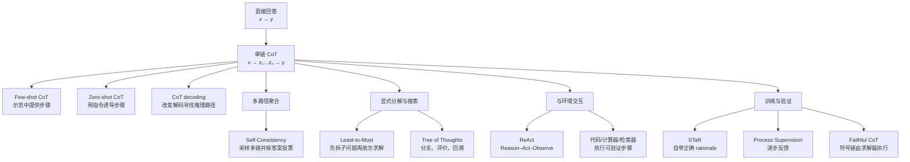

> **一句话结论：** Chain-of-Thought（CoT）是在最终答案前生成一串中间 token，把一次直接映射改造成可分解的序列计算；它常能改善多步问题，却既不保证正确，也不保证忠实反映模型产生答案的真实因果过程。

## 1. 什么是 Chain-of-Thought

Wei 等人把 CoT 定义为“通向最终输出的一系列中间自然语言推理步骤”。原始 few-shot CoT prompt 给模型若干三元组：

$$
(\text{问题},\text{中间推理},\text{答案}),
$$

然后要求模型对新问题同时生成推理与答案。与只给 `问题 → 答案` 示例相比，变化发生在**输出侧**：模型获得更多 token 来拆分计算、保存临时结果并把后续预测条件化在前面的中间状态上。[Wei et al., NeurIPS 2022](https://proceedings.neurips.cc/paper_files/paper/2022/hash/9d5609613524ecf4f15af0f7b31abca4-Abstract-Conference.html)

用潜变量视角表示，设输入为 $x$，思维链为 $z$，最终答案为 $y$。直接回答近似一次建模 $p(y\mid x)$；CoT 则显式生成中间序列：

$$
p(y\mid x)=\sum_z p(z\mid x)p(y\mid x,z).
$$

若 $z=(z_1,\ldots,z_m)$，其自回归生成过程可进一步写成：

$$
p(z,y\mid x)
=
\left[\prod_{t=1}^{m}p(z_t\mid x,z_{<t})\right]
p(y\mid x,z).
$$

实际推理不可能枚举所有 $z$。贪心 CoT 只选择一条路径；self-consistency 采样多条路径并对答案聚合；Tree of Thoughts 则在中间状态上显式搜索。

### CoT 不是什么

| 概念 | 与 CoT 的关系 | 关键区别 |
|---|---|---|
| Rationale / 解释 | 形式可能完全相同 | 解释面向人类说明“为什么”；CoT 首先是模型求解时的中间 token。解释可能是事后生成的 |
| Scratchpad | CoT 的更广义亲属 | scratchpad 可含公式、代码、表格或不可读符号，不一定是流畅自然语言 |
| Plan | 可成为 CoT 的一部分 | plan 描述将来准备做什么；CoT 还可包含计算、证据和状态更新 |
| Tool use | 可与 CoT 组合 | 工具会改变外部状态或返回新证据；纯 CoT 只在已有上下文中继续生成 token |
| Search | 单链 CoT 没有显式搜索 | 采样、树搜索或回溯会保留并比较多条候选路径 |
| Hidden-state computation | CoT 只是可见 token 层 | 神经网络内部仍在连续隐藏状态中计算，文本链不等于完整内部机制 |

因此，“让模型展示思维链”和“得到可审计的解释”是两个不同目标。

## 2. 为什么中间 token 可能有用

CoT 的收益可以从四个互补角度理解，但目前没有一个解释覆盖所有任务与模型。

### 2.1 增加串行计算深度

Decoder-only 模型每生成一个 token，就多执行一次完整网络前向。直接回答可能迫使模型在很少的输出步里完成组合计算；CoT 允许后续 token 读取已经写出的局部结果，相当于用推理时 token 换取更多顺序计算。

这不是“免费思考”。若生成长度从 $L$ 增至 $L+R$，至少增加 $R$ 个自回归解码步，还会扩大 KV cache 和端到端延迟。

### 2.2 把组合问题拆成局部条件问题

设复杂函数为 $f=f_m\circ\cdots\circ f_1$。直接输出要一次近似整个组合；中间步骤允许模型依次预测：

$$
u_1=f_1(x),\quad
u_2=f_2(u_1),\quad\ldots,\quad
y=f_m(u_{m-1}).
$$

局部子问题可能更接近预训练语料中常见的短模式。代价是任何早期错误都会进入后续上下文。

### 2.3 让示例表达“任务算法”而不只是标签

Few-shot 示例中的中间步骤提供了变量选择、分解粒度、计算顺序和答案格式。它们不仅告诉模型“答案是什么”，还展示“这类问题通常怎样处理”。这也是错误示例、无关步骤或风格不匹配会显著影响结果的原因。

### 2.4 为采样、验证和工具提供操作单位

没有中间状态时，系统只能比较最终答案；有了步骤以后，可以：

- 采样多条路径并投票；
- 检查第一处错误；
- 对某一步调用计算器、检索器或代码解释器；
- 从某个中间状态分支、回退或重新规划；
- 用过程奖励模型给每一步打分。

CoT 的系统价值常常来自这些外部机制，而不只是那句“请一步一步思考”。

## 3. 方法谱系



*图｜CoT 方法的功能分层。Mermaid 用于概念关系梳理；这些方法并非互斥，例如 Least-to-Most 的每个子问题仍可使用 self-consistency 或工具验证。*

## 4. 三种基本的 CoT elicitation

### 4.1 Few-shot CoT：用人工示例规定推理形状

原始 CoT 工作在 prompt 中放入少量带人工步骤的例题。以 PaLM 540B 为例，论文 Figure 2 报告 GSM8K solve rate 从标准 prompting 的约 18% 提高到约 57%。但同一论文也发现，这种收益在其当时评测的较小基础模型上不稳定，甚至可能下降；“CoT 随规模涌现”是该批未经过专门 reasoning post-training 模型的实验观察，不应当作所有现代模型的普遍定律。[Wei et al., Figure 2 与 §3](https://proceedings.neurips.cc/paper_files/paper/2022/file/9d5609613524ecf4f15af0f7b31abca4-Paper-Conference.pdf)

**优势**

- 可精确控制分解方式、术语和输出格式；
- 不更新模型参数；
- 专业任务中可把领域约束写进示例。

**缺点**

- 高质量步骤昂贵；
- 对示例选择、顺序和表述敏感；
- 模型可能模仿表面格式，而没有掌握可泛化规则；
- 错误 rationale 会把错误算法写进上下文。

### 4.2 Zero-shot CoT：只要求先推理再回答

Kojima 等人将回答分为两个 prompt：先用类似 “Let’s think step by step” 的触发语生成 rationale，再把问题与 rationale 交给第二个 prompt 提取答案。在 text-davinci-002 上，MultiArith 从 17.7% 提至 78.7%，GSM8K 从 10.4% 提至 40.7%。[Kojima et al., NeurIPS 2022](https://proceedings.neurips.cc/paper_files/paper/2022/hash/8bb0d291acd4acf06ef112099c16f326-Abstract-Conference.html)

该结果说明一些推理能力可以由非常弱的提示激活，但不意味着这一句英文是稳定的“万能提示”：同一论文中 CommonsenseQA 反而从 68.8% 降至 64.6%；MultiArith 上把完整触发语缩成 “Let’s think” 也会从 78.7% 降至 57.5%。不同模型、语言、任务和 system prompt 可能需要不同表达；现代 reasoning-tuned 模型也可能已经默认分配推理 token。

更稳妥的中文模板是显式规定结构：

```text
先列出已知条件、目标和约束；
把问题拆成必要的子问题并逐项求解；
检查单位、边界条件和是否遗漏反例；
最后用“最终答案：”单独给出结论。
```

这比只写“仔细想想”更容易检查，也更利于稳定解析最终答案。

### 4.3 CoT decoding：推理路径也可能被贪心解码压住

Wang 与 Zhou 在 NeurIPS 2024 报告，不改变 prompt、只检查首个解码位置的 top-$k$ 候选，也可能找到随后展开为 CoT 的路径。这说明“模型是否具有某种推理路径”和“默认 greedy decoding 是否选择它”不是同一个问题。[Chain-of-Thought Reasoning Without Prompting](https://proceedings.neurips.cc/paper_files/paper/2024/hash/7a8e7fd295aa04eac4b470ae27f8785c-Abstract-Conference.html)

其边界是：搜索 alternative token 会增加推理成本；路径存在也不等于路径正确，更不等于对真实任务分布稳定。

## 5. 从单链走向多路径、分解与搜索

### 5.1 Self-Consistency：对答案做 Monte Carlo 聚合

Self-consistency 不再贪心生成一条链，而以非零温度采样 $K$ 条不同路径 $(z_k,y_k)$，再选择出现最多的答案：

$$
\hat y=\arg\max_y\sum_{k=1}^{K}\mathbf 1[y_k=y].
$$

它近似对潜在推理路径做边缘化，而不是判断哪段文字最像正确解释。[Wang et al., ICLR 2023](https://openreview.net/forum?id=1PL1NIMMrw)

**什么时候有效**

- 题目有相对唯一、容易规范化的最终答案；
- 单次采样的错误具有一定独立性；
- 模型确实能生成多种有效路径。

**什么时候失效**

- 开放式答案难以归一化；
- 多条链共享同一个错误假设；
- temperature 只制造措辞差异，没有语义多样性；
- $K$ 倍调用成本超过任务价值。

多数票提高的是**答案稳定性**，不是步骤忠实性。十条相同偏见的路径仍会形成高置信错误。

### 5.2 Least-to-Most：把“思考”拆成显式的两阶段协议

Least-to-Most 先生成子问题列表，再按照从简单到复杂的顺序逐一回答，后一个子问题可以读取前面的答案。它针对普通 CoT 的一个弱点：示例只展示简单问题时，模型可能无法把同样链条外推到更长组合。[Zhou et al., ICLR 2023](https://openreview.net/forum?id=WZH7099tgfM)

论文在 SCAN length split 上报告，code-davinci-002 的标准提示为 16.7%、普通 CoT 为 16.2%、Least-to-Most 为 99.7%。摘要强调 14 个 exemplars，而完整流程实际分别使用 8 个分解示例与 14 个映射示例。这个数字高度依赖 SCAN 的规则结构，不能直接外推到开放世界问答；它更有力地证明了**显式分解可改善 easy-to-hard generalization**。

典型流程：

1. 只做分解，不求答案；
2. 检查子问题是否覆盖原目标、是否重复、是否依赖未来信息；
3. 按依赖顺序求解；
4. 用原问题重新验证组合答案。

### 5.3 Tree of Thoughts：把生成改造成启发式搜索

Tree of Thoughts（ToT）把“thought”作为搜索节点：生成多个候选中间状态，由模型或外部规则评价，再进行 BFS/DFS、剪枝与回溯。Game of 24 的 100 个较难样本上，GPT-4 的普通 CoT 成功率为 4%，100 条完整 CoT 的 self-consistency 为 9%，论文的 ToT 配方达到 74%。[Yao et al., NeurIPS 2023](https://proceedings.neurips.cc/paper_files/paper/2023/hash/271db9922b8d1f4dd7aaef84ed5ac703-Abstract.html)

ToT 的收益来自**搜索预算 + 状态表示 + evaluator**的完整组合，不只是把链画成树。若 evaluator 不能识别有希望的中间状态，树搜索会更昂贵地探索错误分支；若普通 CoT 已足够，ToT 只会增加延迟。

### 5.4 ReAct：推理与外部观察交替

ReAct 生成交错的 `Thought → Action → Observation` 轨迹。CoT 负责维护目标与计划，action 调用检索器、环境或工具，observation 把新证据写回上下文。[Yao et al., ICLR 2023](https://openreview.net/forum?id=WE_vluYUL-X)

核心差别是：纯 CoT 只能重组模型已有上下文，ReAct 能查询缺失事实并纠正错误假设。但“接入工具”并不自动提高正确率：HotpotQA 上单独 CoT 为 29.4 EM、单独 ReAct 为 27.4，组合 ReAct→CoT-SC 才达到 35.1。工具结果还可能被 prompt injection 污染，错误 action 也可能产生真实副作用，因此 agent 需要权限、参数校验、沙箱和停止条件。

## 6. 从提示技巧走向训练方法

### 6.1 STaR：用正确答案筛选模型自生成步骤

STaR 的循环是：

1. 用少量 rationale exemplars 生成训练题的步骤与答案；
2. 保留最终答案正确的 rationale；
3. 对答错样本，在给出正确答案的条件下尝试“合理化”出一条链；
4. 用筛选后的链微调模型，再重复生成与训练。

它把少量人工步骤扩展为较大的 reasoning dataset，并在 CommonsenseQA 上达到与大约 30 倍更大模型直接微调相当的结果。[Zelikman et al., NeurIPS 2022](https://proceedings.neurips.cc/paper_files/paper/2022/hash/639a9a172c044fbb64175b5fad42e9a5-Abstract-Conference.html)

主要风险是**只按最终答案筛选**：碰巧答对、步骤错误的样本也可能进入下一轮；给定正确答案再生成 rationale，还会增强事后合理化倾向。

### 6.2 Outcome supervision 与 process supervision

Outcome supervision 只评价最终答案 $y$；process supervision 对中间步骤 $z_t$ 给反馈。可粗略写成：

$$
R_{\mathrm{outcome}}=r(y),
\qquad
R_{\mathrm{process}}=\sum_t r_t(z_t\mid x,z_{<t}).
$$

《Let’s Verify Step by Step》在未用于过程标注的 500 道 MATH 测试题上，从每题 1,860 个候选中进行 best-of-$N$ 选择：process reward model（PRM）解出 78.2%，outcome reward model（ORM）为 72.4%，多数投票为 69.6%；论文同时发布约 800K step-level labels 的 PRM800K。[Lightman et al., ICLR 2024](https://openreview.net/forum?id=v8L0pN6EOi)

这个 78.2% 是“固定生成器 + 大量候选 + PRM 排序”的系统结果，不是单次生成准确率。PRM800K 使用了其余 4,500 道 MATH 测试题构造训练标签，因此主结果只在保留的 500 题上评估，也不能与标准完整 MATH test leaderboard 直接横比。

过程监督的优点是能定位早期错误，并防止后续“用错误步骤碰巧得到正确答案”。它的困难也很现实：

- 步骤边界和粒度没有唯一标准；
- 人工逐步标注昂贵且可能不一致；
- reward model 可能学习表面风格而非逻辑；
- 一条可读链受到过程奖励，不代表它穷尽了神经网络内部的因果计算。

### 6.3 Faithful CoT：让答案由可执行链产生

Faithful CoT 把任务拆成两阶段：LLM 将自然语言问题翻译为带注释的 Python、Datalog 或 PDDL 等符号链，确定性 solver 再执行该链得到答案。这样可以保证**最终答案确实由所显示的符号程序产生**。[Lyu et al., IJCNLP-AACL 2023](https://doi.org/10.18653/v1/2023.ijcnlp-main.20)

这是一种“相对于执行过程”的忠实性：解释忠实于 solver 的计算；它并不让 LLM 的 Translation 阶段变得完全可解释。若模型翻译错了约束，求解器会忠实地执行错误程序。

## 7. 主要实验证据应该怎样读

| 工作 | 关键对照 | 直接支持的结论 | 不能推出的结论 |
|---|---|---|---|
| Few-shot CoT | PaLM 540B，GSM8K 约 18%→57% | 对当时足够大的基础模型，多步示例能显著改善数学题 | 所有模型、所有任务都会受益 |
| Zero-shot CoT | text-davinci-002，MultiArith 17.7%→78.7% | 简短触发语可显著改变解码出的推理行为 | 固定短语是模型无关的最优 prompt |
| Self-Consistency | 同一题采样多条 CoT | 多路径答案聚合通常优于单条 greedy chain | 多数路径正确或解释忠实 |
| Least-to-Most | SCAN length split，普通 CoT 16.2%，分解后 99.7% | 显式子问题依赖可改善长度/组合外推 | 开放领域问题也有同样幅度 |
| Tree of Thoughts | Game of 24，4%→74% | 需要 lookahead/backtracking 时显式搜索有价值 | 任何问题都值得支付树搜索成本 |
| Turpin et al. | 在 prompt 中加入偏置特征，BBH accuracy 最多降 36.3 个百分点 | CoT 可合理化模型未明说的偏置信号 | 所有 CoT 都完全不忠实 |
| Process supervision | 保留的 500 道 MATH 题，best-of-1860：PRM 78.2%、ORM 72.4% | 步骤级反馈可改善候选排序与错误定位 | 单次生成达到 78.2%，或过程奖励自动获得因果忠实性 |

这些结果来自不同年代、模型、prompt、数据污染条件和推理预算，不能拼成单一排行榜。

## 8. CoT 的七类典型失败

### 8.1 错误级联

早期算错变量或误读条件，后续步骤会把错误当成事实继续推导。链越长，可累积的失误点越多。

**改进**：分段验证；每个关键中间量检查单位、范围和不变量；必要时从第一个错误点重算，而不是只让模型“再想一次”。

### 8.2 错误分解

模型可能把问题拆成不完整、循环依赖或根本无关的子问题。NeurIPS 2025 的受控归纳推理研究把失败拆为错误 decomposition、错误 subproblem solving 和错误 final summarization，并发现增加 CoT 有时反而降低归纳表现。[Jin et al., NeurIPS 2025](https://proceedings.neurips.cc/paper_files/paper/2025/hash/94f087ae1cc87511d7b098359fc4eaae-Abstract-Conference.html)

**改进**：先独立审查 decomposition；用依赖图检查遗漏和环；为简单问题设置“不分解”路径。

### 8.3 幻觉知识不会因步骤更多而消失

如果模型缺少事实，CoT 可能把不确定猜测扩写成连贯故事。文字越详细，反而越容易造成可信错觉。

**改进**：事实问题优先检索并引用来源；算术调用计算器；代码运行测试；形式化问题使用 solver。让模型区分“已知、推断、假设”。

### 8.4 Prompt 与示例敏感性

步骤风格、示例顺序、答案位置和选择题编号都可能改变结果。模型可能学习“总选 A”之类伪规律。

**改进**：打乱选项与示例顺序做敏感性测试；使用多套 prompt；固定解析协议；不要只汇报最好的一组模板。

### 8.5 Self-consistency 的相关错误

多次采样不是独立专家。相同训练偏差、错误前提或 retrieval 结果会让多数票稳定地选错。

**改进**：增加真正的路径多样性，例如不同分解、不同工具或不同模型；按可验证证据加权，而不是只数最终字符串。

### 8.6 Overthinking 与无谓成本

简单事实、格式转换或局部分类本不需要长链。强制 CoT 会增加延迟、token、成本和出错机会，也可能把明确问题重新解释错。

**改进**：先做任务路由；简单题直接回答，中等题单链，难题才增加采样、搜索和验证预算。停止条件应由答案稳定性、验证结果和预算共同决定，而不是固定生成“越长越好”。

### 8.7 可读但不忠实

Turpin 等人在 BBH 中加入选项顺序或建议答案等偏置信号，模型经常受其影响，却在 CoT 中不提这个原因，反而生成与错误答案一致的合理解释；在 suggested-answer 条件下，GPT-3.5 的 zero-shot CoT accuracy 最多下降 36.3 个百分点。研究者检查的 426 条受偏置信号影响的解释中，只有 1 条明确提及该信号。[Turpin et al., NeurIPS 2023](https://proceedings.neurips.cc/paper_files/paper/2023/hash/ed3fea9033a80fea1376299fa7863f4a-Abstract.html)

**改进**：把 CoT 当作待验证产物而不是透明窗口；用输入反事实、步骤删除/替换、早答测试和可执行程序检查“答案是否真的依赖这些步骤”。

## 9. Plausibility、Correctness 与 Faithfulness 必须分开

| 属性 | 问题 | 典型检查 |
|---|---|---|
| Plausibility 可理解性 | 人看起来是否合理、连贯？ | 人评、风格与可读性检查 |
| Step correctness 步骤正确 | 每一步是否由前提推出？ | 逐步标注、solver、单元测试、引用核验 |
| Answer correctness 答案正确 | 最终输出是否命中标准答案？ | exact match、执行结果、任务 reward |
| Faithfulness 忠实性 | 最终答案是否因这些步骤而产生？ | 介入、删除、替换、反事实和 causal mediation |

四者没有蕴含关系：

- 链条可以合理且答案正确，但模型其实依赖选项位置；
- 链条可以忠实执行，却忠实地执行了错误程序；
- 最终答案可以碰巧正确，但中间步骤错误；
- 步骤在数学上正确，最终 summary 仍可能抄错答案。

### 常见 faithfulness 测试

1. **Early answering**：只给前 $k$ 步就要求回答；若很早已稳定得到同一答案，后续步骤可能只是装饰。
2. **Adding mistakes**：向中间步骤注入错误，观察答案是否随之改变；完全不变可能说明模型没有使用这些步骤。
3. **Paraphrase / filler intervention**：改写或插入无关内容，区分语义依赖与表面 token 依赖。
4. **Bias counterfactual**：改变选项顺序、建议答案或社会偏见线索，检查 CoT 是否承认真正影响。
5. **Executable trace**：令答案只能由代码、逻辑程序或规划器执行得到，建立步骤到答案的机械因果链。

Lanham 等人的系统研究表明，faithfulness 会随任务、模型和测试方法变化，不能用单一指标给整个模型贴“忠实/不忠实”标签。[Measuring Faithfulness in Chain-of-Thought Reasoning](https://arxiv.org/abs/2307.13702)

这一问题没有随着“推理模型”自动消失。Chen 等人对 Claude 3.7 Sonnet 与 DeepSeek-R1 注入六类提示：在模型确实采用提示答案的样本中，平均主动披露该影响因素的比例分别只有 25% 与 39%；在合成 reward-hacking 环境里，模型几乎总会利用漏洞，但多数环境中少于 2% 的 CoT 会披露它。该工作仍是预印本，支持的是“可见长链不能单独承担安全监控”，而不是“所有推理文本都无用”。[Chen et al., arXiv 2025](https://arxiv.org/abs/2505.05410)

## 10. 实践选型：先判断问题需要哪一级推理预算

| 问题类型 | 推荐方式 | 原因 | 不建议默认使用 |
|---|---|---|---|
| 查一个明确事实 | 检索 + 简短答案 + 来源 | 瓶颈是知识，不是多步计算 | 长篇自由 CoT |
| 简单分类/格式转换 | 直接回答或短结构化检查 | CoT 增加延迟和漂移 | ToT、自一致性 |
| 多步算术/逻辑 | 结构化单链 + 计算器/solver | 中间量可验证 | 只凭自然语言心算 |
| 组合问题 | Least-to-Most | 明确依赖与子问题边界 | 一口气生成长链 |
| 有唯一答案但路径多 | Self-consistency + verifier | 可以聚合并验证 | 只按文风选最好链 |
| 需要规划、回溯 | ToT / search | 需要保留多个候选状态 | 单链贪心 |
| 缺少外部信息 | ReAct / retrieval | 必须取得新证据 | 继续“想”出事实 |
| 高风险决策 | 结构化证据 + 独立验证 + 人审 | 正确、忠实、合规需分别保证 | 将可读 CoT 当审计证据 |

### 一个成本递增的默认阶梯

1. **Direct**：先尝试直接回答；
2. **Structured CoT**：仅在任务需要多步推导时列条件、步骤和检查；
3. **Tool-verified CoT**：关键计算或事实交给工具；
4. **Sample and aggregate**：答案价值高于多次调用成本时采样；
5. **Search / planner**：确实需要回溯、lookahead 或约束满足时才展开树；
6. **Human escalation**：证据不足、风险高或不同路径持续冲突时停止自动决策。

## 11. 一个可审计的 CoT 输出协议

自由散文最难验证。面向工程任务，可把中间输出约束成以下字段：

```text
目标：要回答的精确问题
已知：由输入或来源直接给出的事实
假设：当前采用但尚未验证的条件
子问题：按依赖顺序编号
计算/证据：公式、工具结果或来源
检查：单位、边界、反例、替代解释
最终答案：与中间结果一致的简洁结论
不确定性：仍未知的信息以及它会怎样改变结论
```

这并不保证正确，但能把“缺知识、算错、漏约束、解释不忠实”变成不同的可检查问题。

对于生产系统，还应记录：模型与版本、prompt、temperature、采样数、工具版本、随机种子、token/延迟预算和 verifier 规则。否则所谓 CoT 改进很难复现。

## 12. 如何评测一个 CoT 系统

最终答案 accuracy 只是第一层。完整评测至少包括：

1. **任务效果**：accuracy、pass@k、success rate 或 reward；
2. **步骤质量**：第一处错误位置、有效步骤比例、逻辑/计算正确率；
3. **鲁棒性**：prompt、示例顺序、选项顺序、语言和 OOD 难度变化；
4. **faithfulness**：干预步骤或偏置信号后，答案是否按因果预期变化；
5. **校准**：多路径一致时是否真的更准确，错误时能否表达不确定；
6. **效率**：输入/输出 token、wall-clock latency、工具调用和显存；
7. **安全**：是否泄露敏感上下文，是否受工具输出注入，是否越权执行；
8. **可复现性**：模型 snapshot、prompt、采样参数与 evaluator 是否固定。

比较 Direct 与 CoT 时必须**匹配推理预算**。若 CoT 使用 40 条采样、外部工具和 verifier，而 direct baseline 只有一次 greedy call，实验回答的是“完整系统是否更强”，不能只把提升归因于可见思维链。

## 13. 常见误解

### “CoT 就是模型真正的内心活动”

不成立。它是模型输出的一串 token，可能参与后续答案生成，也可能是后验合理化；需要因果干预检验。

### “步骤越长，推理越深”

不成立。长度可能来自重复、犹豫和错误绕路。应以任务正确率、步骤质量和成本共同评价。

### “Self-consistency 能保证答案”

不成立。它降低部分随机错误，却无法消除共享偏差、错误知识和一致的错误分解。

### “CoT 可以替代工具”

不成立。语言模型不应替代计算器的精确算术、数据库的最新事实或 solver 的约束证明。

### “过程监督等于完全可解释”

不成立。过程奖励约束可见步骤的质量，但神经网络仍可能使用未被文字完整表达的内部特征。

### “不给用户展示 CoT 就没有推理”

不成立。模型可以在隐藏状态、专用 reasoning token、代码执行或不可见 scratchpad 中进行多步计算；显示给用户的是产品接口选择，不是能力定义。

## 14. 我的思考

CoT 最重要的贡献不是让语言模型“像人一样说出内心独白”，而是把推理时计算变成一种可编排资源。单链扩展串行计算，自一致性扩展采样维度，ToT 扩展搜索宽度，ReAct 扩展可访问的信息，过程监督扩展训练信号。它们分别改变不同的计算轴，不能都概括成一句“让模型多想一会儿”。

更稳健的方向不是追求越来越长的自由文本，而是让中间状态**结构化、可执行、可干预、可验证**。对于数学与程序问题，代码和 solver 往往比优美 prose 更可信；对于开放世界问题，带来源的证据图比封闭式自言自语更有价值；对于高风险决策，外部验证和人工责任边界比展示一段流畅理由更重要。

因此我会把 CoT 当作三个东西使用：

1. **计算草稿**：给复杂任务更多顺序计算空间；
2. **系统接口**：让采样、工具、搜索和 verifier 能介入中间过程；
3. **待检验解释**：可以帮助理解，但默认不拥有因果忠实性。

只有第三点不被过度承诺，前两点的工程价值才不会被“看起来很会解释”掩盖。

## 15. 参考资料与检索边界

本笔记是围绕 CoT 核心路线的定向综述，不是系统综述。检索日期为 2026-08-19；查询覆盖 `chain-of-thought prompting`、`zero-shot CoT`、`self-consistency`、`least-to-most`、`Tree of Thoughts`、`ReAct`、`process supervision` 和 `CoT faithfulness`。优先使用 NeurIPS、ICLR、ACL Anthology、arXiv 正式记录及作者官方代码；关键结论均回到原论文核验。

1. Wei, J. et al. (2022). *Chain-of-Thought Prompting Elicits Reasoning in Large Language Models*. NeurIPS 2022. [会议页面](https://proceedings.neurips.cc/paper_files/paper/2022/hash/9d5609613524ecf4f15af0f7b31abca4-Abstract-Conference.html) · [DOI](https://doi.org/10.52202/068431-1800)
2. Kojima, T. et al. (2022). *Large Language Models are Zero-Shot Reasoners*. NeurIPS 2022. [会议页面](https://proceedings.neurips.cc/paper_files/paper/2022/hash/8bb0d291acd4acf06ef112099c16f326-Abstract-Conference.html) · [DOI](https://doi.org/10.52202/068431-1613) · [官方代码](https://github.com/kojima-takeshi188/zero_shot_cot)
3. Wang, X. et al. (2023). *Self-Consistency Improves Chain of Thought Reasoning in Language Models*. ICLR 2023. [OpenReview](https://openreview.net/forum?id=1PL1NIMMrw)
4. Zhou, D. et al. (2023). *Least-to-Most Prompting Enables Complex Reasoning in Large Language Models*. ICLR 2023. [OpenReview](https://openreview.net/forum?id=WZH7099tgfM) · [arXiv](https://arxiv.org/abs/2205.10625)
5. Zelikman, E. et al. (2022). *STaR: Bootstrapping Reasoning With Reasoning*. NeurIPS 2022. [会议页面](https://proceedings.neurips.cc/paper_files/paper/2022/hash/639a9a172c044fbb64175b5fad42e9a5-Abstract-Conference.html) · [DOI](https://doi.org/10.52202/068431-1126) · [官方代码](https://github.com/ezelikman/STaR)
6. Yao, S. et al. (2023). *Tree of Thoughts: Deliberate Problem Solving with Large Language Models*. NeurIPS 2023. [论文](https://proceedings.neurips.cc/paper_files/paper/2023/hash/271db9922b8d1f4dd7aaef84ed5ac703-Abstract.html) · [DOI](https://doi.org/10.52202/075280-0517) · [官方代码](https://github.com/princeton-nlp/tree-of-thought-llm)
7. Yao, S. et al. (2023). *ReAct: Synergizing Reasoning and Acting in Language Models*. ICLR 2023. [OpenReview](https://openreview.net/forum?id=WE_vluYUL-X) · [项目页](https://react-lm.github.io/) · [官方代码](https://github.com/ysymyth/ReAct)
8. Lightman, H. et al. (2024). *Let’s Verify Step by Step*. ICLR 2024. [OpenReview](https://openreview.net/forum?id=v8L0pN6EOi) · [PRM800K](https://github.com/openai/prm800k)
9. Turpin, M. et al. (2023). *Language Models Don’t Always Say What They Think: Unfaithful Explanations in Chain-of-Thought Prompting*. NeurIPS 2023. [会议页面](https://proceedings.neurips.cc/paper_files/paper/2023/hash/ed3fea9033a80fea1376299fa7863f4a-Abstract.html) · [DOI](https://doi.org/10.52202/075280-3275)
10. Lanham, T. et al. (2023). *Measuring Faithfulness in Chain-of-Thought Reasoning*. arXiv preprint. [arXiv](https://arxiv.org/abs/2307.13702)
11. Lyu, Q. et al. (2023). *Faithful Chain-of-Thought Reasoning*. IJCNLP-AACL 2023. [ACL Anthology](https://aclanthology.org/2023.ijcnlp-main.20/) · [DOI](https://doi.org/10.18653/v1/2023.ijcnlp-main.20)
12. Wang, X. & Zhou, D. (2024). *Chain-of-Thought Reasoning Without Prompting*. NeurIPS 2024. [会议页面](https://proceedings.neurips.cc/paper_files/paper/2024/hash/7a8e7fd295aa04eac4b470ae27f8785c-Abstract-Conference.html) · [DOI](https://doi.org/10.52202/079017-2123)
13. Jin, H. et al. (2025). *Evaluating the Inductive Abilities of Large Language Models: Why Chain-of-Thought Reasoning Sometimes Hurts More Than Helps*. NeurIPS 2025. [会议页面](https://proceedings.neurips.cc/paper_files/paper/2025/hash/94f087ae1cc87511d7b098359fc4eaae-Abstract-Conference.html)
14. Chen, Y. et al. (2025). *Reasoning Models Don't Always Say What They Think*. arXiv preprint. [arXiv](https://arxiv.org/abs/2505.05410) · [作者研究说明](https://www.anthropic.com/research/reasoning-models-dont-say-think)
