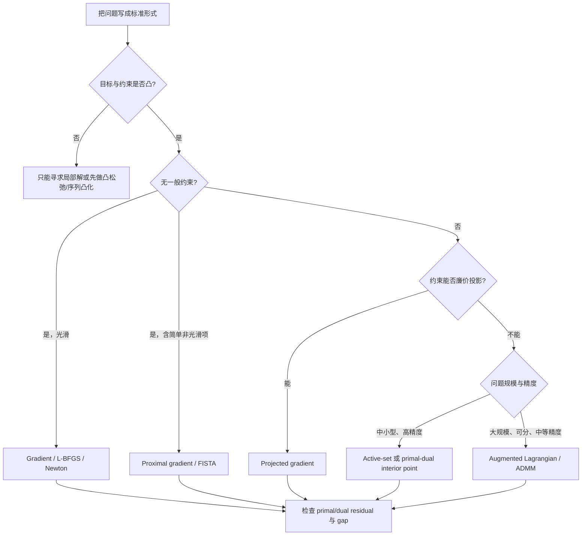

> **一句话结论：** 对可微凸问题，KKT 条件是一张可验证的全局最优证书；若再满足 Slater 条件，最优解必然能配上一组乘子满足 KKT。对一般非凸问题，KKT 通常只有在约束资格条件成立时才是局部最优的必要条件，不能自动证明全局最优。

> **阅读范围：** 本文以 [Boyd 与 Vandenberghe 的《Convex Optimization》](https://web.stanford.edu/~boyd/cvxbook/)及 [Stanford EE364a 对偶讲义](https://web.stanford.edu/class/ee364a/lectures/duality.pdf)为理论主线，参考 [CMU 16-745](https://optimalcontrol.ri.cmu.edu/) 的 Optimization Pt. 1–3、KKT 与 Convex MPC 讲义理解机器人优化中的实际用法。CMU 16-745 的正式课程名是 **Optimal Control and Reinforcement Learning**，不是专门的凸优化课程。

> **求解导读：** 小规模题目通常通过 KKT 与活跃约束手算；中小型 LP/QP/SOCP 追求高精度时常用活跃集或原始—对偶内点法；约束只是盒、球或单纯形时优先用投影梯度；大规模“光滑项 + 简单非光滑正则”常用近端梯度；变量可分块且允许中等精度时可考虑增广拉格朗日或 ADMM。KKT 给出的是最优性方程，真正的求解器则反复解结构化线性系统或近端子问题。

## 1. 为什么凸性重要

一般非凸优化可能存在局部极小、鞍点和相互分离的可行区域。凸优化的特殊之处是：

- 任意局部最优解都是全局最优解；
- 一阶条件可构成全局证书；
- 对偶问题提供可计算的下界；
- LP、QP、SOCP、SDP 等结构可由成熟数值方法稳定求解。

这不意味着“凸问题一定容易”。变量规模、条件数、约束结构和所需精度仍会决定实际成本；但凸性移除了“局部最优不等于全局最优”这一根本歧义。

## 2. 凸集：两点之间的线段不能跑出集合

集合 $C$ 是凸集，当且仅当对任意 $x,y\in C$ 和 $\theta\in[0,1]$，都有

$$
\theta x+(1-\theta)y\in C.
$$

常见凸集包括：

- 仿射子空间 $\{x\mid Ax=b\}$；
- 半空间 $\{x\mid a^\top x\le b\}$ 与多面体；
- 欧氏球、椭球；
- 二阶锥与半正定锥。

凸集的交集仍然凸，因此多个凸约束可以自然叠加。并集通常不凸。

## 3. 凸函数：弦在图像上方

定义域为凸集的函数 $f$ 是凸函数，当且仅当

$$
f(\theta x+(1-\theta)y)
\le
\theta f(x)+(1-\theta)f(y).
$$

若 $f$ 可微，则凸性等价于切平面给出全局下界：

$$
f(y)\ge f(x)+\nabla f(x)^\top(y-x).
$$

若二阶可微，则在凸定义域上

$$
f\text{ 为凸函数}
\iff
\nabla^2f(x)\succeq0,\quad \forall x.
$$

需要区分：

- **凸：** Hessian 半正定，最优解可能不唯一；
- **严格凸：** 不同点间 Jensen 不等式严格，若最优解存在则至多一个；
- **$m$-强凸：** $\nabla^2 f(x)\succeq mI$（二阶可微时），提供唯一解、误差界和更强收敛性质。

“Hessian 在一个点正定”只能说明该点附近的局部曲率，不能据此证明函数在整个定义域凸。

## 4. 标准凸优化问题

标准形式写作

$$
\begin{aligned}
\min_x\quad &f_0(x)\\
\text{s.t.}\quad
&f_i(x)\le0,\quad i=1,\ldots,m,\\
&Ax=b.
\end{aligned}
$$

这是凸问题需要满足：

1. 目标 $f_0$ 为凸函数；
2. 不等式约束函数 $f_i$ 为凸函数；
3. 等式约束必须是仿射的。

第三点经常被遗漏。若用一般凸函数写 $h(x)=0$，集合通常不是凸的。例如 $x^2=1$ 的可行集是 $\{-1,1\}$，并不凸。

常见类型：

| 类型 | 目标 | 约束 | 典型应用 |
|---|---|---|---|
| LP | 线性 | 线性 | 资源分配、流问题 |
| QP | 凸二次 | 线性 | MPC、最小二乘、控制分配 |
| QCQP | 凸二次 | 凸二次 | 鲁棒估计、波束形成 |
| SOCP | 线性 | 二阶锥 | 范数约束、鲁棒优化 |
| SDP | 线性矩阵内积 | 半正定锥 | 控制、松弛、矩阵估计 |

[CMU 16-745 的 Convex MPC 讲义](https://github.com/Optimal-Control-16-745/lecture-notebooks/tree/main/Lecture%2010) 正是把线性动力学、二次代价和凸状态/控制约束组合成在线 QP。

## 5. 从约束到价格：拉格朗日函数

对标准问题定义拉格朗日函数

$$
L(x,\lambda,\nu)
=f_0(x)
+\sum_{i=1}^{m}\lambda_i f_i(x)
+\nu^\top(Ax-b),
$$

其中：

- 不等式乘子 $\lambda_i\ge0$；
- 等式乘子 $\nu$ 没有符号限制。

若 $x$ 原始可行且 $\lambda\ge0$，则

$$
L(x,\lambda,\nu)\le f_0(x),
$$

因为 $f_i(x)\le0$。因此，固定一组乘子并对 $x$ 取下确界，会得到原问题最优值的下界。

> **符号约定提醒：** 本文统一使用 $f_i(x)\le0$ 和 $+\lambda_i f_i(x)$。CMU 16-745 手写讲义常用 $c_i(x)\ge0$，于是写成 $L=f-\lambda^\top c$。两者完全等价，但不能混用不等式方向与乘子符号。

## 6. 对偶函数、弱对偶与强对偶

### 6.1 对偶函数

$$
g(\lambda,\nu)=\inf_x L(x,\lambda,\nu).
$$

$g$ 是 $(\lambda,\nu)$ 的凹函数，即使原问题不是凸问题，因为它是一族仿射函数的逐点下确界。

拉格朗日对偶问题为

$$
\max_{\lambda,\nu}\quad g(\lambda,\nu)
\qquad
\text{s.t.}\quad \lambda\ge0.
$$

记原问题最优值为 $p^\star$，对偶最优值为 $d^\star$。

### 6.2 弱对偶

对最小化问题恒有

$$
d^\star\le p^\star.
$$

这叫弱对偶，不要求原问题凸。任何对偶可行点都给原问题一个下界，因此可以用 primal-dual gap 判断当前解离最优还有多远。

### 6.3 强对偶

$$
d^\star=p^\star
$$

称为强对偶。凸性本身通常还不够；需要 Slater 等约束资格条件，或问题本身具有更特殊的结构。

## 7. Slater 条件到底保证什么

对凸问题，若存在 $\tilde x\in\operatorname{relint}\mathcal D$ 使

$$
f_i(\tilde x)<0,\quad i=1,\ldots,m,
\qquad
A\tilde x=b,
$$

则 Slater 条件成立。它保证：

- 强对偶成立；
- 当原问题最优值有限时，对偶最优值可以达到。

精确理解需要三点：

1. Slater 是强对偶的**充分条件**，不是必要条件；不满足 Slater 不等于一定有 duality gap。
2. 严格不等式只要求用于非仿射凸不等式；仿射不等式可使用精化版 Slater。
3. 使用的是定义域的相对内部 $\operatorname{relint}$，低维仿射集合在普通欧氏空间里可能没有内部，却有相对内部。

## 8. KKT 四条件

对可微标准问题，候选解 $(x^\star,\lambda^\star,\nu^\star)$ 的 Karush-Kuhn-Tucker 条件是：

### 8.1 原始可行性

$$
f_i(x^\star)\le0,
\qquad
Ax^\star=b.
$$

### 8.2 对偶可行性

$$
\lambda_i^\star\ge0.
$$

### 8.3 互补松弛

$$
\lambda_i^\star f_i(x^\star)=0,
\qquad i=1,\ldots,m.
$$

它表示：

$$
f_i(x^\star)<0\Rightarrow\lambda_i^\star=0,
$$

$$
\lambda_i^\star>0\Rightarrow f_i(x^\star)=0.
$$

非活跃约束没有边际价格；乘子严格为正的约束必定贴在边界上。但当 $f_i(x^\star)=0$ 时，$\lambda_i^\star$ 仍可能为零。

### 8.4 驻点条件

$$
\nabla f_0(x^\star)
+\sum_{i=1}^{m}\lambda_i^\star\nabla f_i(x^\star)
+A^\top\nu^\star=0.
$$

几何上，目标函数的下降方向被活跃约束的法向量组合抵消，所以不存在保持一阶可行的下降方向。

非光滑凸问题把梯度条件改为

$$
0\in\partial_x L(x^\star,\lambda^\star,\nu^\star).
$$

## 9. KKT 何时必要，何时充分

这是整篇笔记最重要的边界。

| 问题类型 | KKT 的地位 | 能否证明全局最优 |
|---|---|---|
| 无约束可微凸问题 | $\nabla f(x^\star)=0$ 必要且充分 | 能 |
| 一般可微非凸问题 | 在 LICQ、MFCQ 等约束资格条件下，是局部最优的一阶必要条件 | 通常不能 |
| 可微凸问题 | 任意 KKT 点都是原、对偶全局最优点 | 能；充分性方向不需要 Slater |
| 可微凸问题 + Slater | 最优当且仅当存在乘子满足 KKT | 能；必要且充分 |

### 9.1 KKT 点在非凸问题中可能是极大点

例如

$$
\min_{-1\le x\le1}-x^2.
$$

$x=0$ 位于可行域内部且满足驻点条件，所以是 KKT 点；但它是目标的最大点，最小值在 $x=\pm1$。KKT 对非凸问题不是充分条件。

### 9.2 没有约束资格条件时，最优点可能不满足 KKT

考虑凸问题

$$
\min_x x
\qquad
\text{s.t.}\quad x^2\le0.
$$

唯一可行点 $x^\star=0$ 当然是最优点，但约束梯度在该点为零。驻点条件要求

$$
1+\lambda\cdot 2x=0,
$$

在 $x=0$ 不可能成立。此例没有严格可行点，Slater 失效，说明不能无条件宣称“所有凸最优解都满足 KKT”。

## 10. 完整例题：投影到一个半空间

考虑

$$
\begin{aligned}
\min_{x,y}\quad &\frac12(x^2+y^2)\\
\text{s.t.}\quad &1-x-y\le0.
\end{aligned}
$$

目标 Hessian 为单位阵，问题严格凸；约束仿射；例如 $(1,1)$ 严格可行，所以 Slater 成立。

拉格朗日函数为

$$
L(x,y,\lambda)
=\frac12(x^2+y^2)+\lambda(1-x-y).
$$

KKT 条件：

$$
x-\lambda=0,
\qquad
y-\lambda=0,
$$

$$
1-x-y\le0,
\qquad
\lambda\ge0,
$$

$$
\lambda(1-x-y)=0.
$$

若 $\lambda=0$，则 $x=y=0$，违反约束。因此约束活跃：

$$
x=y=\lambda,
\qquad
1-2\lambda=0.
$$

所以

$$
x^\star=y^\star=\frac12,
\qquad
\lambda^\star=\frac12,
\qquad
p^\star=\frac14.
$$

对偶函数为

$$
g(\lambda)=\lambda-\lambda^2,
$$

对偶问题 $\max_{\lambda\ge0}\lambda-\lambda^2$ 同样在 $\lambda=1/2$ 取得 $d^\star=1/4$，直接验证 $p^\star=d^\star$。

## 11. 真正开始求解前：先识别问题结构

不要拿到问题就直接把 KKT 方程交给通用非线性方程求根器。那样做往往会忽略 $\lambda\ge0$、可行域边界、稀疏结构和全局化策略。更稳妥的顺序是先回答五个问题：

1. **是否有解析解？** 最小二乘、仿射投影和小规模等式 QP 常能化成一个线性系统。
2. **目标是否光滑？** $L$-Lipschitz 梯度支持梯度法；牛顿法还要求二阶可微且能够获得 Hessian；拟牛顿法则用梯度差近似曲率。若含 $\ell_1$、核范数或指示函数，优先考虑近端方法。
3. **约束是否容易投影？** 盒约束、欧氏球、仿射子空间和概率单纯形可直接投影；一般非线性约束更适合内点法或增广拉格朗日。
4. **规模与稀疏性如何？** 小而稠密的问题可直接分解 KKT 矩阵；大规模稀疏问题应利用稀疏 Cholesky、$LDL^\top$、共轭梯度或矩阵—向量乘法。
5. **需要多高精度、是否重复求解？** 高精度最优证书偏向内点法；MPC 中连续求解相似 QP 时，warm start 的活跃集法或一阶算子分裂往往更合适。

下面统一用凸 QP 说明约束算法：

$$
\begin{aligned}
\min_x\quad &\frac12x^\top Px+q^\top x\\
\text{s.t.}\quad &Ax=b,\\
&Gx\le h,
\end{aligned}
\qquad P\succeq0.
$$

LP 是 $P=0$ 的特例；许多一般凸问题也会在每轮牛顿、SQP 或序列凸化中产生这种局部子问题。

## 12. 光滑无约束问题：梯度法、牛顿法与拟牛顿法

先考虑 $\min_x f(x)$，其中 $f$ 可微且凸。最优性条件是 $\nabla f(x^\star)=0$。数值算法的区别主要在于如何构造下降方向与步长。

### 12.1 梯度下降

最基本的更新为

$$
x_{k+1}=x_k-\alpha_k\nabla f(x_k).
$$

若 $\nabla f$ 是 $L$-Lipschitz，固定步长 $0<\alpha\le1/L$ 可保证目标下降。取 $\alpha=1/L$ 时，凸问题满足典型的次线性界

$$
f(x_k)-f^\star
\le
\frac{L\lVert x_0-x^\star\rVert_2^2}{2k}.
$$

若 $f$ 还具有 $m$-强凸性，则收敛变为线性，速度主要受条件数 $\kappa=L/m$ 控制。$\kappa$ 很大时，等高线狭长，梯度会“之”字形前进，这通常提示需要变量缩放、预条件或二阶方法。

实际中往往不知道 $L$，可用 Armijo 回溯线搜索。令 $p_k=-\nabla f(x_k)$，从候选步长 $\alpha=1$ 开始反复乘 $\beta\in(0,1)$，直到

$$
f(x_k+\alpha p_k)
\le
f(x_k)+c\alpha\nabla f(x_k)^\top p_k,
\qquad c\in(0,1/2).
$$

一段最小伪代码是：

```text
p = -grad_f(x)
alpha = 1
while f(x + alpha*p) > f(x) + c*alpha*grad_f(x)^T*p:
    alpha = beta*alpha
x = x + alpha*p
```

梯度范数 $\lVert\nabla f(x_k)\rVert_2$ 可作为停止量；但没有强凸性或误差界时，“梯度很小”不自动给出很紧的目标误差上界。

### 12.2 牛顿法

牛顿方向来自局部二次模型：

$$
\nabla^2 f(x_k)\,\Delta x_k
=
-\nabla f(x_k),
$$

$$
x_{k+1}=x_k+\alpha_k\Delta x_k.
$$

实现时应当**解线性方程**，而不是显式计算 $[\nabla^2f(x_k)]^{-1}$。若解处 Hessian 非奇异，Hessian 在解邻域 Lipschitz 连续，迭代已进入该邻域且最终接受完整步长，则牛顿法具有局部二次收敛；少一个前提都不宜无条件声称二次收敛。每轮还需要形成或作用 Hessian，并完成一次矩阵分解。远离最优点时应配合回溯线搜索或 trust region，而不是盲目取 $\alpha=1$。

Newton decrement 为

$$
\delta(x)^2
=
\nabla f(x)^\top\nabla^2f(x)^{-1}\nabla f(x)
=
-\Delta x^\top\nabla f(x),
$$

当 Hessian 正定时，标准牛顿实现常用 $\delta(x)^2/2\le\epsilon$ 作为局部停止条件；在 self-concordant 分析中它还能给出更精确的次优性控制。对任意凸函数，不能脱离正则性假设把 Newton decrement 当作全局误差证书。

如果 Hessian 奇异、半正定或数值条件差，可以解

$$
\bigl(\nabla^2 f(x_k)+\eta I\bigr)\Delta x_k
=
-\nabla f(x_k),
\qquad \eta>0,
$$

或使用 modified Cholesky / trust region。正则化会改变局部模型，因此仍要用原问题的下降量和残差复核。

### 12.3 拟牛顿与共轭梯度

- **BFGS / L-BFGS：** 用梯度差近似曲率，不显式形成完整 Hessian。L-BFGS 只保存少量历史向量，适合变量很多、目标光滑且一次梯度较便宜的场景。
- **共轭梯度（CG）：** 对大规模对称正定二次问题 $Px=-q$，只需矩阵—向量乘法；配合预条件器可显著降低有效条件数。
- **Newton-CG：** 通过 Hessian-vector product 近似求解牛顿方程，适合大规模光滑模型。

## 13. 简单约束：投影梯度与 Frank–Wolfe

对 $\min_{x\in C}f(x)$，若闭凸集 $C$ 的欧氏投影容易计算，可使用

$$
x_{k+1}
=
\Pi_C\!\left(x_k-\alpha_k\nabla f(x_k)\right),
$$

其中

$$
\Pi_C(y)=\arg\min_{x\in C}\frac12\lVert x-y\rVert_2^2.
$$

若 $f$ 为 $L$-smooth convex，常取 $0<\alpha\le1/L$ 或使用投影回溯线搜索。对应的 projected-gradient mapping 为

$$
G_{\alpha,C}(x)
=
\frac1\alpha
\left[
x-\Pi_C\bigl(x-\alpha\nabla f(x)\bigr)
\right].
$$

$G_{\alpha,C}(x)=0$ 等价于一阶约束最优性，可用其范数作为停止量。

常见投影包括：

- 盒约束 $l\le x\le u$：逐元素截断；
- 半径为 $R$ 的欧氏球：若 $\lVert y\rVert_2>R$，则缩放为 $Ry/\lVert y\rVert_2$；
- 仿射集合 $Ax=b$：若 $A$ 满行秩，

$$
\Pi_{Ax=b}(y)
=
y-A^\top(AA^\top)^{-1}(Ay-b);
$$

- 概率单纯形：通过排序寻找统一阈值，再执行截断。

公式中的逆矩阵只用于推导；实现时应解关于 $AA^\top$ 的线性系统。

如果投影很贵，但线性最小化子问题

$$
s_k=\arg\min_{s\in C}\nabla f(x_k)^\top s
$$

很容易，则可使用 Frank–Wolfe：

$$
x_{k+1}=x_k+\gamma_k(s_k-x_k).
$$

它保持迭代点可行，常用于单纯形、核范数球和产生稀疏/低秩解的场景。若 $f$ 凸且 $L$-smooth、$C$ 为紧凸集或具有有限 curvature constant、线性 oracle 能取到最小值，并采用标准步长或线搜索，基础 Frank–Wolfe 的目标误差为 $O(1/k)$；闭凸但无界的集合甚至可能让线性子问题没有解。

## 14. 等式约束 QP 与 KKT 线性系统

考虑

$$
\begin{aligned}
\min_x\quad
&\frac12x^\top Px+q^\top x+r\\
\text{s.t.}\quad
&Ax=b,
\end{aligned}
\qquad P\succeq0.
$$

KKT 条件为

$$
Px+q+A^\top\nu=0,
\qquad
Ax=b,
$$

合并成鞍点线性系统

$$
\begin{bmatrix}
P&A^\top\\
A&0
\end{bmatrix}
\begin{bmatrix}
x^\star\\
\nu^\star
\end{bmatrix}
=
\begin{bmatrix}
-q\\
b
\end{bmatrix}.
$$

这就是最优控制、SQP、轨迹优化和 primal-dual interior-point method 中反复出现的 KKT system 原型。[CMU 16-745 Lecture 4](https://github.com/Optimal-Control-16-745/lecture-notebooks/tree/main/Lecture%204) 以 equality-constrained Newton / Gauss-Newton 形式推导了同类系统。

### 14.1 直接解 KKT 系统

KKT 矩阵通常对称但不正定，适合使用带主元选择的 $LDL^\top$ 分解，而不是普通 Cholesky。若 $A$ 满行秩，且

$$
v\ne0,\ Av=0
\quad\Longrightarrow\quad
v^\top Pv>0,
$$

也就是 $P$ 在 $\operatorname{null}(A)$ 上正定，则原解唯一且 KKT 矩阵非奇异。冗余等式、可行自由方向上的零曲率或极差的缩放都可能让系统奇异或病态。

### 14.2 Null-space 消元

先找一个满足 $Ax_p=b$ 的特解，并令 $F$ 的列构成 $\operatorname{null}(A)$ 的一组基。所有可行点都可写成

$$
x=x_p+Fz.
$$

代回目标后得到降维线性系统：

$$
F^\top PFz
=
-F^\top(Px_p+q).
$$

当自由维数 $n-\operatorname{rank}(A)$ 很小，或需要每个迭代点都严格满足等式时，这种方法很有效；但显式构造稠密零空间基可能破坏原问题稀疏性。通常使用 QR 或 SVD 处理秩与零空间，而不是通过普通法方程硬算。

### 14.3 Schur complement / range-space 法

若 $P\succ0$ 且 $A$ 满行秩，由驻点条件得到

$$
x=-P^{-1}(q+A^\top\nu).
$$

代入等式约束：

$$
AP^{-1}A^\top\nu
=
-b-AP^{-1}q.
$$

此时 $AP^{-1}A^\top\succ0$。先解较小的乘子系统，再回代得到 $x$。当约束数远小于变量数时很有吸引力。实现时不形成 $P^{-1}$，而是复用 $P$ 的分解来求解多个右端项。若等式冗余，应先用 rank-revealing QR/SVD 删除或隔离相关行，不能假定 Schur 系统仍可逆。

三种路线可按结构选择：

| 结构 | 更合适的线性代数路线 |
|---|---|
| 约束数 $p\ll n$，且 $P$ 易求解 | Schur complement / range-space |
| 自由维数 $n-p\ll n$ | Null-space |
| 一般大型稀疏结构，或 $P$ 仅半正定 | 稀疏 KKT $LDL^\top$ |

### 14.4 一个可直接手算的等式例题

把向量 $c\in\mathbb R^n$ 投影到超平面 $\mathbf1^\top x=1$：

$$
\min_x\frac12\lVert x-c\rVert_2^2
\quad\text{s.t.}\quad
\mathbf1^\top x=1.
$$

驻点条件给出 $x-c+\nu\mathbf1=0$，所以 $x=c-\nu\mathbf1$。代入约束：

$$
\nu=\frac{\mathbf1^\top c-1}{n},
\qquad
x^\star
=
c-\frac{\mathbf1^\top c-1}{n}\mathbf1.
$$

这展示了“写 KKT—消去原变量—求乘子—回代”的基本套路。

## 15. 不等式 QP 的活跃集法：逐步识别真实边界

对 $Gx\le h$，最优点只会有一部分约束取等号。活跃集法维护工作集 $\mathcal W_k$，把其中约束暂时当作等式。给定一个可行点 $x_k$，方向子问题为

$$
\begin{aligned}
\min_p\quad
&\frac12p^\top Pp+(Px_k+q)^\top p\\
\text{s.t.}\quad
&Ap=0,\\
&G_i p=0,\quad i\in\mathcal W_k.
\end{aligned}
$$

每轮按以下逻辑更新：

1. 解等式约束 QP，得到方向 $p_k$ 和工作集乘子。
2. 在精确算术中，若 $p_k=0$ 且所有活跃不等式乘子 $\lambda_i\ge0$，完整 KKT 成立，当前点就是凸 QP 的全局最优解。
3. 若 $p_k=0$ 但某个 $\lambda_i<0$，删除一个负乘子约束，通常删除最负者。
4. 若 $p_k\ne0$，在保持所有非活跃约束可行的前提下取最大步长：

$$
\alpha_k
=
\min\left(
1,
\min_{i\notin\mathcal W_k,\;G_i p_k>0}
\frac{h_i-G_i x_k}{G_i p_k}
\right).
$$

5. 更新 $x_{k+1}=x_k+\alpha_kp_k$；如果某个约束阻挡了完整步长，就把它加入工作集。

数值实现以 $\lVert p_k\rVert\le\epsilon_p$ 代替严格的 $p_k=0$。若步长公式中的候选集合为空，约定内层最小值为 $+\infty$，于是可取完整步长；多个约束同时阻挡时，还要处理 tie、线性相关和 anti-cycling。

与第 10 节二维例题连接：从可行点 $(1,1)$ 出发，无约束方向是 $(-1,-1)$；约束写成 $-x-y\le-1$ 后，最大可行步长为 $1/2$，恰好到达 $(1/2,1/2)$。该约束进入工作集，下一轮得到零方向和非负乘子，于是终止。

活跃集法并非穷举全部 $2^m$ 个集合，而是利用相邻迭代或相邻控制时刻的边界通常变化不大。它在小中型 QP、MPC warm start 和高精度边界识别中很有效。缺点是需要可行初值或 Phase I；退化约束、线性相关工作集和零乘子约束可能引发 cycling；最坏情况下仍可能经历很多工作集。

### 15.1 如何得到可行初值：Phase I

一种通用办法是引入标量 $t$，先解

$$
\begin{aligned}
\min_{x,t}\quad &t\\
\text{s.t.}\quad &f_i(x)\le t,
\quad i=1,\ldots,m,\\
&Ax=b.
\end{aligned}
$$

若 Phase I 的最优解 $(x^\star,t^\star)$ 存在，则 $t^\star<0$ 给出严格可行点，$t^\star\le0$ 给出可行点，$t^\star>0$ 证明原不等式系统在给定等式下不可行。若 $Ax=b$ 本身无解，Phase I 也会不可行；若最优值没有达到或问题无界，则需单独分析，不能只按 $t^\star$ 分类。工程求解器常使用 elastic slack，把不可行量显式加入目标，以便诊断究竟是哪组约束冲突。

## 16. 障碍法与原始—对偶内点法

### 16.1 从 log barrier 理解 central path

对一般不等式 $f_i(x)\le0$，定义

$$
\phi(x)=-\sum_{i=1}^{m}\log\bigl(-f_i(x)\bigr).
$$

在参数 $t>0$ 下求

$$
\min_{Ax=b}\quad
tf_0(x)+\phi(x).
$$

障碍项在边界附近趋于无穷，因此每个中心点都严格可行。其隐含乘子为

$$
\lambda_i(t)=\frac{1}{-t f_i(x(t))},
$$

从而

$$
\lambda_i(t)\bigl[-f_i(x(t))\bigr]=\frac1t.
$$

这正是被扰动的互补松弛；对应对偶间隙为 $m/t$。逐步增大 $t$，并用上一个中心点 warm start 下一次牛顿求解，就沿 central path 逼近最优点。基础 barrier method 可在 $m/t\le\epsilon$ 时结束外层迭代，但它要求严格可行初值。

### 16.2 原始—对偶 KKT 系统

对 $Gx\le h$ 引入 slack

$$
s=h-Gx>0.
$$

扰动 KKT 条件写成

$$
\begin{aligned}
\nabla f_0(x)+A^\top\nu+G^\top\lambda&=0,\\
Ax-b&=0,\\
Gx+s-h&=0,\\
S\Lambda\mathbf1&=\mu\mathbf1,\\
s&>0,\quad\lambda>0,
\end{aligned}
$$

其中 $S=\operatorname{diag}(s)$，$\Lambda=\operatorname{diag}(\lambda)$。若本轮选择中心化参数 $\sigma\in[0,1]$，则右端的中心化残差定义为

$$
r_{\mathrm{cent}}
=
S\lambda-\sigma\mu\mathbf1.
$$

在当前点线性化可得到牛顿系统

$$
\begin{bmatrix}
H&A^\top&G^\top&0\\
A&0&0&0\\
G&0&0&I\\
0&0&S&\Lambda
\end{bmatrix}
\begin{bmatrix}
\Delta x\\
\Delta\nu\\
\Delta\lambda\\
\Delta s
\end{bmatrix}
=
-\begin{bmatrix}
r_{\mathrm{dual}}\\
r_{\mathrm{eq}}\\
r_{\mathrm{ineq}}\\
r_{\mathrm{cent}}
\end{bmatrix}.
$$

这里 $H$ 是拉格朗日函数关于 $x$ 的 Hessian；对于 QP 就是 $P$。实际求解器会消去 $\Delta s$、$\Delta\lambda$，把系统缩减成更小的对称不定 KKT 系统，并尽量复用稀疏分解。

### 16.3 一轮原始—对偶内点法

1. 计算原始残差、对偶残差和 $\mu=s^\top\lambda/m$。
2. 选择中心化参数 $\sigma\in[0,1]$，令目标互补量接近 $\sigma\mu$。
3. 解牛顿系统得到 $\Delta x,\Delta\nu,\Delta\lambda,\Delta s$。
4. 用 fraction-to-the-boundary 规则选步长，例如

$$
\alpha_{\mathrm{pri}}
=
\min\left(
1,
\eta\min_{\Delta s_i<0}
\frac{-s_i}{\Delta s_i}
\right),
\qquad \eta\in(0,1),
$$

并对 $\lambda$ 计算 $\alpha_{\mathrm{dual}}$，确保更新后仍严格为正。
5. 更新所有原始、对偶变量，直到可行残差、驻点残差和对偶间隙同时足够小。

原始—对偶 infeasible-start 方法可以从不满足等式的点启动，但仍需 $s>0,\lambda>0$。内点法通常用较少迭代达到高精度，并有成熟的多项式复杂度理论；主要成本是每轮矩阵分解。随着 $\mu\to0$，$s_i/\lambda_i$ 可能跨越多个数量级，因此 scaling、正则化、稀疏 $LDL^\top$ 与 iterative refinement 很重要。[CMU 16-745 Lecture 5](https://github.com/Optimal-Control-16-745/lecture-notebooks/tree/main/Lecture%205) 展示了 barrier、slack 与 primal-dual Newton 的连接。

## 17. 罚函数、增广拉格朗日与 ADMM

### 17.1 为什么纯二次罚函数容易病态

对等式约束 $Ax=b$，二次罚函数求解

$$
\min_x\quad
f(x)+\frac{\rho}{2}\lVert Ax-b\rVert_2^2.
$$

通常只有当 $\rho\to\infty$ 时，解才被强迫到精确可行。可是 Hessian 会多出 $\rho A^\top A$，不同方向的曲率差距不断放大。若原 Hessian 为 $I$、约束只有 $a^\top x=b$，罚问题 Hessian 为

$$
I+\rho aa^\top,
$$

当 $n\ge2$ 且 $a\ne0$ 时，它的特征值为 $1$（重数 $n-1$）和 $1+\rho\lVert a\rVert_2^2$，所以谱条件数为

$$
\kappa_2(I+\rho aa^\top)
=
1+\rho\lVert a\rVert_2^2.
$$

若 $n=1$，非零标量矩阵的条件数为 $1$。这个例子说明“约束不够准就把罚系数增大几个数量级”常会把可行性误差转化为数值病态。

### 17.2 增广拉格朗日法

增广拉格朗日为

$$
L_\rho(x,\nu)
=
f(x)+\nu^\top(Ax-b)
+\frac{\rho}{2}\lVert Ax-b\rVert_2^2.
$$

基本迭代为

$$
x_{k+1}
=
\arg\min_x L_\rho(x,\nu_k),
$$

$$
\nu_{k+1}
=
\nu_k+\rho(Ax_{k+1}-b).
$$

乘子负责积累约束误差，因此不需要让 $\rho$ 无限增大。内层 $x$ 子问题可以不完全求精确，但误差必须随外层迭代受到控制。对不等式约束，可引入非负 slack，或使用带投影的乘子更新。

### 17.3 ADMM：把一个大问题拆成两个子问题

考虑可分形式

$$
\min_{x,z}\quad f(x)+g(z)
\qquad
\text{s.t.}\quad Ax+Bz=c.
$$

采用 scaled dual variable $u$ 后，ADMM 迭代为

$$
x^{k+1}
=
\arg\min_x
\left[
f(x)+\frac{\rho}{2}
\lVert Ax+Bz^k-c+u^k\rVert_2^2
\right],
$$

$$
z^{k+1}
=
\arg\min_z
\left[
g(z)+\frac{\rho}{2}
\lVert Ax^{k+1}+Bz-c+u^k\rVert_2^2
\right],
$$

$$
u^{k+1}
=
u^k+Ax^{k+1}+Bz^{k+1}-c.
$$

它适合 $x$、$z$ 子问题各自容易求解，或数据/变量天然分布在不同机器上的场景。常用停止量为

$$
r^k=Ax^k+Bz^k-c,
$$

$$
s^k=\rho A^\top B(z^k-z^{k-1}),
$$

分别衡量一致性违反和对偶变化。常用 absolute + relative 容差，例如对长度为 $p$ 的一致性约束：

$$
\epsilon_{\mathrm{pri}}
=
\sqrt p\,\epsilon_{\mathrm{abs}}
+\epsilon_{\mathrm{rel}}
\max\{\lVert Ax\rVert,\lVert Bz\rVert,\lVert c\rVert\}.
$$

若对偶残差位于 $x\in\mathbb R^n$ 的空间，可配套使用

$$
\epsilon_{\mathrm{dual}}
=
\sqrt n\,\epsilon_{\mathrm{abs}}
+\epsilon_{\mathrm{rel}}
\lVert\rho A^\top u\rVert_2.
$$

$\rho$ 太小常使原始残差下降慢，太大则可能让对偶残差或子问题条件变差；残差平衡式调节很实用。若从 $\rho_{\mathrm{old}}$ 改为 $\rho_{\mathrm{new}}$，为了保持未缩放乘子 $y=\rho u$ 不变，应同步令

$$
u
\leftarrow
\frac{\rho_{\mathrm{old}}}{\rho_{\mathrm{new}}}u.
$$

ADMM 的优势是可分解、易并行、常能较快得到中等精度解；它通常不是单机小规模问题上获得高精度的首选。经典两块凸 ADMM 的理论也不能无条件套到朴素的多块顺序更新上。

## 18. 非光滑凸问题：次梯度、近端梯度与 FISTA

### 18.1 次梯度法

若 $g_k\in\partial f(x_k)$，次梯度更新为

$$
x_{k+1}=x_k-\alpha_k g_k.
$$

它只需要一个次梯度，适用面很广；在凸性、最优解距离与次梯度有界、步长合适等标准假设下，经典的 $O(1/\sqrt{k})$ 目标误差界通常针对前 $k$ 轮的 best iterate 或加权平均点，而不是自动适用于最后一个迭代点。目标值也不保证每轮下降。它更像通用保底方法，而不是已有可利用结构时的首选。

### 18.2 近端梯度

对复合问题

$$
\min_x\quad F(x)=f(x)+g(x),
$$

其中 $f$ 光滑凸，$g$ 可非光滑但近端算子容易计算，定义

$$
\operatorname{prox}_{\alpha g}(v)
=
\arg\min_z
\left[
g(z)+\frac{1}{2\alpha}\lVert z-v\rVert_2^2
\right].
$$

近端梯度更新为

$$
x_{k+1}
=
\operatorname{prox}_{\alpha g}
\left(x_k-\alpha\nabla f(x_k)\right).
$$

它先按光滑项走一步，再由 prox 精确处理非光滑结构：

- $g=I_C$ 是集合 $C$ 的指示函数时，prox 就是投影 $\Pi_C$；
- $g(x)=\lambda\lVert x\rVert_1$ 时，prox 是逐元素 soft-threshold；
- 组稀疏正则对应 block soft-threshold；
- 核范数正则对应奇异值 soft-threshold。

若 $f$ 为 $L$-smooth convex，$g$ 为 proper closed convex，最优解存在且 $\alpha\le1/L$，基础近端梯度的目标误差为 $O(1/k)$。FISTA 从 $t_0=1,y_0=x_0$ 初始化，并使用 Nesterov 动量：

$$
x_{k+1}
=
\operatorname{prox}_{\alpha g}
\left(y_k-\alpha\nabla f(y_k)\right),
$$

$$
t_{k+1}=\frac{1+\sqrt{1+4t_k^2}}{2},
$$

$$
y_{k+1}
=
x_{k+1}
+\frac{t_k-1}{t_{k+1}}(x_{k+1}-x_k),
$$

在相同的标准凸性假设下，它把目标误差界改善到 $O(1/k^2)$。加速会带来振荡，实际中常使用 backtracking 和 adaptive restart。

### 18.3 Lasso：近端梯度怎样真正落地

考虑

$$
\min_x
\frac12\lVert Ax-b\rVert_2^2
+\lambda\lVert x\rVert_1.
$$

光滑项梯度为 $A^\top(Ax-b)$，其 Lipschitz 常数为 $L=\lVert A\rVert_2^2$。取 $\alpha\le1/L$：

$$
x_{k+1}
=
S_{\alpha\lambda}
\left(
x_k-\alpha A^\top(Ax_k-b)
\right),
$$

其中 soft-threshold 为

$$
[S_\theta(v)]_i
=
\operatorname{sign}(v_i)
\max(|v_i|-\theta,0).
$$

因此每轮只需一次 $A$、$A^\top$ 的矩阵—向量乘法和逐元素阈值化。可用 gradient mapping

$$
G_\alpha(x)
=
\frac1\alpha
\left[
x-
\operatorname{prox}_{\alpha g}
(x-\alpha\nabla f(x))
\right]
$$

作为停止量；$\lVert G_\alpha(x)\rVert_2=0$ 等价于复合问题的一阶最优性。若 $L$ 未知，应使用 proximal backtracking，而不是随意选择过大的步长。

### 18.4 坐标下降

若目标对坐标或变量块可分，每轮只更新一个坐标/块可能比全梯度便宜得多。Lasso 的坐标更新可直接做一维 soft-threshold；但高度耦合、特征强相关或并行写冲突明显时，收敛可能变慢。

## 19. 如何判断“已经求解”：残差、对偶间隙与证书

对 QP 的原始—对偶候选点 $(x,s,\lambda,\nu)$，定义

$$
\begin{aligned}
r_{\mathrm{eq}}&=Ax-b,\\
r_{\mathrm{ineq}}&=Gx+s-h,\\
r_{\mathrm{dual}}&=Px+q+A^\top\nu+G^\top\lambda,\\
r_{\mathrm{comp}}&=S\lambda,\\
\operatorname{gap}&=s^\top\lambda.
\end{aligned}
$$

当原始、对偶可行性与驻点精确成立时，$s^\top\lambda$ 等于该 QP 的 primal-dual gap；在迭代中它更准确地说是 complementarity measure。这里特意把最终 KKT 的 $r_{\mathrm{comp}}=S\lambda$ 与第 16 节每一轮使用的中心化残差 $r_{\mathrm{cent}}=S\lambda-\sigma\mu\mathbf1$ 区分开。记当前原始目标为 $p_{\mathrm{obj}}=f_0(x)$，对偶目标为 $d_{\mathrm{obj}}=g(\lambda,\nu)$。一个可信的停止判断应同时检查：

1. **原始可行性：** $\lVert r_{\mathrm{eq}}\rVert$、$\lVert r_{\mathrm{ineq}}\rVert$ 足够小，且 $s\ge0$；
2. **对偶可行与驻点：** $\lambda\ge0$，$\lVert r_{\mathrm{dual}}\rVert$ 足够小；
3. **互补性：** $s_i\lambda_i$ 足够小；
4. **对偶间隙：** $s^\top\lambda$ 或实际可计算的 $p_{\mathrm{obj}}-d_{\mathrm{obj}}$ 足够小；
5. **原问题单位下的误差：** 缩放后的残差达标后，还要回到未缩放模型检查物理约束。

相对 gap 可写成

$$
\frac{|p_{\mathrm{obj}}-d_{\mathrm{obj}}|}
{1+|p_{\mathrm{obj}}|+|d_{\mathrm{obj}}|}
\le\epsilon_{\mathrm{rel}}.
$$

对于无约束光滑问题可检查梯度范数；对于复合非光滑问题可检查 gradient mapping；对于 ADMM 则检查 primal/dual residual。单独使用“目标值几轮没有变化”或“变量步长很小”并不可靠，因为算法也可能停在病态区域、错误尺度或不精确子问题上。

只有原始、对偶点足够可行时，对偶间隙才有最优证书意义。“迭代次数耗尽”也不能区分不可行、无界、病态与参数不合适；不可行和无界应由专门的对偶射线或求解器证书判断。

### 19.1 数值实现中最值得坚持的规则

- **不显式求逆。** 用 Cholesky、QR、带主元 $LDL^\top$ 或迭代线性求解器处理方程。
- **避免随意形成法方程。** 若 $A$ 满列秩，形成 $A^\top A$ 会使谱条件数平方：

$$
\kappa_2(A^\top A)=\kappa_2(A)^2.
$$

若 $A$ 秩亏，则 $A^\top A$ 奇异，其谱条件数按通常约定为无穷；这时法方程会进一步放大秩与舍入问题。

- **先缩放再求解。** 变量或约束相差多个数量级时，线搜索、残差和 KKT 分解都会受影响。
- **保留稀疏结构。** 少消几个变量却把矩阵变稠密，可能反而更慢、更耗内存。
- **处理冗余与秩亏。** 重复等式会让乘子不唯一，近相关约束会放大舍入误差。
- **正则化后用原始残差复核。** 正则化 KKT 系统得到的是修正方向，不是原问题已经满足 KKT 的证明。
- **按绝对值与相对值共同设容差。** 只用固定绝对阈值会使结果依赖量纲。
- **区分建模层与算法层。** 建模工具负责把表达式规范化并调用求解器；真正决定速度与精度的是问题锥结构、线性代数、容差和求解算法。

## 20. 怎样选择算法

| 问题结构 | 常用首选 | 主要理由 | 需要警惕 |
|---|---|---|---|
| 超大规模光滑无约束 | Gradient、CG、L-BFGS | 存储低、单步便宜 | 条件数、线搜索 |
| 中等规模光滑、需要高精度 | Newton / trust region | 局部收敛快 | Hessian 与分解成本 |
| 盒、球、仿射集合等简单约束 | Projected gradient | 每轮直接恢复可行 | 投影是否真的便宜 |
| 线性最小化容易、投影昂贵 | Frank–Wolfe | 无需投影、保持可行 | 基础版本收敛较慢 |
| 等式约束 QP | Null-space、Schur 或 KKT $LDL^\top$ | 利用线性代数结构 | 秩亏、稠密化 |
| 重复求解且活跃集变化小的 QP/MPC | Active-set | warm start 强 | 冷启动与退化 |
| 通用 LP/QP/SOCP/SDP、高精度 | Primal-dual interior point | 稳健、迭代数少 | 每轮分解和内存 |
| 大规模复合非光滑、prox 简单 | Proximal gradient / FISTA | 利用正则结构 | 步长、加速振荡 |
| 大规模可分或分布式、中等精度 | ADMM | 易分解与并行 | $\rho$ 调节、尾部收敛 |
| 等式约束且内层最小化容易 | Augmented Lagrangian | 比纯罚函数稳定 | 内层误差控制 |
| 只能取得普通次梯度 | Subgradient | 最通用 | 收敛慢、步长敏感 |



*图｜从问题结构到求解方法的选择流程。作者整理；用于辅助理解，不替代课程或论文中的原始图表。*

### 20.1 一套可执行的求解流程

1. 统一不等式方向，显式写出变量定义域与单位。
2. 判断目标和每个约束的凸性；等式必须是仿射的。
3. 先检查解析解、线性消元、投影或 prox 是否可用。
4. 检查原始可行性；需要严格可行点时执行 Phase I。
5. 按规模、稀疏性、精度和是否重复求解选择算法，而不是只按“LP/QP”标签选择。
6. 做变量和约束 scaling，缓存不变的矩阵分解与稀疏模式。
7. 迭代中同时监控目标、可行残差、驻点残差、互补量与步长。
8. 求解结束后在未缩放原问题上复算 KKT 残差和对偶间隙。
9. 对安全关键或实时问题，再做最坏执行时间、容差敏感性和失败回退测试。

## 21. 常见误区与失败模式

1. **不统一不等式方向。** $f_i\le0$ 配 $\lambda_i\ge0$；若改写为 $c_i\ge0$，拉格朗日项的符号也要改。
2. **把一般等式当凸约束。** 标准凸问题的等式必须仿射。
3. **只解驻点条件。** 还必须检查 primal feasibility、dual feasibility 和 complementarity。
4. **认为每个约束在最优点都取等号。** 非活跃约束严格松弛，其乘子为零。
5. **认为 KKT 对任意局部最优都必要。** 非凸问题需要 LICQ、MFCQ 等约束资格条件；退化凸问题也可能失败。
6. **认为 KKT 点一定全局最优。** 只有凸问题才有这一充分性。
7. **把 Slater 当必要条件。** 它是常用且方便验证的充分条件。
8. **把强对偶与解的存在混为一谈。** 最优值相等、原最优解达到、对偶最优解达到是相关但不同的命题。
9. **忽略定义域。** 例如 $-\log x$ 自带 $x>0$ 的定义域限制。
10. **认为 $P\succeq0$ 就保证 QP 解唯一。** 唯一性还需要严格凸性，或 $P$ 在可行方向上正定。
11. **直接求矩阵逆。** 这通常比解线性系统更慢、更不稳定，也更容易破坏稀疏性。
12. **把罚系数无限增大。** 可行性可能改善，但条件数会急剧恶化；应考虑增广拉格朗日或内点法。
13. **只看目标值，不看约束残差。** 一个目标值很低的不可行点并不是原问题的解。
14. **只看 complementarity，不看可行性。** $s^\top\lambda$ 很小不能弥补 $Ax\ne b$ 或驻点残差很大。
15. **把求解器状态当作数学证明。** `success` 仍需检查实际容差；`max_iter` 也不能直接解释成不可行。
16. **忽略 scaling。** 同一个数学问题换单位后算法表现剧变，通常说明容差或线性代数没有妥善缩放。
17. **认为 warm start 永远有益。** 相邻问题差异过大时，旧活跃集或旧乘子可能拖慢甚至误导早期迭代。
18. **将 SQP 的局部 QP 当成原非凸问题的全局证书。** SQP 对非线性非凸问题仍只是在当前邻域构造局部模型。

## 22. 延伸方向

- **敏感度与影子价格：** 最优乘子描述约束收紧对最优值的一阶影响。
- **锥优化：** SOCP、SDP 将标量非负乘子推广到对偶锥。
- **非光滑优化：** 使用次梯度、法锥、proximal operator 和 Fenchel duality。
- **机器学习：** SVM、稀疏回归、最大熵模型和许多正则化估计都可由对偶/KKT 分析。
- **机器人：** MPC、trajectory optimization、contact force QP、control barrier function 经常实时求解结构化 QP。
- **可微优化层：** 对 KKT system 做隐式微分，可将凸优化问题作为网络中的可微模块。
- **SQP 与序列凸优化：** 对一般非线性目标和约束构造局部 QP，配合 merit function、line search 或 trust region 求局部解；非凸性并未因此消失。
- **一阶锥方法：** 对超大规模锥问题牺牲高精度，以矩阵—向量乘法和投影换取更低单步成本。

## 23. 我的思考

KKT 最有价值的地方不是“多背四条公式”，而是把一个受约束最优解拆成四类可审计证据：

- 这个解真的可行吗？
- 约束价格的符号正确吗？
- 哪些约束真正限制了最优解？
- 目标梯度是否已被活跃约束的法向量抵消？

凸性决定这张证书能否从“局部一阶条件”升级为“全局最优证明”，Slater 等条件则决定最优解是否一定拥有这张证书。把三者分开理解，比记住“KKT 必要充分”这一句不带前提的口号重要得多。

## 24. 参考资料与检索记录

### 核心资料

1. Boyd, S., Vandenberghe, L. *Convex Optimization*. Cambridge University Press, 2004. [官方主页与开放 PDF](https://web.stanford.edu/~boyd/cvxbook/)，理论部分重点为 Chapter 2–5，求解部分重点为 Chapter 9–11。
2. Stanford EE364a. *Convex Optimization I*. [课程主页](https://web.stanford.edu/class/ee364a/)；[Duality and KKT](https://web.stanford.edu/class/ee364a/lectures/duality.pdf)；[Unconstrained Minimization](https://web.stanford.edu/class/ee364a/lectures/unconstrained.pdf)；[Equality Constrained Minimization](https://web.stanford.edu/class/ee364a/lectures/equality.pdf)；[Interior-Point Methods](https://web.stanford.edu/class/ee364a/lectures/barrier.pdf)。
3. CMU 16-745. *Optimal Control and Reinforcement Learning*. [课程主页](https://optimalcontrol.ri.cmu.edu/)；[2025 lectures](https://optimalcontrol.ri.cmu.edu/lectures/)。
4. CMU 16-745. [2024 KKT Conditions / Augmented Lagrangian recitation](https://github.com/Optimal-Control-16-745/recitations-2024/blob/main/2_02/2-02-recitation.pdf)。
5. Farina, G. MIT 6.7220/15.084. *Lecture 7: Lagrange Multipliers and KKT Conditions*. 2025. [MIT OpenCourseWare PDF](https://ocw.mit.edu/courses/6-7220j-nonlinear-optimization-spring-2025/mit6_7220_s25_lec07.pdf)。
6. Boyd, S. et al. *Distributed Optimization and Statistical Learning via the Alternating Direction Method of Multipliers*. Foundations and Trends in Machine Learning, 2011. [作者官方页面与 PDF](https://web.stanford.edu/~boyd/papers/admm_distr_stats.html)；[DOI](https://doi.org/10.1561/2200000016)。
7. Parikh, N.; Boyd, S. *Proximal Algorithms*. Foundations and Trends in Optimization, 2014. [作者官方页面与 PDF](https://web.stanford.edu/~boyd/papers/prox_algs.html)；[DOI](https://doi.org/10.1561/2400000003)。
8. Beck, A.; Teboulle, M. *A Fast Iterative Shrinkage-Thresholding Algorithm for Linear Inverse Problems*. SIAM Journal on Imaging Sciences, 2009. [DOI](https://doi.org/10.1137/080716542)。
9. MIT OpenCourseWare. *Solution Methods for Quadratic Optimization*. [课程讲义 PDF](https://ocw.mit.edu/courses/15-094j-systems-optimization-models-and-computation-sma-5223-spring-2004/eda74dc064b1dc5ad89fbca7ef1a311e_14solving_qp_art.pdf)。

### 检索审计

- 检索日期：2026-08-19。
- 查询包括：`CMU 16-745 optimization KKT convex`、`CMU 16-745 KKT recitation`、`Boyd Vandenberghe KKT Slater`、`Stanford EE364a duality KKT`、`EE364a unconstrained equality constrained interior point`、`Boyd proximal algorithms ADMM`。
- 实际核读：Boyd 官方教材相关章节、EE364a duality/unconstrained/equality/barrier 讲义、CMU 官方课程页及 2025 Lecture 3–5/10 手写讲义、MIT 6.7220 KKT 与 MIT QP 求解讲义，以及 Boyd 团队的 ADMM、proximal algorithms 官方资料。
- 来源限制：只使用大学课程官网、课程官方 GitHub、出版社/作者官方开放教材；未以搜索摘要或第三方教程作为理论依据。
- DOI 说明：Boyd 教材与大学课程讲义本身不依赖 DOI 标识；ADMM、Proximal Algorithms 与 FISTA 等正式算法文献的 DOI 已在对应条目逐条记录。
