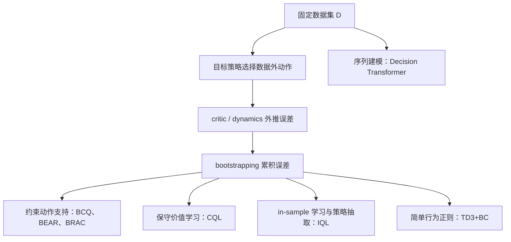

> **一句话结论：** Offline RL 的核心并不是“把 replay buffer 固定下来”，而是在不能重新向环境取样时，阻止策略利用数据外动作的错误高价值。BCQ 约束动作支持，CQL 压低数据外价值，TD3+BC 直接拉近策略与日志动作，IQL 则用 in-sample value learning 加优势加权行为克隆绕开显式 OOD 动作查询。

> **阅读范围：** 目标性检索与方法综述，不宣称系统综述。本文重点阅读经典 model-free Offline RL 工作及 D4RL 基准，不对所有理论算法或最新榜单做穷举。检索与核验日期为 2026-08-19。

## 1. Offline RL 到底改变了什么

Offline reinforcement learning（也称 fixed-dataset 或 batch RL）只允许使用预先收集的数据集

$$
\mathcal D=\{(s_i,a_i,r_i,s'_i,d_i)\}_{i=1}^{N},
$$

训练期间不能执行当前策略取得新样本。数据通常由一个或多个行为策略 $\beta(a\mid s)$ 产生，而目标是从这些日志中学出回报更高的策略 $\pi$。这一设定的权威综述可见 [Levine 等人的 Offline RL Tutorial](https://arxiv.org/abs/2005.01643)。

它与 off-policy 的关系是：

- **Off-policy** 只表示数据策略 $\beta$ 与目标策略 $\pi$ 可以不同；DQN、SAC 即使 off-policy，只要训练中继续收集新数据，仍然是 online RL。
- **Offline** 表示数据集完全固定。策略犯错后不能去环境中补样本，因此普通 off-policy 算法的分布偏移会被放大。
- “可以使用 replay”不等于“可以安全地使用任意固定日志”。[BCQ 原论文](https://proceedings.mlr.press/v97/fujimoto19a.html) 的出发点正是：DQN/DDPG 在固定批数据上会因 extrapolation error 失效。

更完整的强化学习分类关系见站内笔记：[强化学习概述：四组正交分类、优劣与改进路线](/notes/reinforcement-learning-overview/)。

## 2. 根本困难：OOD 动作进入 Bellman backup

标准 actor-critic 的 critic 目标常写成

$$
y=r+\gamma\,\mathbb E_{a'\sim\pi(\cdot\mid s')}
\left[\bar Q(s',a')\right].
$$

若 $a'$ 在数据集的状态 $s'$ 附近几乎没有出现，$Q(s',a')$ 就缺乏直接监督。神经网络仍会输出一个数，策略改进又偏爱最大的数，于是偶然高估的 OOD 动作被选中，并通过 bootstrapping 逐步传播。Offline RL 的典型恶性循环是：

$$
\text{数据外动作}
\rightarrow \text{价值误差}
\rightarrow \text{策略选择该动作}
\rightarrow \text{Bellman 目标继续高估}.
$$

问题不仅是“Q 值过估计”，更准确地说是 **有限数据覆盖、函数逼近和策略改进共同造成的分布偏移**。即使把估计改成平均低估，如果低估排序仍然错误，策略也可能选错动作。

## 3. 最重要的基线：Behavior Cloning

行为克隆（BC）直接把日志动作当监督标签：

$$
\mathcal L_{\mathrm{BC}}(\theta)
=-\mathbb E_{(s,a)\sim\mathcal D}
\left[\log\pi_\theta(a\mid s)\right].
$$

连续确定性策略中也常使用 $\|\pi_\theta(s)-a\|_2^2$。BC 不学习价值函数，因此不会产生 Bellman 外推误差；当数据几乎全是高质量示范时，它往往是非常强且稳定的基线。

但 BC 有三个根本限制：

1. **忽略奖励。** 好动作和坏动作被同等模仿，无法从质量混合的数据中主动筛选更优片段。
2. **序列分布偏移。** 一次小误差可能把策略带到训练数据未覆盖的状态，后续误差继续累积。
3. **多峰动作平均。** 用单峰高斯或 MSE 拟合多种合理动作时，均值动作可能本身不可行。

因此，任何 Offline RL 实验都应先报告 BC。若复杂 RL 方法没有稳定超过 BC，通常应先检查数据质量、终止标记、归一化和评测协议，而不是继续堆模型。

## 4. BCQ：把策略限制在数据支持内

[Batch-Constrained deep Q-learning（BCQ）](https://proceedings.mlr.press/v97/fujimoto19a.html) 是早期代表性方法。它把“策略靠近数据”实现为三部分：

1. 条件 VAE $G_\omega(s)$ 学习行为动作分布并生成候选动作 $a_i$；
2. perturbation model $\xi_\phi(s,a)$ 只允许对候选做幅度受限的小修正；
3. twin critic 在有限候选中选择价值最高的动作。

$$
\tilde a_i=a_i+\xi_\phi(s,a_i),
\qquad
\pi(s)=\arg\max_{\tilde a_i}Q(s,\tilde a_i),
\quad a_i\sim G_\omega(s).
$$

其 target 对 twin Q 的较小值与较大值做保守混合，再在 $n$ 个生成候选中取最大值。关键不是 VAE 本身，而是 **最大化只发生在数据支持附近**。

**优点**

- 机制直观，直接阻止 actor 任意走向未见动作。
- 在连续控制和含噪、质量混合的数据上能够利用奖励优于纯 BC。
- 把“行为支持”与“支持内的策略改进”明确分开。

**局限**

- 需要额外训练行为生成模型；VAE 对高维、多峰动作支持的拟合质量会成为瓶颈。
- 每步要采样多个候选并逐个估值，训练和推理都比简单 actor 更重。
- 支持约束过紧会退化为模仿，过松又重新暴露 OOD 误差。
- 数据没有覆盖的真正优动作仍无法被可靠发现。

官方实现见 [sfujim/BCQ](https://github.com/sfujim/BCQ)。

## 5. BEAR 与 BRAC：用分布距离约束策略

[BEAR](https://proceedings.neurips.cc/paper/2019/hash/c2073ffa77b5357a498057413bb09d3a-Abstract.html) 将 bootstrapping error 明确归因于 backup 使用了数据支持外动作，并用 MMD 约束 learned policy 与行为数据的动作分布。与逐点模仿不同，它试图让策略留在行为分布的支持附近，而不要求复制每个动作的精确概率。

[BRAC](https://openreview.net/forum?id=BJg9hTNKPH) 则给出 behavior-regularized actor-critic 框架，把 KL、MMD、Wasserstein 等分布差异放入 actor 或 critic 目标。抽象形式可写成

$$
\max_\pi\;
\mathbb E_{s\sim\mathcal D,\,a\sim\pi}
\left[Q(s,a)\right]
-\alpha\,
D\!\left(\pi(\cdot\mid s),\beta(\cdot\mid s)\right).
$$

这类方法建立了经典的 **policy constraint** 路线，但实践难点也很明显：行为密度或分布距离本身就要从有限数据估计，且固定的 $\alpha$ 无法同时适配数据丰富区和稀疏区。

## 6. CQL：不限制动作生成器，直接压低数据外价值

[Conservative Q-Learning（CQL）](https://proceedings.neurips.cc/paper/2020/hash/0d2b2061826a5df3221116a5085a6052-Abstract.html) 在 Bellman error 外增加保守正则。离散动作下的常见 CQL(H) 形式是

$$
\begin{aligned}
\min_Q\quad
&\alpha\,
\mathbb E_{s\sim\mathcal D}
\left[
\log\sum_a \exp Q(s,a)
-\mathbb E_{a\sim\beta(\cdot\mid s)}Q(s,a)
\right]\\
&+\frac12\,
\mathbb E_{(s,a,r,s')\sim\mathcal D}
\left[(Q(s,a)-\mathcal B^\pi\bar Q(s,a))^2\right].
\end{aligned}
$$

第一项降低所有可能动作的 Q，同时把数据动作的 Q 拉回来；结果是数据外动作相对更悲观。连续动作中，$\log\int\exp Q(s,a)\,da$ 需要通过当前策略和均匀动作等 proposal 采样近似。

**优点**

- 不必显式拟合行为策略密度，可叠加在离散 Q-learning 或连续 SAC 上。
- 直接处理策略最容易利用的 critic 高估漏洞。
- 在复杂、多模态离线数据上形成了长期使用的强基线。

**局限与严谨表述**

- $\alpha$ 太大时会过度悲观，把优质但稀少的动作也压低；太小时又不足以控制 OOD 误差。
- 连续动作的 log-sum-exp 依赖采样近似，计算开销和 proposal 质量都会影响结果。
- 论文的保守/下界结论依赖具体目标与理论假设，更稳妥的表述是“对策略期望价值形成保守估计”，不能泛化为每个 $(s,a)$ 都是严格逐点下界。
- CQL 仍无法解决完全缺失的状态覆盖，也不能把“悲观”自动转化为部署安全。

官方实现见 [aviralkumar2907/CQL](https://github.com/aviralkumar2907/CQL)。

## 7. TD3+BC：最小改动的强基线

[TD3+BC](https://proceedings.neurips.cc/paper_files/paper/2021/hash/a8166da05c5a094f7dc03724b41886e5-Abstract.html) 只对 TD3 做两项核心改动：状态归一化，并在 actor 目标中加入 BC 项：

$$
\max_\pi\;
\mathbb E_{(s,a)\sim\mathcal D}
\left[
\lambda Q(s,\pi(s))-\|\pi(s)-a\|_2^2
\right].
$$

论文按一个 batch 内 $|Q|$ 的平均尺度归一化 $\lambda$，减轻奖励尺度变化。它说明很多 Offline RL 收益可以来自非常朴素的行为正则，而不一定需要复杂生成模型。

**优点：** 实现短、训练快、容易成为连续控制 sanity check；行为约束与价值优化的权衡非常清楚。

**局限：** 单一全局权重对不同状态的数据密度不自适应；确定性 MSE 容易平均多峰动作；BC 项只直接约束 actor，critic 的 OOD 估值问题仍可能存在；性能对奖励尺度、数据归一化和实现细节敏感。

官方实现见 [sfujim/TD3_BC](https://github.com/sfujim/TD3_BC)。

## 8. IQL：只在数据动作上做动态规划

[Implicit Q-Learning（IQL）](https://openreview.net/forum?id=68n2s9ZJWF8) 的核心是：critic 训练期间不显式查询数据外动作，但仍进行多步价值传播。

### 8.1 Expectile value

定义 expectile loss

$$
L_2^\tau(u)
=\left|\tau-\mathbf 1(u<0)\right|u^2.
$$

用数据动作上的 target Q 拟合状态价值：

$$
\mathcal L_V(\psi)
=\mathbb E_{(s,a)\sim\mathcal D}
\left[
L_2^\tau\bigl(Q_{\hat\theta}(s,a)-V_\psi(s)\bigr)
\right].
$$

当 $\tau>0.5$ 时，高 Q 动作获得更大权重，所以 $V$ 逼近数据动作价值分布的上 expectile。它不是简单的 max，也不是任意 OOD 动作上的最优值。

### 8.2 In-sample Q backup

$$
\mathcal L_Q(\theta)
=\mathbb E_{(s,a,r,s')\sim\mathcal D}
\left[
\left(r+\gamma V_\psi(s')-Q_\theta(s,a)\right)^2
\right].
$$

下一状态只查询 $V(s')$，不需要从当前 actor 采样 $a'\sim\pi(\cdot\mid s')$，因而绕开了 critic 训练中的显式 OOD action query。

### 8.3 Advantage-weighted policy extraction

最后用优势加权行为克隆得到可执行策略：

$$
\max_\phi\;
\mathbb E_{(s,a)\sim\mathcal D}
\left[
\exp\!\left(\beta\,[Q(s,a)-V(s)]\right)
\log\pi_\phi(a\mid s)
\right],
$$

实际实现通常会裁剪指数权重以防数值爆炸。高于当前 expectile baseline 的数据动作被更强地模仿。

**优点**

- 不需要行为生成模型、MMD 或 log-sum-exp OOD 采样，结构简单且计算高效。
- 能通过 Q/V backup “拼接”数据中的优良片段，在 AntMaze 等长时域任务上表现突出。
- actor 单独抽取，便于继续 online fine-tuning。

**局限**

- $\tau$ 和温度 $\beta$ 控制“追求高价值”与“接近数据”的权衡，选错会退化为近似 BC 或过度追逐噪声 Q。
- “无需显式策略约束”不等于没有约束；优势加权 BC 仍把策略隐式限制在数据动作上。
- 稀有高回报动作若是偶然噪声，会被指数权重放大。
- 行为数据不覆盖关键状态或关键动作时，IQL 同样不能凭空恢复最优策略。

官方实现见 [ikostrikov/implicit_q_learning](https://github.com/ikostrikov/implicit_q_learning)。

## 9. AWAC：为 offline-to-online 设计的优势加权回归

[Advantage-Weighted Actor-Critic（AWAC）](https://arxiv.org/abs/2006.09359) 从带 KL 约束的策略改进得到非参数目标

$$
\pi^*(a\mid s)
\propto
\beta(a\mid s)
\exp\!\left(\frac{1}{\lambda}A^{\pi_k}(s,a)\right),
$$

再用数据动作回归近似它：

$$
\max_\theta\;
\mathbb E_{(s,a)\sim\mathcal D}
\left[
\log\pi_\theta(a\mid s)
\exp\!\left(\frac{1}{\lambda}A(s,a)\right)
\right].
$$

它与 IQL 的 actor extraction 很像，但 critic 仍采用普通 off-policy TD；IQL 则专门用 expectile $V$ 重构 critic update，以避免训练期间查询 OOD 动作。AWAC 的主要目标是“先利用离线数据初始化，再快速在线提升”，论文实验也重点覆盖模拟与真实机器人 offline-to-online fine-tuning。

**优点：** 不必显式拟合行为密度，actor 更新简单；从离线阶段切换到在线 replay 很自然。

**局限：** 普通 critic 在纯离线阶段仍可能受 OOD backup 影响；指数优势权重对 critic 误差和温度敏感；一旦进入在线阶段，交互成本和探索安全问题会重新出现。AWAC 当前主要以 arXiv 预印本和[作者项目页](https://awacrl.github.io/)为权威记录，不应写成已正式同行评审会议论文。

## 10. Decision Transformer：把控制改写成条件序列建模

[Decision Transformer](https://proceedings.neurips.cc/paper/2021/hash/7f489f642a0ddb10272b5c31057f0663-Abstract.html) 不做 Bellman backup，而把 return-to-go、状态和动作交错为序列：

$$
(\hat R_1,s_1,a_1,\hat R_2,s_2,a_2,\ldots).
$$

因果 Transformer 在目标回报和历史条件下预测动作。它绕开了 critic 外推与策略梯度，却没有消除离线数据边界：测试时指定的数据外高回报可能没有对应行为证据；序列模型也可能只学习“高回报轨迹长什么样”，未必能可靠完成跨轨迹的动态规划拼接。

因此 DT 更适合作为独立的 **return-conditioned sequence modeling** 路线，而不是 BCQ/CQL/IQL 的同义替代。

## 11. 方法横向比较

| 方法 | OOD 控制发生在哪里 | 是否显式行为模型 | 最强直觉 | 主要代价 |
|---|---|---:|---|---|
| BC | 直接模仿数据动作 | 否 | 不做价值外推 | 忽略奖励，易累积误差 |
| BCQ | 候选动作与 backup | 是，VAE | 只在数据支持内最大化 | 生成模型和候选采样较重 |
| BEAR / BRAC | actor/critic 的分布约束 | 通常需要 | 用距离控制策略偏移 | 距离估计与权重难调 |
| CQL | critic 价值面 | 否 | 主动压低数据外动作 | 可能过度保守，连续动作采样较重 |
| TD3+BC | actor 目标 | 否 | 最小改动实现行为正则 | 全局 BC 权重不自适应 |
| IQL | V/Q backup 与策略抽取 | 否 | critic 只学习数据动作 | expectile/温度敏感，仍受数据支持限制 |
| AWAC | 优势加权 actor 回归 | 否 | 便于 offline-to-online 切换 | 普通 critic 在纯离线阶段仍可能 OOD |
| Decision Transformer | 条件序列分布 | 否 | 不做 Bellman backup | 目标回报 OOD、长序列和数据覆盖问题 |

不能把这张表理解成固定排名。同一算法会随数据质量、覆盖范围、奖励尺度、动作维数和实现细节发生明显变化。[D4RL](https://arxiv.org/abs/2004.07219) 的意义是提供包含 random、medium、expert、replay、human demonstration 和 AntMaze 等不同数据结构的共同测试起点，而不是证明某个方法在所有现实日志上最好。

## 12. 按数据形态选方法

| 数据情况 | 优先尝试 | 原因 | 警告 |
|---|---|---|---|
| 几乎全是高质量示范 | BC、TD3+BC | 简单模仿已很强，价值学习只需小幅改进 | 不要假定 RL 必然超过 BC |
| 质量混合、但支持较宽 | IQL、CQL、TD3+BC | 可利用奖励筛选优动作 | 需要检查 reward 与 timeout |
| 多策略、多峰动作 | IQL + 表达力强的 actor，或支持建模方法 | 单高斯/MSE 会平均模式 | 行为模型也可能漏掉小概率模式 |
| 支持极窄 | BC、强行为约束 | 激进 policy improvement 风险高 | 没有算法能可靠推断完全缺失动作 |
| 长时域“拼接”任务 | IQL、合适的 value-based 方法 | 多步 backup 可传播跨片段价值 | 错误 terminal 会破坏传播 |
| 计划继续在线微调 | IQL、AWAC 等可自然转在线的方法 | 离线初始化后可用新数据纠错 | online 阶段重新引入探索与安全问题 |

## 13. 实践中最容易坏的地方

### 12.1 数据覆盖不足

最根本的解决方案不是换 loss，而是改善数据：增加状态覆盖、保留行为策略信息、记录失败轨迹和终止原因。若关键动作从未出现，保守方法最多告诉策略“不要乱猜”，无法证明另一个动作更好。

### 12.2 `terminated` 与 `truncated` 混淆

真正终止状态不应 bootstrap；因时间上限截断的状态通常仍应 bootstrap。把两者混为一个 `done` 会系统性扭曲 Q，尤其影响长时域任务。

### 12.3 奖励、观测和动作尺度

应明确奖励缩放、observation normalization、action clipping 及不同数据源的传感器定义。TD3+BC、CQL 的正则权重都与价值尺度有关，未经记录的缩放会让复现失去意义。

### 12.4 只看训练 Q，不做策略评估

Offline RL 不能在训练时直接验证新策略。应结合：

- 独立 simulator 或安全沙盒评测；
- Fitted Q Evaluation、importance sampling、Doubly Robust 等 OPE；
- 多随机种子、置信区间和超参数选择协议；
- BC 与行为策略回报基线；
- OOD 状态、动作和不确定性诊断。

OPE 本身也依赖覆盖和模型假设，不能把一个估计分数当作部署保证。

### 12.5 把“离线”误写成“安全”

Offline RL 只避免训练阶段新增环境交互。部署时仍可能遇到日志外状态、错误奖励、传感器漂移和 critic 外推。安全关键系统还需要独立约束、runtime shield、fallback controller 和分阶段上线。

## 14. 一个可靠的实验顺序

1. **审计数据：** 行为策略、轨迹质量、覆盖、终止、奖励与重复样本。
2. **先跑 BC：** 确认数据和评测管线至少能复现日志行为。
3. **再跑简单基线：** TD3+BC 与 IQL；离散动作可选 CQL-DQN。
4. **按失败类型加机制：** 明显 Q 高估再用 CQL，确需显式支持约束再用 BCQ/BEAR。
5. **固定模型选择规则：** 不用测试环境回报偷偷挑 checkpoint。
6. **报告代价与边界：** 不只报告 D4RL normalized score，还报告方差、训练成本和数据假设。
7. **若允许上线：** 从 shadow mode、保守阈值和小规模 offline-to-online 开始。

## 15. 我的思考

Offline RL 的各种经典方法可以统一为一个问题：**策略改进愿意离开数据多远，凭什么相信离开后仍然更好？**

- BC 的回答是“不离开”；
- BCQ/BEAR 的回答是“只在估计的支持内移动”；
- TD3+BC 的回答是“价值收益必须抵消偏离日志的代价”；
- CQL 的回答是“离开数据可以，但 critic 先按悲观价格计费”；
- IQL 的回答是“critic 不看数据外动作，最后只强化数据里相对更好的动作”。

这些设计都没有消除信息论限制：固定数据不能回答它从未观察过的反事实。真正决定 Offline RL 上限的，常常不是算法名字，而是数据覆盖、奖励可信度和部署时能否获得新的纠错信号。

## 16. 参考资料与检索记录

### 核心资料

1. Levine, S., Kumar, A., Tucker, G., Fu, J. *Offline Reinforcement Learning: Tutorial, Review, and Perspectives on Open Problems*. 2020. [arXiv](https://arxiv.org/abs/2005.01643)
2. Fujimoto, S., Meger, D., Precup, D. *Off-Policy Deep Reinforcement Learning without Exploration*. ICML 2019. [PMLR](https://proceedings.mlr.press/v97/fujimoto19a.html)
3. Kumar, A. et al. *Stabilizing Off-Policy Q-Learning via Bootstrapping Error Reduction*. NeurIPS 2019. [NeurIPS](https://proceedings.neurips.cc/paper/2019/hash/c2073ffa77b5357a498057413bb09d3a-Abstract.html)
4. Wu, Y., Tucker, G., Nachum, O. *Behavior Regularized Offline Reinforcement Learning*. arXiv preprint / ICLR 2020 OpenReview submission, 2019. [arXiv](https://arxiv.org/abs/1911.11361)；[OpenReview](https://openreview.net/forum?id=BJg9hTNKPH)
5. Kumar, A. et al. *Conservative Q-Learning for Offline Reinforcement Learning*. NeurIPS 2020. [NeurIPS](https://proceedings.neurips.cc/paper/2020/hash/0d2b2061826a5df3221116a5085a6052-Abstract.html)
6. Fujimoto, S., Gu, S. *A Minimalist Approach to Offline Reinforcement Learning*. NeurIPS 2021. [NeurIPS](https://proceedings.neurips.cc/paper_files/paper/2021/hash/a8166da05c5a094f7dc03724b41886e5-Abstract.html)
7. Kostrikov, I., Nair, A., Levine, S. *Offline Reinforcement Learning with Implicit Q-Learning*. ICLR 2022. [OpenReview](https://openreview.net/forum?id=68n2s9ZJWF8)
8. Chen, L. et al. *Decision Transformer: Reinforcement Learning via Sequence Modeling*. NeurIPS 2021. [NeurIPS](https://proceedings.neurips.cc/paper/2021/hash/7f489f642a0ddb10272b5c31057f0663-Abstract.html)
9. Nair, A. et al. *AWAC: Accelerating Online Reinforcement Learning with Offline Datasets*. 2020. [arXiv](https://arxiv.org/abs/2006.09359)
10. Fu, J. et al. *D4RL: Datasets for Deep Data-Driven Reinforcement Learning*. 2020. [arXiv](https://arxiv.org/abs/2004.07219)

### 检索审计

- 数据源：PMLR、NeurIPS Proceedings、OpenReview、arXiv 及作者官方代码仓库。
- 检索式包括：`offline RL BCQ extrapolation error`、`CQL conservative Q-learning`、`IQL expectile value`、`TD3+BC minimalist offline RL`、`BEAR BRAC behavior regularization`。
- 纳入：奠定主要算法路线、能直接解释数据支持与分布偏移的论文。
- 排除：只在单一新 benchmark 上增加模块、与本文核心机制重复或仅有第三方解读的工作。
- 阅读状态：上述核心方法的公开全文均已读取，公式与主要边界回到正式论文或作者版本核对。
- 出版状态：BCQ、BEAR、CQL、TD3+BC、Decision Transformer 为正式会议论文；IQL 为 ICLR 2022 正式论文；BRAC 与 AWAC 按预印本/公开投稿材料记录；综述与 D4RL 使用 arXiv 版本。
- DOI：上述 PMLR、NeurIPS、OpenReview 与 arXiv 官方记录大多未分配会议论文 DOI；本文不以 arXiv DataCite DOI 冒充正式 venue DOI，统一链接权威落地页。
