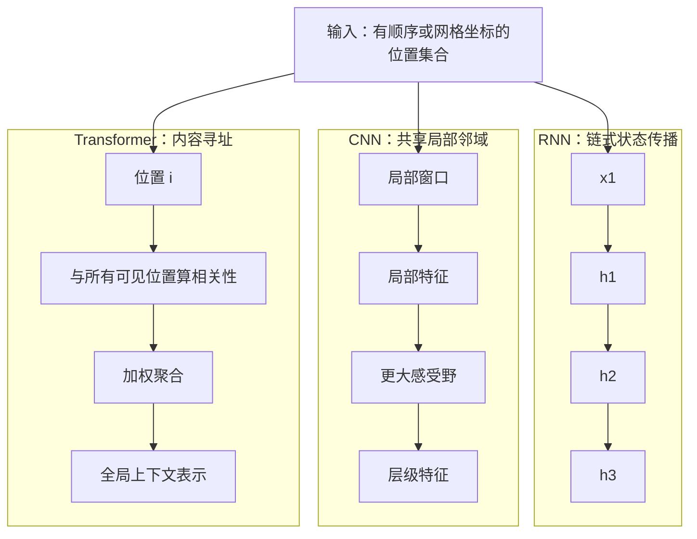
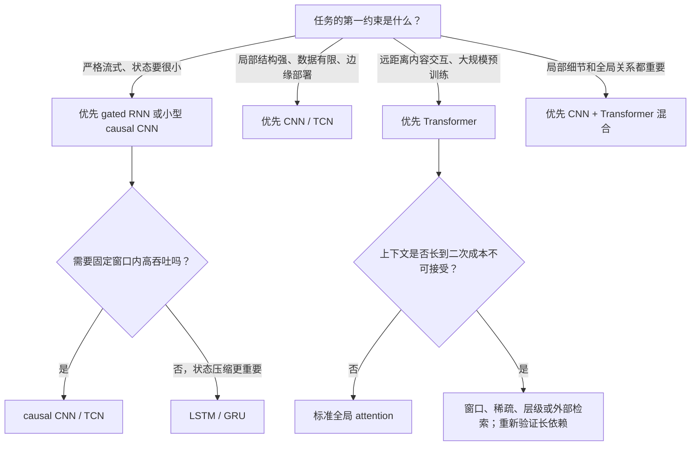

> **一句话结论：** RNN 用一个随时间递推的状态压缩过去，CNN 用共享局部核逐层扩大感受野，Transformer 用数据相关的注意力直接连接位置。三者的真正差别是**连接图、信息路径与归纳偏置**；输入是文本、图像还是时序信号，并不能单独决定架构。

> **比较口径：** 本文比较的是三类基本计算骨架，而不是某三个具体模型。复杂度默认序列或网格共有 $n$ 个位置、通道宽度为 $d$；卷积核含 $\kappa$ 个空间位置，一维宽度为 $k$ 时 $\kappa=k$，二维 $k\times k$ 时 $\kappa=k^2$。实际速度还受 batch、算子融合、稀疏性、缓存、硬件和实现影响。

## 1. 先用一张图看懂三种信息传播方式

可以把神经网络的一层统一看成**在位置图上收集消息**：位置集合为 $\Omega$，允许的信息边为 $\mathcal E$。对位置 $i$，一般形式是

$$
h_i^{(\ell+1)}
=\Phi^{(\ell)}
\left(
h_i^{(\ell)},
\operatorname{AGG}
\left\{
m_{ij}^{(\ell)}:j\in\mathcal N(i)
\right\}
\right).
$$

三类架构主要改变三件事：

1. **邻居是谁**：前一个状态、固定局部窗口，还是所有可见位置；
2. **边权怎样来**：共享转移矩阵、固定卷积参数，还是由当前输入动态计算；
3. **远处信息要走几步**：沿时间链逐步传递、跨多层卷积传播，或一次全局注意力直达。

这也是统一序列和网格视角的关键。一维时间序列、文本 token、图像像素、二维 patch 都只是带坐标的位置集合；CNN 也能做序列，Transformer 也能做图像，RNN 甚至可以按扫描顺序处理网格。

## 2. RNN：用递归状态把过去压进现在

### 2.1 核心计算

最基本的 Elman RNN 写作

$$
h_t=\phi(W_xx_t+W_hh_{t-1}+b_h),
\qquad
y_t=\psi(W_yh_t+b_y).
$$

$h_t$ 同时承担两种角色：当前输出的特征，以及传给下一时刻的记忆。参数 $W_x,W_h$ 在所有时刻共享，所以模型学习的是一个反复应用的状态转移。Elman 的早期工作正是通过把隐藏状态反馈到下一时刻，让内部表示随先前上下文变化。[Elman, 1990](https://doi.org/10.1207/s15516709cog1402_1)

若做因果序列预测，$h_t$ 只能包含 $x_{1:t}$；若整个输入已知，可使用双向 RNN，把正向状态与反向状态拼接：

$$
h_t=\left[\overrightarrow h_t;\overleftarrow h_t\right].
$$

双向并不适用于必须实时输出的严格流式场景，因为反向状态需要看到未来输入。

### 2.2 为什么普通 RNN 难学长依赖

反向传播穿过多个时刻时，梯度包含许多 Jacobian 的连乘：

$$
\frac{\partial h_t}{\partial h_{t-q}}
=
\prod_{j=t-q+1}^{t}
\frac{\partial h_j}{\partial h_{j-1}}.
$$

若这些因子的谱尺度长期小于 1，梯度指数衰减；大于 1 则可能爆炸。即使数值稳定，固定维度的 $h_t$ 也要把所有相关历史压缩进同一状态，形成**状态瓶颈**。

LSTM 通过门控和独立 cell state 建立更平滑的记忆路径。常见形式为

$$
\begin{aligned}
i_t&=\sigma(W_i[x_t,h_{t-1}]+b_i),\\
f_t&=\sigma(W_f[x_t,h_{t-1}]+b_f),\\
o_t&=\sigma(W_o[x_t,h_{t-1}]+b_o),\\
\tilde c_t&=\tanh(W_c[x_t,h_{t-1}]+b_c),\\
c_t&=f_t\odot c_{t-1}+i_t\odot\tilde c_t,\\
h_t&=o_t\odot\tanh(c_t).
\end{aligned}
$$

$f_t$ 控制保留旧记忆，$i_t$ 控制写入，$o_t$ 控制读出。原始 LSTM 论文针对的正是循环反向传播中不足、衰减的误差信号，并用门控维持长时间的信息流。[Hochreiter & Schmidhuber, 1997](https://direct.mit.edu/neco/article/9/8/1735/6109/Long-Short-Term-Memory)

门控缓解而不消除长依赖问题：长期记忆仍受状态维度、训练数据、截断反向传播和门饱和影响。

### 2.3 RNN 的归纳偏置

- **顺序优先**：第 $t$ 步天然依赖第 $t-1$ 步，时间顺序直接写进计算图；
- **状态压缩**：历史必须经过 $h_t$ 这条有限带宽通道；
- **时间共享**：同一个状态转移在所有时刻复用，适合平稳动力学与流式信号；
- **可变长度自然**：只要不断递推，理论上可处理任意长度；但训练长度外能否保持记忆是另一个问题。

### 2.4 优点、失败模式与修补

| 优点 | 代价或失败模式 | 常见修补 |
|---|---|---|
| 严格因果、天然适合逐样本流式更新 | 时间维串行，训练难充分利用 GPU/TPU | batch 并行、层内融合；特殊线性递归可做 parallel scan，但普通非线性 RNN 不能一般化地消除依赖链 |
| 部署时只保留固定维度状态，缓存小 | 固定状态会遗忘细节，长历史被压缩 | LSTM/GRU、外部记忆、attention、增大状态或分层时间尺度 |
| 参数不随序列长度增长 | 梯度消失/爆炸、门饱和 | 门控、梯度裁剪、残差、归一化、正交初始化 |
| 每来一个输入即可立即给出新状态 | 误差和状态污染会逐步累积 | reset/校准机制、teacher forcing 调度、状态监控 |
| 对小数据和低功耗时序任务常有竞争力 | 隐藏状态不易解释，吞吐受 sequential dependency 限制 | 可视化门值、辅助监督或改用 causal CNN |

### 2.5 典型变体

- **Elman / vanilla RNN**：最简单的递归状态；
- **LSTM、GRU**：用门控制记忆写入与遗忘；
- **bidirectional RNN**：离线编码时同时读左右上下文；
- **stacked / hierarchical RNN**：不同层或时间尺度建模；
- **RNN + attention**：保留递归 decoder，同时允许直接回看 encoder 状态；
- **ConvLSTM**：把状态转移里的全连接替换为卷积，保留空间网格。

## 3. CNN：用共享局部核构造层级感受野

### 3.1 一维和二维卷积是同一个思想

对一维序列，卷积可写成

$$
y_t
=\sigma\left(
\sum_{r\in\mathcal K}W_r x_{t+r}+b
\right).
$$

对二维网格，只需把偏移 $r$ 换成二维偏移 $(u,v)$：

$$
y_{i,j}
=\sigma\left(
\sum_{(u,v)\in\mathcal K}
W_{u,v}x_{i+u,j+v}+b
\right).
$$

同一组 $W_r$ 在每个位置复用，带来平移等变性：输入平移，特征也相应平移。边界 padding、stride、位置相关模块和数据处理会破坏严格等变；加入全局池化后才可能进一步得到近似平移不变的分类表示。

LeNet-5 展示了卷积、下采样和端到端梯度学习在文档识别中的经典组合。[LeCun et al., 1998](https://doi.org/10.1109/5.726791) 后来的 ResNet 用

$$
y=F(x)+x
$$

让深层网络学习残差并提供短梯度路径，主要解决“网络加深后优化反而退化”，不是把卷积换成另一种运算。[He et al., CVPR 2016](https://openaccess.thecvf.com/content_cvpr_2016/html/He_Deep_Residual_Learning_CVPR_2016_paper.html)

### 3.2 感受野怎样增长

若一维 stride 为 1、每层核宽 $k$、没有 dilation，堆叠 $L$ 层后的理论感受野为

$$
R_L=1+L(k-1).
$$

若第 $\ell$ 层 dilation 为 $q_\ell$，则

$$
R_L=1+\sum_{\ell=1}^{L}(k-1)q_\ell.
$$

令 $q_\ell=2^{\ell-1}$，感受野会随深度指数扩大。Temporal Convolutional Network（TCN）通常组合**因果卷积、扩张卷积、残差块和固定长度 receptive field**，把 CNN 用到序列建模。Bai 等人的系统比较报告，其通用 TCN 在所测多项序列任务上优于典型 LSTM，并显示更长的有效记忆；这是特定基准的经验结论，不是 CNN 对所有序列任务的普遍定理。[Bai, Kolter & Koltun, 2018](https://arxiv.org/abs/1803.01271)

理论感受野也不等于有效感受野：远处位置虽然数学上可达，训练后对输出的实际贡献仍可能很小。

### 3.3 CNN 的归纳偏置

- **局部性**：近邻先交互，适合边缘、纹理、局部波形和短期模式；
- **权重共享**：同一个模式可以出现在不同位置；
- **层级组合**：浅层局部特征逐层组合成大范围结构；
- **固定连接图**：边由坐标邻域决定，不会因为当前内容而动态跳到远处。

这组偏置在数据较少、局部统计稳定时很有价值；若绝对位置、跨远距离配对或非局部关系才是核心，偏置也可能成为限制。

### 3.4 优点、失败模式与修补

| 优点 | 代价或失败模式 | 常见修补 |
|---|---|---|
| 所有位置可并行卷积，硬件内核成熟 | 固定感受野外的信息不可达 | 加深、dilation、下采样、多尺度、global pooling 或 attention |
| 局部与平移等变偏置带来较高数据效率 | 绝对位置和长距离对象关系表达较间接 | 坐标通道、位置编码、非局部块、Transformer stage |
| 计算随位置数近似线性 | 稠密通道卷积的 $d^2$ 成本仍高 | depthwise separable、group convolution、bottleneck |
| 可用 stride/pooling 逐步压缩网格 | 下采样丢细节、产生 aliasing | anti-aliasing、skip connection、U-Net 式多尺度融合 |
| 因果卷积可流式并缓存有限历史 | dilation 可能出现 gridding，固定窗口忘记更久历史 | 混合 dilation、残差、多尺度 kernel 或递归/attention memory |
| 邻域结构清楚、部署延迟可预测 | padding 会产生边界伪影 | 合理 padding、有效区域裁剪、反射 padding |

### 3.5 典型变体

- **LeNet / AlexNet / VGG**：从浅层文档识别到深层视觉卷积；
- **ResNet**：残差连接让深网络更易优化；
- **dilated / atrous CNN**：不额外下采样而扩大感受野；
- **depthwise separable CNN**：拆分空间和通道混合，降低计算；
- **TCN / WaveNet 风格 causal CNN**：面向序列生成与预测；
- **U-Net / feature pyramid**：融合多个分辨率，兼顾语义和定位。

## 4. Transformer：让每个位置按内容选择信息源

### 4.1 核心计算

给定 $X\in\mathbb R^{n\times d}$，单头 scaled dot-product attention 为

$$
Q=XW_Q,
\qquad
K=XW_K,
\qquad
V=XW_V,
$$

$$
\operatorname{Attn}(Q,K,V)
=
\operatorname{softmax}
\left(
\frac{QK^\top}{\sqrt{d_h}}+M
\right)V.
$$

$M$ 决定哪些边可见：encoder 常允许双向读取；自回归 decoder 使用因果掩码，使位置 $t$ 不能读取未来 token。多头注意力让不同子空间拥有不同的寻址模式，再经位置前馈网络、残差和归一化更新表示。

原始 Transformer 是 encoder–decoder 序列转换模型，用 self-attention 取代循环和卷积，并强调训练时可以并行处理已知序列。[Vaswani et al., NeurIPS 2017](https://proceedings.neurips.cc/paper_files/paper/2017/hash/3f5ee243547dee91fbd053c1c4a845aa-Abstract.html)

### 4.2 为什么必须处理位置

不加入位置特征时，双向 self-attention 对输入排列是 permutation-equivariant：它知道 token 内容，却不能从连接图本身区分“前一个”和“后一个”。因此通常加入绝对位置 embedding、正弦位置编码、相对位置 bias 或旋转位置编码。

因果 mask 已编码“只能看过去”的偏序，但仍不能充分表达具体距离和相对位置；现代 causal Transformer 仍需要位置机制。位置表示还决定了训练长度外外推是否可靠，不能把“支持更长输入”与“会正确使用更长输入”混为一谈。

### 4.3 Transformer 的归纳偏置

- **内容寻址**：连接强度由当前 query 与 key 决定，同一层可动态选择不同信息源；
- **全局连接**：标准 self-attention 中任意两个可见位置一层即可交互；
- **弱局部先验**：不像卷积默认偏爱邻居，通常更依赖数据量、预训练和位置设计；
- **集合式计算骨架**：位置关系由 embedding/mask 注入，因此容易适配文本、图像 patch、音频帧和多模态 token。

### 4.4 优点、失败模式与修补

| 优点 | 代价或失败模式 | 常见修补 |
|---|---|---|
| 已知输入的所有位置可并行训练 | 标准 attention 的分数矩阵随 $n^2$ 增长 | FlashAttention 降低显存读写；local/sparse/linear attention 改变连接或算法，但需核对数学语义 |
| 全局位置间路径短，适合非局部关系 | 全局可见不等于一定学会长依赖，模型会忽略或混淆远处证据 | 长上下文训练、检索、层级/局部-全局结构、专门评测 |
| 动态寻址，能按内容重组信息 | 局部和平移先验较弱，小数据时可能不如 CNN | patch stem、卷积位置编码、数据增强、预训练 |
| 统一 token 接口，容易扩展到多模态 | 位置编码、tokenization 和尺度选择会成为新瓶颈 | relative position、RoPE、多尺度 token、混合 CNN |
| 大规模预训练和并行硬件生态成熟 | 自回归输出仍逐 token 串行，长上下文 KV cache 大 | KV cache、MQA/GQA、量化、speculative decoding、paged cache |
| attention 权重可检查 | attention weight 不等于因果解释 | ablation、counterfactual、归因和行为测试 |

### 4.5 典型变体

- **encoder-only**：双向表示、分类、抽取和检索；
- **decoder-only**：因果 next-token prediction 和开放式生成；
- **encoder–decoder**：输入编码与条件输出显式分工；
- **local / window / sparse Transformer**：减少全局二次成本；
- **linear attention**：借核函数或状态重排降低复杂度，但稳定性和表达与标准 softmax attention 不一定等价；
- **vision Transformer 与层级 Transformer**：把像素或 patch token 化，并引入多尺度或窗口；
- **MoE Transformer**：增加参数容量但让每个 token 只激活部分专家；它解决参数计算分配，不直接解决 $n^2$ attention。

## 5. 一张表对齐核心差异

| 维度 | RNN | CNN | Transformer |
|---|---|---|---|
| 基本连接 | $h_{t-1}\rightarrow h_t$ 的链 | 固定局部邻域 | 由 query–key 内容动态加权的可见位置 |
| 顺序/坐标来源 | 递推顺序天然给出 | kernel offset 与网格布局 | 需位置表示；因果任务另加 mask |
| 核心归纳偏置 | 时间连续、状态压缩、转移共享 | 局部、平移等变、层级组合 | 内容寻址、全局交互、较弱局部先验 |
| 最大远距信息路径 | 最坏 $O(n)$ | 普通宽 $k$ 的局部卷积约 $O(n/(k-1))$；指数 dilation 可到 $O(\log n)$ | 全局 attention 为 $O(1)$；窗口 attention 会增长 |
| 已知序列训练 | 时间维串行 | 位置并行 | 位置并行 |
| 完整输入编码推理 | 时间维串行 | 位置并行 | 位置并行 |
| 自回归输出 | 串行，保留 recurrent state | 串行，缓存各层历史激活 | 串行，缓存 K/V；attention 内部仍并行 |
| 长依赖主要障碍 | 梯度连乘与固定状态瓶颈 | 有限/稀疏感受野 | 二次成本、位置外推和有效利用不足 |
| 小数据/强局部任务 | 可强，尤其低维时序 | 通常很强 | 往往更依赖预训练或正则 |
| 流式缓存 | 小，通常每层 $O(d)$ | 有界，取决于 kernel/dilation/depth | 标准全历史 KV 每层 $O(nd)$ |
| 典型强项 | 在线状态估计、低延迟传感器、短模型 | 图像、局部时序、边缘部署 | 大规模语言、多模态、全局关系 |

“最大路径短”只是梯度和信息更容易到达的结构条件，不是有效长期记忆的保证；“训练并行”也不等于自回归生成可以并行。

## 6. 复杂度和内存：先写清假设再比较

设单层输入有 $n$ 个位置、输入输出宽度均为 $d$，忽略 bias、激活函数、小常数和 batch。稠密实现的量级为：

| 架构 | 单层主要计算 | 训练顺序深度 | 训练激活的典型量级 | 流式/自回归缓存 |
|---|---:|---:|---:|---:|
| vanilla RNN | $O(nd^2)$ | $O(n)$ | $O(nd)$；BPTT 要保留时序状态 | 每层 $O(d)$ |
| 稠密 CNN | $O(\kappa nd^2)$ | 每层对位置为 $O(1)$ | $O(nd)$ | causal 模式保留有限层级历史 |
| 全局 Transformer | $O(nd^2+n^2d)$ | 每层对位置为 $O(1)$ | 朴素 attention 含 $O(n^2)$ 分数/概率，加 $O(nd)$ 表示 | 每层 K/V 为 $O(nd)$ |

### 6.1 不能只背“大 O”

- 当 $n\ll d$ 时，Transformer 的 $nd^2$ 投影/FFN 可能比 $n^2d$ 更贵；长上下文时二次项才主导。
- CNN 使用 depthwise separable convolution 后，空间卷积可从近似 $O(\kappa nd^2)$ 降为 $O(\kappa nd+nd^2)$。
- LSTM 每步有多组门，仍是 $O(nd^2)$ 量级，但常数明显高于 vanilla RNN。
- FlashAttention 可以避免把完整 attention matrix 反复写回高带宽显存，显著降低实际内存和 IO；它不把标准全局 softmax attention 的算术依赖从二次改成线性。
- 推理内存必须区分**一次性编码**与**持续生成**。分类模型前向结束后可释放激活；decoder-only Transformer 为继续生成要长期保留每层 KV。

### 6.2 自回归解码为什么三者都串行

若概率分解为

$$
p(y_{1:m}\mid x)
=\prod_{t=1}^{m}p(y_t\mid y_{<t},x),
$$

则在不知道 $y_t$ 前不能精确计算依赖它的 $y_{t+1}$。因此：

- RNN 每步更新一个固定状态；
- causal CNN 每步更新各层的有限历史缓存；
- Transformer 每步新增一组 K/V，让新 query 读取历史 KV。

Transformer 的训练可以把真实的 $y_{1:m}$ 右移后一次并行计算，这是 teacher forcing 已知目标的结果，不代表部署时可以同时生成未知 token。

## 7. 长依赖：路径长度、记忆容量和计算预算是三回事

### 7.1 RNN：路径长且经过同一瓶颈

位置 1 的信息影响位置 $n$，要依次穿过 $n-1$ 次状态转移。LSTM 改善梯度路径，但若 cell 没学会保留、状态容量不足或 BPTT 被截断，长期信息仍会丢失。

### 7.2 CNN：路径可控，但必须进入感受野

普通小核 CNN 要靠很多层连接远端；dilation、stride 和多尺度可缩短路径。代价是感受野边界固定，dilation 的采样格可能漏掉局部连续结构，且网络要学会把远处信号逐层路由到目标位置。

### 7.3 Transformer：结构上直达，资源上昂贵

全局 attention 允许任意两个位置一层直连，因此原始论文的复杂度表把最大路径长度写为常数。[Transformer 论文 Table 1](https://proceedings.neurips.cc/paper/7181-attention-is-all-you-need.pdf) 但当 $n$ 很大时，二次 attention 和 KV cache 限制可见长度；即使塞得进窗口，模型也可能出现位置偏置、干扰或检索失败。

所以“适合长依赖”至少要拆成：

1. 理论连接图是否可达；
2. 训练时梯度能否稳定到达；
3. 模型容量是否保留信息；
4. 计算和内存是否允许足够长的上下文；
5. 训练数据是否教会模型在长距离上正确取证。

## 8. 如何选型：先问约束，再问流行度

### 8.1 典型场景

| 场景 | 首选起点 | 原因 | 何时换方案 |
|---|---|---|---|
| 微控制器上的连续传感器状态估计 | GRU/LSTM 或轻量 causal CNN | 状态/缓存有界，单步延迟低 | 长历史中要精确回查某事件时，加 attention 或外部 memory |
| 小中型图像数据集 | ResNet 类 CNN | 局部和平移偏置带来数据效率，部署成熟 | 有大规模预训练、需要跨区域关系或多模态统一接口时用 ViT/hybrid |
| 高采样率时序分类 | TCN / 1D CNN | 训练和整段推理并行，局部波形强 | 依赖不规则远端事件或要动态检索时加 attention |
| 大规模语言建模与开放生成 | decoder-only Transformer | token 接口统一、扩展和预训练生态成熟 | 极低功耗流式或超长上下文受限时考虑混合/受限 attention |
| 输入输出长度差异大的条件生成 | encoder–decoder Transformer | 双向读输入、因果写输出分工清楚 | 输入局部模式极强时在 encoder 加卷积前端 |
| 视频、语音、机器人感知 | 混合架构常更合理 | 局部时空特征与全局语义同时存在 | 先做消融确认每个模块确有收益，避免无目的堆叠 |

### 8.2 选型时必须回答的十个问题

1. 输入在训练和部署时是完整可见，还是逐步到达？
2. 输出是一次性分类/回归，还是严格自回归生成？
3. 相关依赖的典型距离和最坏距离是多少？
4. 局部平移等变是否合理，还是绝对位置很重要？
5. 数据量是否足以让弱归纳偏置模型学出结构？
6. 主要瓶颈是 FLOPs、显存、内存带宽、端到端延迟还是能耗？
7. 上下文必须无损保留，还是允许压缩成状态？
8. 任务能否容忍固定 receptive field？
9. 部署硬件对 convolution、matrix multiply、attention kernel 的支持怎样？
10. 质量提升是否来自架构本身，还是更大预训练数据、参数或计算预算？

最后一问尤其重要。不同论文的 RNN、CNN、Transformer 若参数量、tokenization、训练数据和优化预算不同，不能把最终指标差异全部归因于骨架。

## 9. 混合架构：把偏置放在最需要的位置

三类结构不是三选一。常见组合包括：

### 9.1 CNN 前端 + Transformer 主干

卷积先处理高分辨率局部信号、下采样并形成稳定 token，Transformer 再做全局交互。图像、语音和视频常采用这一思路：

$$
X_{\mathrm{raw}}
\xrightarrow{\mathrm{CNN\ stem}}
Z_{1:m}
\xrightarrow{\mathrm{Transformer}}
H_{1:m}.
$$

优点是减少 token 数并注入局部偏置；风险是前端过早下采样会丢掉细粒度信息。

### 9.2 CNN / TCN + RNN

CNN 抽取短窗口模式，RNN 汇总跨窗口动态：

$$
z_t=\operatorname{CNN}(x_{t-w:t}),
\qquad
h_t=\operatorname{RNN}(z_t,h_{t-1}).
$$

适合局部波形明确、又需要在线状态的任务。两级压缩也可能叠加信息损失。

### 9.3 RNN + attention

RNN 保留因果状态和低成本逐步解码，attention 允许在需要时回看全部 encoder states 或外部记忆。这是从纯 recurrent seq2seq 走向 Transformer 的重要中间路线，也适合在固定状态之外提供可寻址证据。

### 9.4 局部 attention + 全局 recurrent memory

窗口 attention 处理块内细节，少量 recurrent/global token 在块间传递摘要，可把二次成本限制在局部。代价是块间信息再次经过压缩瓶颈，需要专门测试跨块检索。

### 9.5 Transformer block 中加入卷积

把 depthwise convolution 放进 attention 或 FFN 旁边，可以补局部和平移偏置；反过来，在 CNN stage 间插入 attention，可补全局关系。混合的正确评估方式不是看参数更多后是否变好，而是控制参数量、FLOPs、训练数据和延迟做消融。

## 10. 常见误区

1. **“RNN 能处理任意长度，所以一定擅长长依赖。”** 可运行长度不等于有效记忆长度。
2. **“CNN 只能做图像。”** 一维 causal/dilated CNN 是成熟的序列模型。
3. **“Transformer 完全没有顺序。”** 顺序由位置编码和 mask 注入；没有这些机制的双向 self-attention 才近似把输入当集合。
4. **“Transformer 推理是并行的。”** 完整输入编码可并行；自回归生成的输出步仍串行。
5. **“attention 是 $O(n^2)$，所以 Transformer 所有计算都是二次。”** 投影和 FFN 为 $O(nd^2)$；哪个主导取决于 $n$ 与 $d$。
6. **“FlashAttention 把 attention 变成线性复杂度。”** 它主要优化 IO 和中间存储，标准全局 attention 的两两相互作用仍在。
7. **“CNN 平移不变。”** 卷积首先是平移等变；池化、分类头等才可能产生不变性。
8. **“LSTM 已经解决梯度消失。”** 它提供更好的门控记忆路径，不保证任意长度、任意任务都能保留信息。
9. **“最大路径长度决定一切。”** 路径短只是一项结构指标，还要考虑信号选择、优化、容量和预算。
10. **“最新架构一定适合小数据和边缘硬件。”** 强归纳偏置、成熟 kernel 与有界状态常比模型潮流更重要。

## 11. 最后用三句话记忆

- **RNN：** 把过去压成状态；流式省缓存，但时间串行且可能遗忘。
- **CNN：** 把邻域逐层组合；局部高效且数据友好，但远依赖必须穿过感受野。
- **Transformer：** 按内容直接寻址；训练并行、全局路径短，但标准 attention 和 KV cache 随上下文变贵。

工程上最可靠的选择通常不是先问“哪一个最强”，而是先确定信息需要走多远、何时可见、允许保存多少状态，以及部署硬件擅长什么。

## 参考文献

1. Elman, J. L. (1990). *Finding Structure in Time*. Cognitive Science, 14(2), 179–211. [DOI / 出版页面](https://doi.org/10.1207/s15516709cog1402_1)
2. Hochreiter, S., & Schmidhuber, J. (1997). *Long Short-Term Memory*. Neural Computation, 9(8), 1735–1780. [MIT Press](https://direct.mit.edu/neco/article/9/8/1735/6109/Long-Short-Term-Memory) · [DOI](https://doi.org/10.1162/neco.1997.9.8.1735)
3. LeCun, Y., Bottou, L., Bengio, Y., & Haffner, P. (1998). *Gradient-Based Learning Applied to Document Recognition*. Proceedings of the IEEE, 86(11), 2278–2324. [DOI / IEEE Xplore](https://doi.org/10.1109/5.726791)
4. He, K., Zhang, X., Ren, S., & Sun, J. (2016). *Deep Residual Learning for Image Recognition*. CVPR 2016, 770–778. [CVF 正式页面](https://openaccess.thecvf.com/content_cvpr_2016/html/He_Deep_Residual_Learning_CVPR_2016_paper.html)
5. Bai, S., Kolter, J. Z., & Koltun, V. (2018). *An Empirical Evaluation of Generic Convolutional and Recurrent Networks for Sequence Modeling*. arXiv:1803.01271. [arXiv](https://arxiv.org/abs/1803.01271)
6. Vaswani, A., Shazeer, N., Parmar, N., Uszkoreit, J., Jones, L., Gomez, A. N., Kaiser, Ł., & Polosukhin, I. (2017). *Attention Is All You Need*. Advances in Neural Information Processing Systems 30. [NeurIPS 正式页面](https://proceedings.neurips.cc/paper_files/paper/2017/hash/3f5ee243547dee91fbd053c1c4a845aa-Abstract.html) · [正式 PDF](https://proceedings.neurips.cc/paper/7181-attention-is-all-you-need.pdf)
