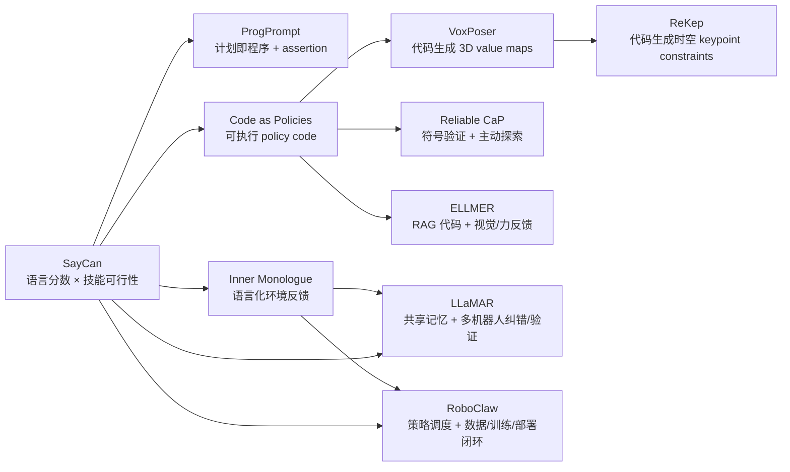
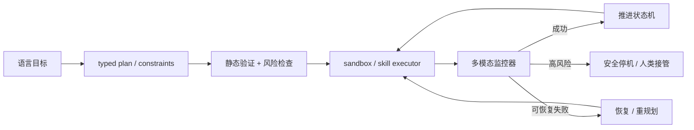

> **阅读范围**：定向检索并全文精读 10 篇代表性论文及可获得的附录/补充材料，同时核验官方项目与代码；每篇另有独立中文精读笔记。 
> **检索日期**：2026-08-19 
> **综述性质**：机制导向的代表性综述，不是穷尽式系统综述或统计元分析。 
> **核心判断**：具身 agent 的关键进步不是把自然语言直接变成更长文本，而是逐步建立“可执行中间表示—物理 grounding—执行反馈—恢复/学习”闭环；代码只是其中一种中间表示，RoboClaw 代表的生命周期 agent 已进一步转向调度学习到的策略并让部署经验回流。

## 核心结论

从 SayCan 到 RoboClaw，可以看到五次主要抽象迁移：

1. **从语言合理性到物理可行性。** SayCan 不让 LLM 单独决定下一项技能，而把语言模型对任务步骤的先验与机器人 value/affordance 分数相乘，建立“应该做”与“做得到”的联合排序。
2. **从技能名称到可执行程序。** ProgPrompt 把任务计划写成带 API、注释与 assertion 的 Python 风格程序；Code as Policies 进一步让 LLM 生成包含感知查询、数学运算、控制流与递归函数定义的 policy code。
3. **从单体计划到部分可观测的多机器人协作。** LLaMAR 用共享文本记忆、开放/已完成子任务集合和联合高层动作，把长时程任务分解、动态角色分配、失败修正与完成验证放进集中式 Plan–Act–Correct–Verify 循环。
4. **从一次生成到环境闭环。** Inner Monologue 把成功检测、场景描述和人类反馈重新写入语言上下文；Reliable Code-as-Policies 则显式加入符号验证和主动信息收集，处理动态、部分可观测环境。
5. **从动作调用到空间目标与生命周期管理。** VoxPoser 和 ReKep 让模型生成可由优化器求解的 3D value map 或关键点约束；ELLMER 用 RAG 检索代码示例并接入力/视觉闭环；RoboClaw 不以生成 Python 为中心，而让同一个 VLM agent 管理自复位数据采集、策略训练和长时程技能编排。

这些工作共同说明：LLM/VLM 最适合承担的是**语义分解、组合与中间表示生成**，而几何、动力学、稳定控制和安全仍主要由感知模块、优化器、技能策略、VLA 或低层控制器承担。因而“LLM 控制机器人”通常不等于 LLM 直接输出电机命令。

证据边界也必须保留：十篇论文跨 VirtualHome、AI2-THOR、搜索救援网格世界、RLBench、桌面机械臂、移动操作和不同真实场景，成功率没有统一分母、任务难度、传感器或人工干预协议；不能把它们排成一个总榜。多数工作依赖闭源 LLM/VLM、手工 API/技能库和受控环境，代码可执行也不等于物理安全。

## 检索记录

### 检索策略

- **概念查询**：`embodied agent code as policy robot`、`LLM generated robot code closed loop`、`robot agent skill API planning feedback`、`VLM agent long-horizon manipulation policy orchestration`、`multi-agent robot long-horizon partial observability`。
- **准确题名查询**：RoboClaw、Code as Policies、ProgPrompt、SayCan、Inner Monologue、VoxPoser、LLaMAR、ReKep、Towards Reliable Code-as-Policies、ELLMER。
- **一手来源**：IEEE/ICRA、PMLR/CoRL、Springer、OpenReview、NeurIPS proceedings、Nature Machine Intelligence、arXiv、作者项目页与官方 GitHub。
- **纳入标准**：LLM/VLM 在部署或任务生成环节显式承担规划、代码/约束生成、技能调用、验证、反馈修复或生命周期编排；论文必须包含可核验实验，且全文可获得。
- **排除与降级**：普通端到端 VLA 只产生连续动作，不因使用 VLM 就视为 agent；ChatGPT for Robotics 主要是设计原则报告；Voyager 主要在 Minecraft；Eureka/GenSim 侧重奖励或仿真任务生成；AutoRT 侧重规模化数据采集。它们在相关工作中有价值，但本轮不逐篇精读。
- **消歧**：搜索 `RoboClaw` 会同时命中电机控制器和另一个同名 “Embodied AI Assistant” 仓库。本综述的 RoboClaw 专指 arXiv:2603.11558、由 Ruiying Li 等提出的长时程机器人 agent 框架。
- **全文状态**：10/10 核心论文全文读取；正式版本优先，预印本注明所读修订；代码只在作者/机构官方仓库存在时标为官方。
- **更正与撤稿**：逐篇版本、勘误与开源边界见独立精读；截至检索日未发现入选论文被撤稿。

### 核心文献集合

| 时间 | 工作 | 在路线中的角色 | 独立精读 |
|---:|---|---|---|
| 2022/2023 | SayCan | 用 value/affordance 将 LLM 技能计划 grounding 到机器人能力 | [SayCan](/posts/saycan/) |
| 2022/2023 | ProgPrompt | API、对象、注释和 assertion 组成的程序化任务计划 | [ProgPrompt](/posts/progprompt/) |
| 2022/2023 | Code as Policies | 生成可调用感知与控制 API 的递归语言模型程序 | [Code as Policies](/posts/code-as-policies/) |
| 2022/2023 | Inner Monologue | 将成功、场景和人类反馈写回语言上下文形成闭环 | [Inner Monologue](/posts/inner-monologue/) |
| 2023 | VoxPoser | 由代码组合 3D affordance/constraint value maps，再做模型规划 | [VoxPoser](/posts/voxposer/) |
| 2024 | LLaMAR | 在部分可观测环境中集中协调多机器人，循环执行计划、动作、纠错与验证 | [LLaMAR](/posts/llamar/) |
| 2024/2025 | ReKep | 生成作用于语义 3D keypoints 的时空约束函数并优化轨迹 | [ReKep](/posts/rekep/) |
| 2025 | Reliable Code-as-Policies | 符号验证、主动探索与交互式 code validation | [Reliable Code-as-Policies](/posts/reliable-code-as-policies/) |
| 2025 | ELLMER | GPT-4 + RAG 生成/适配代码，并接入视觉与力反馈真机闭环 | [ELLMER](/posts/ellmer/) |
| 2026 | RoboClaw | 统一自复位采集、策略学习、监控与长时程 policy orchestration | [RoboClaw](/posts/roboclaw/) |

年份列同时保留思想首次公开与正式出版的跨年情况；排序指标中的 `paper_year` 采用正式会议/期刊年份，只有尚未正式发表的论文采用预印本年份。

## 研究问题

### 1. 什么才算这里讨论的“具身 agent”

本综述不把任何“输入图像、输出动作”的模型都叫 agent。至少需要一个显式闭环：

$$
b_t\xrightarrow{\text{plan / program / select}}u_t
\xrightarrow{\text{execute}}o_{t+1}
\xrightarrow{\text{update}}b_{t+1},
$$

其中 $b_t$ 是 agent 对任务、环境和执行进度的内部状态，$u_t$ 可以是技能、代码、约束函数或策略调用，$o_{t+1}$ 是执行后的新观测。若系统还能把失败、人工修正或 rollout 重新写入技能库/训练集，则形成更长时间尺度的学习闭环。

这一定义关注五个问题：

1. LLM/VLM 输出什么可执行中间表示？
2. 中间表示怎样绑定当前物体、几何与机器人能力？
3. 谁把它变成连续轨迹或电机控制？
4. 执行后有哪些反馈能改变下一步决策？
5. 失败经验是否只用于本回合重规划，还是能进入持久记忆和策略更新？

### 2. 为什么代码是有吸引力但危险的接口

代码把自然语言计划变成了可检查、可组合和可执行的结构：循环可表达反应式策略，函数可封装技能，第三方库可承担几何运算，条件分支可根据感知结果改变行动。相比让 LLM 从固定技能列表选择，代码的组合空间更大。

但代码接口没有消除 grounding，只是把困难移动到 API 契约：

- 感知 API 是否返回正确对象和坐标？
- 技能的前置条件、后置条件和失败状态是否完整？
- 生成代码是否越权、死循环、访问不存在对象或产生危险目标？
- 世界在生成与执行之间变化时，状态是否已经过期？

因此，代码生成能力与具身任务成功之间至少隔着**语法正确、API 可执行、物理可行、任务正确和安全约束**五层。

## 方法与数据

### 1. 五类可执行中间表示

| 类型 | 代表工作 | LLM/VLM 主要输出 | 下游执行器 | 表达力与主要瓶颈 |
|---|---|---|---|---|
| 技能选择/排序 | SayCan、Inner Monologue | 技能名称或高层步骤 | 预训练技能 policy | 稳定但受固定技能库覆盖限制 |
| 计划/策略代码 | ProgPrompt、Code as Policies、Reliable CaP、ELLMER | Python 风格程序、API 调用、assertion、探索代码 | 解释器 + primitives/controller | 可组合且可检查，但需要可信 API 与 sandbox |
| 多智能体子任务与联合动作 | LLaMAR | 开放/完成子任务、每个 agent 的高层动作与纠错建议 | 集中式 VLM 模块 + 低层策略 | 能共享局部观测并动态分工，但通信、拥塞和调用成本随 agent 数增长 |
| 目标/约束代码 | VoxPoser、ReKep | 3D value map、cost/constraint function | motion planner / optimizer / MPC | 几何更连续，但依赖感知、标定与优化可行性 |
| 策略编排与生命周期操作 | RoboClaw | 子任务、policy 选择、监控和采集/训练指令 | VLA policy pool + 数据/训练基础设施 | 能管理长期学习，但不等于在线生成底层控制代码 |

这些类别不是互斥的。LLaMAR 的 Actor 仍从预定义高层动作与低层策略中选择；ELLMER 同时包含任务分解、代码检索/生成和传感器闭环；RoboClaw 的 VLM 也会推理和监控，但执行单位主要是已经学习的 policy primitive。

### 2. 从 SayCan 到 code-as-policy

SayCan 对候选技能 $a$ 同时计算语言相关性和可行性。概念上可写为

$$
\operatorname{score}(a\mid s,l,h)
=p_{\mathrm{LLM}}(a\mid l,h)\,p_{\mathrm{aff}}(a\mid s),
$$

其中 $l$ 是指令、$h$ 是已执行步骤，$s$ 是当前物理状态。LLM 提供“这一步对任务是否合理”，value/affordance 模型提供“当前机器人能否完成”。这种乘积结构减少了语义合理但无法执行的步骤，却仍只能在预定义技能集合中选择。

ProgPrompt 与 Code as Policies 改变的是动作空间：下一步不再是一个标签，而是一段程序。二者区别在于：ProgPrompt 更接近**plan-as-code**，主要生成离散 API 序列、注释、前置条件断言和恢复动作；Code as Policies 更接近**policy-as-code**，允许生成循环、感知查询、数值计算与递归定义未提供的辅助函数，因此能表达反应式和几何控制逻辑。

### 3. 从文字反馈到主动验证

Inner Monologue 把执行后得到的反馈转换成文本，再追加进 prompt：成功检测告诉 agent 当前技能是否完成，场景描述更新可见对象和状态，人类反馈补充缺失信息。LLM 本身不需要再训练，却能基于新上下文重规划。

ProgPrompt 的 assertion 也是反馈，但更局部：它主要检查程序中显式写出的语义前置条件。Reliable Code-as-Policies 把验证提升为独立阶段：符号模块检查计划/状态关系；在部分可观测情况下，agent 先生成探索代码获取缺失观测，再生成或修正任务代码。它由“执行失败后再问 LLM”转向“执行前主动降低未知状态”。

### 4. LLaMAR：部分可观测多机器人中的 Plan–Act–Correct–Verify

LLaMAR 把多个机器人各自的局部视觉观测、历史动作、失败原因和任务进度汇总成共享文本记忆。Planner 根据当前可见对象与记忆维护开放子任务；Actor 为所有机器人同步选择联合高层动作；低层策略执行后，Corrector 根据动作失败反馈提出修正，Verifier 再用新观测与成功动作判断哪些子任务应从开放集合移入完成集合。下一轮重新规划，由此形成集中式闭环，而不是为每个机器人各跑一个彼此独立的对话 agent。

它还用 CLIP 对四个方向的图像与开放子任务文本做相似度评分，引导未见对象的探索；自然语言动作通过微调 Sentence-BERT 映射到可执行 action schema。这里的“多智能体”主要体现在共享信息、动态任务分配和联合动作选择，底层仍是预训练 RL、行为克隆或启发式 policy。论文不依赖 oracle 判定**子任务完成**，但仍由模拟器提供高层动作执行是否成功的布尔反馈，因此不能写成完全无环境特权信号。

### 5. 从 API 调用到可优化的空间代码

VoxPoser 让 LLM 调用 VLM/感知接口，在 3D voxel 空间组合 affordance、avoidance、末端旋转、末端速度与夹爪动作等 value map。规划器对这些 map 求高值轨迹，闭环更新观测；接触丰富场景还可以从在线经验学习 dynamics model。

ReKep 把 dense value map 换成 Relational Keypoint Constraints：VLM 根据 RGB-D 和语言识别语义 keypoints，再生成 Python cost functions，描述“把壶嘴移到杯口上方”“保持杯子直立”等关系。层级优化器同时求解阶段性 subgoal 和路径，并在执行时重新检测 keypoints、重规划。

两者的共同思想是：LLM 不直接猜连续轨迹，而是写出**优化问题的目标**。这样能利用成熟的几何与控制求解器；代价是 keypoint/mask 错误、不可行约束、遮挡和标定误差会直接传入优化。

### 6. ELLMER：检索代码模板并把力反馈写进执行层

ELLMER 使用 GPT-4 和 RAG 从人工整理的知识库检索 motion-function 示例，再根据语音指令和场景生成/改写 Python 代码。代码由 ROS 控制器执行，视觉负责对象位姿，力/力矩传感器处理倒液体、拉抽屉等仅靠视觉难以稳定完成的动作。

它的重要性不在于提出新的通用训练算法，而在于展示 code agent 如何与 40 Hz 末端位姿/姿态反馈、力控制和真实厨房式任务集成。与此同时，知识库、硬件工程与手写 motion functions 是系统能力的重要组成，不能把成功全部归因于 GPT-4。

### 7. RoboClaw：从“本回合闭环”扩展到“机器人生命周期闭环”

RoboClaw 的核心对象不再是一段 Python policy，而是一组可以被训练、版本化和调度的 VLA policy primitives。它提出 Entangled Action Pairs，把正向任务技能与逆向恢复技能配成自复位循环，使机器人能连续采集近 on-policy 数据；同一 VLM agent 决定何时采集、训练、选择技能、监控和恢复，并把部署失败重新送回学习流程。

这条路线回答了 Code as Policies 较少处理的问题：API primitive 本身从哪里来、怎样持续改进、失败后谁重置环境。它也引入新依赖：训练基础设施、policy pool 的版本管理、VLM 对执行状态的识别，以及 agent 触发训练/部署操作的权限边界。

### 8. 机制演进图

*图｜作者依据十篇论文整理的概念关系，不表示严格的引用或单线继承；Mermaid 只用于路线综合，各独立精读仍保留原论文关键图表。*

## 主要发现

### 1. Grounding 不是一个模块，而是一条链

SayCan 主要 grounding **技能是否可执行**；ProgPrompt grounding API 和对象名称；Code as Policies grounding 感知接口和控制 primitives；LLaMAR grounding 多机器人的局部观测、联合动作和任务进度；VoxPoser/ReKep grounding 连续 3D 几何；ELLMER 再把力/视觉闭环加入执行。每一步都缩小了语言与物理世界的间隙，但也引入新的接口假设。

最常见的误读是把“LLM 生成了可运行 Python”当成“策略已物理 grounding”。实际上，程序可能语法正确，却调用错误对象、给出不可达位姿、忽略碰撞，或者依赖低层技能无法满足的前置条件。

### 2. 开环/闭环不是二元标签

这一组论文至少包含五种反馈时间尺度：

| 时间尺度 | 反馈例子 | 代表工作 |
|---|---|---|
| 单个控制周期 | 视觉位姿、力/力矩、轨迹跟踪误差 | ELLMER 的低层反馈控制 |
| waypoint / 轨迹级 | 新 RGB-D、keypoint、地图与轨迹偏差 | VoxPoser、ReKep |
| 单个技能完成后 | 成功检测、场景文字描述 | Inner Monologue、RoboClaw |
| 单个联合高层动作后 | 多机器人局部观测、动作成败、开放/完成子任务与共享记忆 | LLaMAR |
| 计划执行中 | assertion、符号验证、主动观测 | ProgPrompt、Reliable CaP |
| 一个任务回合后 | 失败总结、重新规划、恢复技能 | Inner Monologue、RoboClaw |
| 多回合/多版本 | 新数据采集、policy 训练与替换 | RoboClaw |

所以“closed-loop”必须说明反馈是什么、多久一次、能修改哪一层。只有在技能结束后重新问 LLM 的系统，不能被描述成低层实时反馈控制。

### 3. 代码的真正价值是组合与验证，不是取代控制器

Code as Policies 的循环、函数和数学库让新指令可以重组既有能力；ProgPrompt 的 assertion 和 Reliable CaP 的验证让程序具有可检查结构；VoxPoser/ReKep 则把代码变成求解器可消费的目标函数。它们很少让通用 LLM 直接学习机器人动力学。

这也是代码路线与端到端 VLA 的互补点：VLA 擅长把高维感知映射成短时连续动作，代码/agent 擅长长程组合、显式状态和工具调用。RoboClaw 正是把 VLM agent 放在 learned VLA policy pool 之上，而不是选择二者之一。

### 4. “开放世界”常被 API 和感知覆盖限制

自由语言指令并不意味着开放动作空间。若一个对象不在 detector/VLM 的可靠覆盖内、一个关系无法由提供的 API 表达、一个技能不在 policy library 中，agent 仍会失败。所谓 zero-shot 往往指不为目标任务更新 LLM/VLM 参数，不等于没有人工 prompt、技能、场景接口或标定。

VoxPoser 官方代码甚至明确用 RLBench 提供的 object mask 替代真机感知管线；这使代码可复现性高于完整系统可复现性。类似地，RoboClaw 公共仓库与完整 VLA 部署包的开放程度并不相同。

### 5. 强真机演示不能替代受控因果证据

ELLMER 的咖啡制作、ReKep 的双臂/移动操作、RoboClaw 的长时程任务展示了系统整合能力，却同时混合 LLM、感知、motion primitives、控制器、硬件与人工工程。它们支持“完整系统在这些条件下可工作”，不自动证明某个 prompt、memory 或 agent loop 是唯一增益来源。

更可靠的因果证据来自同协议消融：去掉 affordance、反馈、验证、约束更新或生命周期回流后发生什么。即使如此，不同论文的模型 API、任务和人工干预仍无法完全配平。

### 6. 一张机制对照表

| 工作 | LLM/VLM 输出 | 物理 grounding | 执行反馈 | 持久学习 | 核心边界 |
|---|---|---|---|---|---|
| SayCan | 下一技能及顺序 | 技能 value/affordance | 技能边界重算 affordance/value | 否 | 固定技能库与 value 覆盖 |
| ProgPrompt | Python 风格离散计划 | API、对象表、assertion | 语义前置条件 | 否 | 计划近似开环，不处理连续几何 |
| Code as Policies | 可执行函数/控制流 | 感知和控制 API | 代码可查询传感器 | 否 | API 契约、代码安全、LLM 版本依赖 |
| Inner Monologue | 下一技能/重计划 | 技能库 + 语言化状态 | 成功、场景、人类文本 | 本回合上下文 | 文本反馈可能丢失连续状态 |
| LLaMAR | 开放子任务 + 多 agent 联合高层动作 | 共享局部观测、文本记忆、预定义技能 | 动作成败、纠错、视觉化子任务验证 | 本回合共享记忆 | 集中式瓶颈、四次 VLM 调用/步、拥塞与模拟器 action-success 信号 |
| VoxPoser | 3D value-map 代码 | VLM mask + voxel map + planner | 视觉闭环/可选 dynamics | 接触任务可在线学 dynamics | 感知与标定依赖，真实管线未完整开源 |
| ReKep | keypoint cost functions | RGB-D keypoints + 优化器 | keypoint 重检测与重规划 | 否 | 约束生成和优化可行性无保证 |
| Reliable CaP | 任务代码 + 探索代码 | 符号状态/验证器 + skills | 主动观测、验证与修正 | 否 | 符号抽象仍可能漏掉物理风险 |
| ELLMER | 检索/生成的 Python motion code | 视觉、力反馈与 ROS motion functions | 低层视觉/力闭环 | 知识库可扩充 | 任务/硬件范围窄，工程组件贡献混合 |
| RoboClaw | 技能选择、监控、采集/训练操作 | VLM context + learned VLA policies | 监控、恢复、失败回流 | 是，更新 policy pool | 预印本、基础设施和完整部署组件开放有限 |

### 7. 代表性证据与不可横比的分母

下面只列各论文内部最有解释力的结果，不构成跨论文排行榜。不同工作使用的机器人、技能库、感知输入、模型 API、任务难度与人工干预协议均不同。

| 工作 | 代表性结果 | 必须同时保留的分母与边界 |
|---|---|---|
| SayCan | mock kitchen 为 84% 规划 / 74% 执行，真实 kitchen 为 81% / 60%；No-VF 总规划为 67% | 101 条指令；高层规划成功与低层真正执行分开评定 |
| ProgPrompt | VirtualHome 的 GPT-3 完整版 SR / Exec / GCR 为 0.34 / 0.84 / 0.65；实机计划 8/9、执行 7/9 | 仿真为 10 任务 × 5 次；实机每条件仅一次且关闭 assertion feedback |
| Code as Policies | 未见动作 + 未见指令的仿真长程 / 空间任务为 80% / 62% | 定量机器人结果来自仿真；真实机器人主要是定性展示；主表与附录还有一项数值冲突 |
| Inner Monologue | 真实桌面完整反馈为 90%；真实厨房 Object + Success 为 60.4%，SayCan 为 30.8% | 桌面每任务/设置 10 次；厨房总计 120 次，但最强 Object feedback 由人工提供 |
| LLaMAR | 两机器人 MAP-THOR 中 SR / TR / Coverage 为 0.66 / 0.91 / 0.97；最强非 LLaMAR 基线 ReAct 的 SR 为 0.34 | Table 5 的确切 episode 分母无法由论文与公开代码恢复；只在 AI2-THOR 与自建 SAR 仿真测试，最多 30 个联合高层决策步 |
| VoxPoser | 五项实机静态 / 扰动为 88% / 70%，primitive baseline 为 24% / 0% | 每任务每条件 10 次；baseline 没有同等强的空间反馈闭环 |
| ReKep | 七项实机总计：VoxPoser 10.0%、Auto 44.3%、人工关键点/约束 68.6% | 每任务每设置 10 次；Auto 与人工相差 24.3 个百分点，点跟踪占作者失败归因的 48.7% |
| Reliable CaP / NeSyRo | RLBench 长程 High / Low / Stochastic / Complete 为 45% / 45% / 35% / 65%；真机总 SR 为 57.5±3.5%，CaP 为 10.6±0.9% | 技能和 PDDL 域均预定义；摘要中的 86.8% executability 在正文没有可追踪定义与分母 |
| ELLMER | 80 条生成式 planning queries 上，GPT-4 faithfulness 从 0.74 升到 0.88 | 80 是查询数，不是 80 次真机长程任务；咖啡制作 + 绘图是一次系统展示，没有独立成功率分母 |
| RoboClaw | 四技能长程任务第五轮约 30%，同数据无 Agent 的 $\pi_{0.5}$ 约 5%，即 +25 个百分点 | 每个点 20 次、只有一个长程任务；论文是近期预印本，完整 VLA 部署包未公开下载 |

## 局限与适用边界

### 1. 本综述的边界

- 这是 10 篇机制转折点的定向综述；多 agent 协作只以 LLaMAR 为一个代表，仍没有穷尽具身导航、奖励代码生成、自动仿真任务生成和所有 VLA agent。
- 论文任务、机器人、传感器、LLM 版本和成功定义不同，不能做统计元分析或跨论文胜率排名。
- RoboClaw 仍是近期预印本；其证据成熟度不能与已正式同行评议的 SayCan、Code as Policies、VoxPoser 或 ELLMER 等量齐观。
- 商业 LLM/VLM 会版本漂移；论文中的模型名称、API 行为、成本与今天的服务可能不同。

### 2. 整个方向反复出现的风险

1. **任意代码执行**：需要 allowlist API、sandbox、静态检查、超时/资源限制、权限隔离和 emergency stop；语法验证远不等于物理安全证明。
2. **接口覆盖上限**：代码只能组合已提供的感知、技能和控制 API，无法凭空获得不存在的能力。
3. **部分可观测与陈旧状态**：文本场景摘要容易丢掉连续几何；生成代码时看到的状态可能在执行前已经变化。
4. **长时程误差累积**：技能成功率即使单步很高，串联后仍会快速下降；恢复动作本身也可能失败。
5. **感知与标定脆弱性**：开放词汇 detector、mask、depth、keypoint 和坐标变换错误会被代码/优化器放大。
6. **评测缺少统一干预账本**：reset、人工提示、重试、失败恢复和安全终止往往没有共同报告标准。
7. **闭源模型与数据泄漏**：无法完整审计预训练数据、模型更新和 benchmark contamination。
8. **高层正确不代表低层安全**：碰撞、力、速度、关节极限、稳定性和人与机器人共域风险仍需独立约束。
9. **学习闭环可能放大错误**：RoboClaw 式失败回流若缺少质量筛选、版本回滚和离线评测，可能把错误示范固化进下一版策略。
10. **集中式共享记忆会成为团队瓶颈**：LLaMAR 式架构需要汇总所有 agent 的局部观测并在每个高层步调用多个 VLM 模块；agent 增多时会出现 token/延迟增长、通信失效、任务失衡和物理拥塞。

## 我的思考

### 1. “代码即策略”更准确地说是“代码即可执行中间表示”

多数系统的 Python 并不取代底层 policy，而是组织感知、几何库、motion planner、RL skill 或 VLA。把它称为 executable intermediate representation 更能解释各路线关系：ProgPrompt 的 IR 偏符号计划，CaP 偏控制程序，VoxPoser/ReKep 偏优化目标，RoboClaw 的 IR 则是 policy graph 与生命周期操作。

未来值得统一的不是某一种代码模板，而是一套带类型和契约的 embodied IR：对象、坐标系、单位、技能前置/后置条件、不确定性、安全约束和恢复路径都应成为一等字段，而不是藏在自然语言 docstring 中。

### 2. Agent 的下一步不是更长 CoT，而是可验证状态机

在物理世界中，长推理文本的价值有限；更重要的是让每一步具有可观测前置条件、可判定完成条件、失败码、回滚策略和权限边界。Reliable CaP、ReKep 与 RoboClaw 分别从验证、约束和生命周期三侧接近这一目标。

一个可检验的系统方向是：

这里的关键评价对象应是整条闭环：任务成功、无干预完成率、恢复成功率、安全违规率、人工分钟数和端到端延迟，而不只是代码 pass rate。

### 3. 最需要建立的共同基准

建议后续基准固定同一组低层技能和机器人，系统性改变：

- 静态/动态、完全/部分可观测环境；
- 语言新组合、对象新实例和几何新布局；
- 感知噪声、技能随机失败和人类干扰；
- open-loop、反馈重规划、主动探索、持久记忆、policy 更新五级 agent；
- 相同 LLM/VLM、token/调用预算和 wall-clock 限制。

只有这样才能回答：改进来自更强基础模型、更多 API、更好的低层技能，还是 agent loop 本身。

## 参考文献

1. Ichter, B., et al. (2023). *Do As I Can, Not As I Say: Grounding Language in Robotic Affordances*. CoRL 2022 / PMLR 205. [正式页面](https://proceedings.mlr.press/v205/ichter23a.html)
2. Singh, I., et al. (2023). *ProgPrompt: Program Generation for Situated Robot Task Planning Using Large Language Models*. Autonomous Robots. [正式页面](https://link.springer.com/article/10.1007/s10514-023-10135-3)
3. Liang, J., et al. (2023). *Code as Policies: Language Model Programs for Embodied Control*. ICRA 2023. [DOI](https://doi.org/10.1109/ICRA48891.2023.10160591)
4. Huang, W., et al. (2023). *Inner Monologue: Embodied Reasoning through Planning with Language Models*. CoRL 2022 / PMLR 205. [正式页面](https://proceedings.mlr.press/v205/huang23c.html)
5. Huang, W., et al. (2023). *VoxPoser: Composable 3D Value Maps for Robotic Manipulation with Language Models*. CoRL 2023 / PMLR 229. [正式页面](https://proceedings.mlr.press/v229/huang23b.html)
6. Huang, W., et al. (2025). *ReKep: Spatio-Temporal Reasoning of Relational Keypoint Constraints for Robotic Manipulation*. CoRL 2024, PMLR 270. [正式页面](https://proceedings.mlr.press/v270/huang25g.html) · [OpenReview](https://openreview.net/forum?id=9iG3SEbMnL)
7. Ahn, S., et al. (2025). *Towards Reliable Code-as-Policies: A Neuro-Symbolic Framework for Embodied Task Planning*. NeurIPS 2025. [正式页面](https://proceedings.neurips.cc/paper_files/paper/2025/hash/6d13ce54347c65845614d01ced1dbe23-Abstract-Conference.html) · [DOI](https://doi.org/10.52202/085713-2533)
8. Mon-Williams, R., et al. (2025). *Embodied Large Language Models Enable Robots to Complete Complex Tasks in Unpredictable Environments*. Nature Machine Intelligence, 7, 592–601. [DOI](https://doi.org/10.1038/s42256-025-01005-x)
9. Li, R., et al. (2026). *RoboClaw: An Agentic Framework for Scalable Long-Horizon Robotic Tasks*. arXiv preprint. [arXiv](https://arxiv.org/abs/2603.11558) · [官方代码](https://github.com/RoboClaw-Robotics/RoboClaw)
10. Nayak, S., et al. (2024). *Long-Horizon Planning for Multi-Agent Robots in Partially Observable Environments*. NeurIPS 2024. [正式页面](https://papers.nips.cc/paper_files/paper/2024/hash/7d6e85e88495104442af94c98e899659-Abstract-Conference.html) · [DOI](https://doi.org/10.52202/079017-2169) · [官方代码](https://github.com/nsidn98/LLaMAR)
