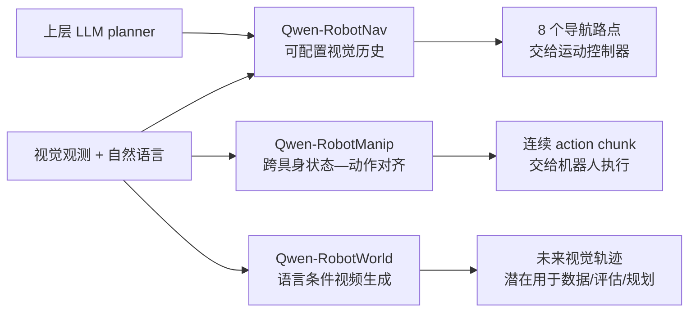

> **阅读范围**：全文精读 Qwen-Robot Suite 的三份技术报告及附录，并核验 arXiv 版本、Qwen 官方博客与官方仓库。三篇论文另有独立精读笔记，并保留原论文关键图表。 
> **检索日期**：2026-08-19 
> **出版状态**：三篇均是 2026 年 arXiv 技术报告，尚不能按已同行评审会议或期刊论文表述。 
> **正式 DOI**：无；`10.48550/arXiv.*` 仅为 arXiv/DataCite DOI，不是 venue DOI。 
> **核心判断**：Qwen-Robot Suite 不是一个共享权重的单一端到端模型，而是三个互补系统：Nav 输出导航路点，Manip 输出连续机器人动作，World 生成语言条件未来视频。

## 核心结论

Qwen-Robot Suite 试图覆盖具身智能中的三个不同问题：**如何移动到目标、如何操纵物体、如何预测动作语义对应的未来世界**。三篇报告共享 Qwen 多模态模型作为语义基础，但模型结构、监督信号和部署职责并不相同：

1. **Qwen-RobotNav 把“观察方式”做成可配置接口。** 它以 Qwen3-VL 为骨干，通过任务模式、视觉 token 预算、时间衰减和相机权重，让同一导航模型适配指令跟随、PointNav、ObjectNav、目标跟踪与驾驶；上层智能体还能在执行中动态改变配置。
2. **Qwen-RobotManip 把“跨具身对齐”放在数据扩展之前。** 它将不同机器人的状态与动作映射到 80 维规范空间，以相机坐标系下的末端增量减弱坐标系差异，并通过近期执行历史进行无参数更新的行为适配。
3. **Qwen-RobotWorld 把自然语言当作高层动作接口。** 它让冻结的 Qwen2.5-VL 语义流与视频 VAE latent 流在 60 层双流 MMDiT 中交互，生成未来视频，而不是直接产生可执行控制量。
4. **三者尚未形成闭环联合规划器。** World 没有为 Nav/Manip 的候选低层动作做反事实 rollout；Nav 和 Manip 的主要定量实验也没有把 RobotWorld 当作在线预测模块。Suite 当前是能力拼图，而不是已经联合训练、联合部署的一体化 agent。
5. **证据强度不对称。** Nav 和 Manip 有较广的 benchmark 数字，但真实机器人证据仍以有限任务或定性案例为主；World 的主要证据是视频生成 benchmark，尚未证明生成质量能转化为闭环控制收益。

## 三篇报告与独立精读

| 报告 | 研究对象 | 模型输出 | 精读笔记 | 官方资源状态 |
|---|---|---|---|---|
| Qwen-RobotNav | 多任务导航与上层智能体执行 | 未来 8 个二维路点 $(x,y,\theta)$ | [Qwen-RobotNav 精读](/posts/qwen-robotnav/) | [arXiv](https://arxiv.org/abs/2606.18112)；[官方仓库](https://github.com/QwenLM/Qwen-RobotNav)，但官方明确无权重发布计划 |
| Qwen-RobotManip | 跨具身机器人操作 | flow matching 生成的连续 action chunk | [Qwen-RobotManip 精读](/posts/qwen-robotmanip/) | [arXiv](https://arxiv.org/abs/2606.17846)；[官方仓库](https://github.com/QwenLM/Qwen-RobotManip)，但官方明确无权重发布计划 |
| Qwen-RobotWorld | 语言条件具身世界建模 | 未来视频 latent / 视频 | [Qwen-RobotWorld 精读](/posts/qwen-robotworld/) | [arXiv](https://arxiv.org/abs/2606.17030)；截至检索日未核到官方代码、权重或 EWK 下载 |

三份报告分别署名 Qwen Team。RobotNav 当前精读版本为 arXiv v3，RobotManip 为 v2，RobotWorld 为 v3。`10.48550/arXiv.*` 若被引用，只是 arXiv/DataCite DOI，不是正式会议或期刊 DOI。

## 研究问题

具身系统通常包含感知、语义推理、状态预测、动作规划和低层控制。一个“看图后直接输出动作”的 VLA 可以端到端学习这些映射，但不同任务对输出频率、空间尺度和训练信号的要求差异很大：

- 导航以秒级、米级空间移动为主，依赖长历史、地图语义和可变观察范围；
- 操作以更高频的关节或末端动作控制为主，需要跨机器人坐标和动作空间对齐；
- 世界模型的目标是预测“接下来会看到什么”，重点是时空一致性、物理变化与多样性，不天然等于一个最优动作策略。

Qwen-Robot Suite 因此采用专门化分工：

*图｜依据三篇报告整理的职责关系。Mermaid 用于跨论文比较，不替代各独立精读笔记中的原论文图表。RobotWorld 用于规划在当前报告中仍是应用方向，而非已验证的联合闭环。*

## 方法与数据

### 1. Qwen-RobotNav：把视觉历史压缩策略暴露给上层 agent

#### 输入输出与骨干

RobotNav 以 Qwen3-VL 为视觉—语言骨干，在末端接四层 MLP action head。输入是自然语言指令、机器人状态和一个或多个相机的历史 RGB；输出长度 $K=8$ 的二维路点序列：

$$
\hat{A}_t=\{(x_{t+k},y_{t+k},\theta_{t+k})\}_{k=1}^{8}.
$$

模型不是逐帧输出底盘电机命令，而是先给出局部轨迹，再由部署系统的低层控制器执行。因此它应被称作**语言条件路点策略**，而非完整机器人控制栈。

#### 可配置观察接口

报告最重要的设计不是新增一种 Transformer，而是把观察编码写成外部配置：任务模式、视觉 token 总预算 $B$、历史帧时间衰减 $\gamma$、相机权重 $w_c$、采样模式及单图预算上下限。训练时随机化这些参数，使同一模型在推理时可以：

- 为长指令提高历史覆盖；
- 为跟踪提高近期帧权重；
- 为多相机驾驶调整各相机 token 配额；
- 在上层 planner 切换子任务时同步切换观察策略。

时间和相机身份还以自然语言标签写入上下文，避免修改 Qwen3-VL 的主体结构。这种设计把“怎样看”从固定 preprocessing 变成 agent 可操纵的接口。

#### 智能体系统

长程 EQA 演示使用 Qwen3.6-Plus 作为上层 planner，将问题分解为搜索、跟踪、到点和回答等子任务；RobotNav 负责反应式执行，轨迹证据、笔记和关键帧进入跨 episode memory。需要注意：EQA 成绩属于**上层闭源模型、工具、记忆和 RobotNav 的组合系统**，不能归因于 RobotNav 单模型。

### 2. Qwen-RobotManip：三层对齐后再扩大数据

#### 架构与动作生成

RobotManip 使用 Qwen3.5-4B 作为视觉—语言骨干，连接 10 层、隐藏维度 768 的 DiT action expert。action expert 对状态和噪声动作做 self-attention，并交替 cross-attend 视觉 token 与语言 token。训练采用 flow matching：

$$
x_t=(1-t)\epsilon+t a,
\qquad
\mathcal L_{\mathrm{FM}}
=\mathbb E\left[\left\|f_\theta(x_t,t,s,o)-(a-\epsilon)\right\|_2^2\right].
$$

推理用 4 次 Euler 积分生成 action chunk。论文还把不同具身下无效的维度和时间步写入二值 mask，按每个样本的有效元素归一化损失，避免自由度较高的机器人因有效维度更多而主导训练。

#### 表征对齐

所有状态与动作进入 80 维规范向量：两条手臂各有 29 维，包含关节、9 维末端姿态、夹爪和灵巧手关节，其余 22 维预留。每种机器人只激活自身有效槽位。统一容器解决张量形状问题，但仅靠补零并不能让同一物理动作在不同机器人上数值一致。

#### 运动对齐

论文进一步把末端动作写为**参考相机坐标系下的增量位姿**，并用 Camera-aware Positional Encoding 表达相机与动作 token 的相对几何。这样“向画面右侧移动”在不同底座坐标系、不同机械臂上更接近同一数值模式。无标定数据则回退到机器人基座相对坐标，并用 flag 告知模型当前模式。

#### 行为对齐

结构化 prompt 提供机器人型号、任务、速度、FPS 和相机方向。Context 版本还输入同一 episode 中近期或随机位置的“观测—状态—已执行 action chunk”。训练时随机抽取历史，而不是总取最近一段，以防模型通过复制上一动作取得低损失；部署时再使用滚动近期历史，使模型从实际执行反馈中推断当前机器人的运动特征。它是**上下文条件适配**，不是在线梯度更新或强化学习。

#### 多源数据与双流训练

约 38,100 小时操作数据由三部分构成：约 11,420 小时公开机器人数据、1,933 小时第一视角人类视频、24,808 小时 human-to-robot 合成数据，覆盖 15 种合成机器人平台。预训练以约 9:1 混合 VLA 与视觉语言数据：

$$
\mathcal L=\mathcal L_{\mathrm{FM}}+0.1\,\mathcal L_{\mathrm{VLM}}.
$$

这种共训用来减轻动作微调对原 VLM 语言 grounding 和视觉理解的遗忘。值得区分：**原始来源公开**不等于训练后的 38,100 小时规范化语料、合成管线、模型权重和完整训练 recipe 已可下载。

### 3. Qwen-RobotWorld：以语言统一高层动作语义的视频生成器

#### 双流 MMDiT

RobotWorld 将冻结的 Qwen2.5-VL 作为理解流，将视频 VAE latent 作为生成流；60 层双流 MMDiT 在每层通过 joint attention 交换语义与时空信息。论文报告的主要组件规模为：MLLM 7B、VAE 127M、MMDiT 20B。语言描述同时承担任务目标和高层动作条件，例如“用右手拿起粉色瓶子并给花浇水”。

这与 VLA 的动作接口不同：语言无法精确表达每个控制周期的关节速度、接触力或末端位姿。RobotWorld 学到的是**语义动作条件下的视觉结果分布**，不是低层 action-conditioned dynamics。

#### EWK 数据

Embodied World Knowledge（EWK）包含约 8.6M 视频—文本对、超过 200M 帧，覆盖操作、驾驶、室内导航和 human-to-robot transfer。数据策展把标注分成目标、细粒度动作、物理反馈、长描述和短描述五个层级，并建立 20+ 具身、500+ 动作类别到自然语言的映射。

训练先学习通用 T2I/T2V/TI2V 视觉先验，再以约 70% 具身、30% 通用数据进行逐阶段 SFT；具身部分又高度偏向操作。因完整 EWK、训练代码和权重未公开，这一数据配方目前不能独立复现。

#### 能做什么，尚未证明什么

论文提出三种应用：为策略训练生成数据、为策略评测生成虚拟环境、为下游控制提供规划信号。但实验证据主要评价视频的指令遵循、外观、物理一致性和多视角一致性；没有展示 Nav/Manip 使用它进行候选动作搜索后提高任务成功率。因此不能把“可生成未来”直接改写成“已实现规划器”或“已提高控制安全性”。

## 实验与证据边界

三篇报告没有共享同一个 benchmark，数字不能合并成总榜。更合理的做法是问每组实验支持哪项内部主张。

### RobotNav

| 场景 | 代表结果 | 可支持的结论 | 重要限定 |
|---|---:|---|---|
| RxR-CE 全景，8B | SR 76.5，SPL 65.7，nDTW 72.5 | 多任务路点模型在该协议下有强连续 VLN 表现 | 与单目、图式 VLN 或不同传感器设置不可直接横比 |
| EVT-Bench tracking，8B | tracking rate 89.7，success rate 78.6 | 同一接口可以承担视觉跟踪 | tracking rate 最高不等于最终 success 最高；部分基线 SR 更高 |
| NAVSIM | PDMS 91.4 | 模型可迁移到驾驶规划 benchmark | 仍是 benchmark planning，不等于闭环道路安全验证 |
| HM-EQA agent system | Accuracy 76.7 | planner、记忆、工具与 Nav 组合可提高长程信息收集 | 不是 RobotNav 单模型成绩 |
| 真机 | 多场景长距离和搜索案例 | 证明部署可行性 | 缺少 episode 数、成功率、置信区间与系统性失败统计 |

Token budget 消融只在约 500 个 R2R episode 上进行：预算从 2,048 增至 4,608 时 SR 从 70.8 升到 74.6，但 OSR 并非单调增加；时间衰减也存在中间最优点。这更支持“观察分配可调且需按任务选取”，而不是“token 越多越好”。

### RobotManip

| 评测 | Qwen-RobotManip 代表结果 | 读法 |
|---|---:|---|
| LIBERO / RoboTwin Easy / Hard | 99.1 / 93.4 / 92.5；Context 为 99.2 / 93.7 / 94.0 | 说明域内适配强，但作者也强调域内榜单难区分预训练质量 |
| LIBERO-Plus | 基础 89.0，Context 91.4 | 对相机、机器人、语言、光照、背景、噪声和布局扰动的综合 OOD 结果 |
| RoboTwin-C2R Hard | joint 62.6，Context-joint 69.4 | 历史上下文在复合扰动下有明显收益 |
| RoboTwin-IF | 72.2，对比 $\pi_{0.5}$ 的 49.6 | 支持视觉相同时模型仍响应不同语言命令 |
| RoboTwin-XE | camera-frame EEF 平均 23.9，$\pi_{0.5}$ 为 7.5 | 展示零样本跨机器人迁移，但绝对成功率仍低 |
| RoboChallenge Table30 v1 | SR 45%，process score 59.83 | 30 个任务、四种真机上的综合结果；对比 DM0 为 37% / 48.43 |

Context 不是无条件提高：RoboCasa365 总分从 35.9 降到 33.8，EBench SR 从 45.6 降到 43.6，RoboTwin-IF 也可能因具体训练配方而略变。更准确的结论是：历史执行反馈在部分运动/扰动场景中有用，但它增加上下文与延迟，且可能诱发错误历史累积。

### RobotWorld

| 评测 | 代表结果 | 限定 |
|---|---:|---|
| EWMBench | overall 4.60，LVP 为 4.05 | 仅 21 个样本、7 个任务，统计覆盖很小 |
| DreamGen Bench | total 4.952，整体排名第一 | instruction following 子项不是每项最优；评测含 VLM judge |
| PBench | overall 0.804 | 低于 Veo3 0.827、Kling 0.821，并非所有模型第一；论文的稳妥结论是开源比较中领先 |
| WorldModelBench | total 8.99 | 低于 Wan2.6 的 9.27 和 Veo3 的 9.25；物理各子项并非全满分 |
| 操作、导航、驾驶与跨具身案例 | 多组生成视频 | 多为定性结果，尚未转化为 policy success、碰撞率或闭环回报 |

生成视频 benchmark 往往以 Qwen2.5-VL 等 VLM 作自动裁判，可能与模型家族的语义偏好相关。视频得分也没有直接测量接触动力学、长时间误差累积或控制可辨识性。

## 主要发现

### 1. 接口对齐比简单扩大参数更重要

- Nav 对齐不同任务的**观察接口**；
- Manip 对齐不同机器人的**状态—动作坐标与行为上下文**；
- World 对齐不同具身的**高层动作语言**。

三者都没有把异构数据简单拼接。它们先寻找一个共同接口，再扩大训练数据。这个判断有内部消融支持，但对齐与数据规模往往同时改变，仍不能把所有增益唯一归因于单一模块。

### 2. 视觉语言共训用于抵抗“动作捷径”

Nav 报告指出只学轨迹容易退化为反应式 action mapper；Manip 发现只做动作 SFT 会降低语言敏感度，因此混入视觉语言任务；World 则以冻结 MLLM 提供语义条件。共同目标是防止模型只从场景外观预测常见动作，而忽略指令。

### 3. 历史不是越长越好，而是需要选择机制

Nav 用 token budget 与时间衰减压缩历史；Manip 用随机历史块防止复制最近动作；World 的视频生成受上下文 token 上限约束。三者分别说明：具身历史的主要问题不是“有没有 memory”，而是**怎样保留对决策有用的信息并避免近邻捷径**。

## 局限与适用边界

### 1. 开放性不足

RobotNav 与 RobotManip 虽有官方 GitHub 页面，但仓库明确表示没有发布权重的计划；它们并非可从训练到评测完整复现的开源实现。RobotWorld 截至检索日未核到官方代码、权重或 EWK 数据下载。三篇报告的大规模实验因此主要是作者报告，社区难以验证训练数据去重、实现细节和完整统计。

### 2. “开源数据”不等于“可复现训练集”

Manip 的源机器人数据和人类视频来自公开资源，这是重要优势；但清洗、同步、标定、动作转换、human-to-robot retargeting、inpainting 和最终采样配比构成了新的派生语料。没有这些流水线和固定清单，仅有源数据不能重建 38,100 小时训练集。

### 3. benchmark 范围与协议异质

Nav 汇总 VLN、ObjectNav、tracking、EQA 和驾驶任务，不同方法可能使用不同相机、地图、数据版本和上层工具。Manip 的 OOD benchmark 更严格，但多数仍是仿真；新提出的 RoboTwin-IF/XE 又由同一工作设计并首先报告。World 的自动指标依赖 judge model 和小规模集合。横向“全面 SOTA”应降级成具体协议下的结果。

### 4. 真机安全仍未建立

三篇报告都没有给出形式化安全约束、置信度校准、分布外拒绝、故障恢复覆盖或长期接管率。Manip 的固定 action chunk 和推理延迟限制亚秒反应；Nav 的路点仍可能碰撞或跌落；World 的视觉幻觉若被下游控制器当成真实预测，可能放大风险。

### 5. Suite 尚缺少可验证闭环

理想联合系统可以让 World 对多个 Nav/Manip 候选动作生成反事实未来，再由价值、安全或目标函数选择动作；当前 RobotWorld 的条件主要是自然语言动作，不足以精确区分细微低层控制。要形成真正闭环，还需要共享状态/动作表示、动作条件动力学、不确定性估计、候选规划器及真实执行反馈。

## 我的思考

Qwen-Robot Suite 最值得关注的不是“用一个 Qwen 模型解决所有机器人任务”，而是对三类异构问题分别寻找可扩展接口：Nav 让上层 agent 控制观察与任务模式，Manip 让不同机器人共享动作数值语义，World 让不同具身活动共享语言动作描述。三篇报告共同强化了一个经验：**没有接口对齐，更多数据未必形成可迁移能力。**

但现有证据只支持三个专用模型各自在其评测协议中的进展。它们尚未证明一个统一 checkpoint、RobotWorld 驱动的反事实规划、可复现训练或经过系统统计的安全真机部署。下一步真正有研究价值的不是简单把三者串联，而是建立低层动作条件的共享世界状态，使预测误差能够被规划器校准，并通过公开闭环 benchmark 检验世界模型是否实际提高成功率与安全性。

## 参考文献

- [Qwen-Robot Suite 官方介绍](https://qwen.ai/blog?id=qwen-robotsuite)
- [Qwen-RobotNav 官方介绍](https://qwen.ai/blog?id=qwen-robotnav)
- [Qwen-RobotManip 官方介绍](https://qwen.ai/blog?id=qwen-robotmanip)
- [Qwen-RobotWorld 官方介绍](https://qwen.ai/blog?id=qwen-robotworld)
- [Qwen-RobotNav arXiv](https://arxiv.org/abs/2606.18112)
- [Qwen-RobotManip arXiv](https://arxiv.org/abs/2606.17846)
- [Qwen-RobotWorld arXiv](https://arxiv.org/abs/2606.17030)
- arXiv/DataCite DOI（非 venue DOI）：[RobotNav](https://doi.org/10.48550/arXiv.2606.18112)、[RobotManip](https://doi.org/10.48550/arXiv.2606.17846)、[RobotWorld](https://doi.org/10.48550/arXiv.2606.17030)

## 检索记录

- 以三篇准确题名和 `Qwen-Robot Suite` 检索，优先使用 arXiv、Qwen 官方博客和 QwenLM 官方 GitHub；未以媒体转载、论文聚合站或第三方复现替代一手证据。
- 全文读取 RobotNav v3（37 页 PDF）、RobotManip v2（44 页）和 RobotWorld v3（25 页），包括附录、消融和局限段落；逐项核对本文引用的表格数字。
- 截至 2026-08-19，未在 arXiv 元数据中核到三篇报告的正式会议/期刊 reference 或独立 venue DOI，也未发现撤稿或正式勘误。
- 代码状态按“论文页面存在、仓库含实现、权重可下载、数据可下载”分别核验；官方宣传页或 demo 仓库不自动等同于完整开源。
