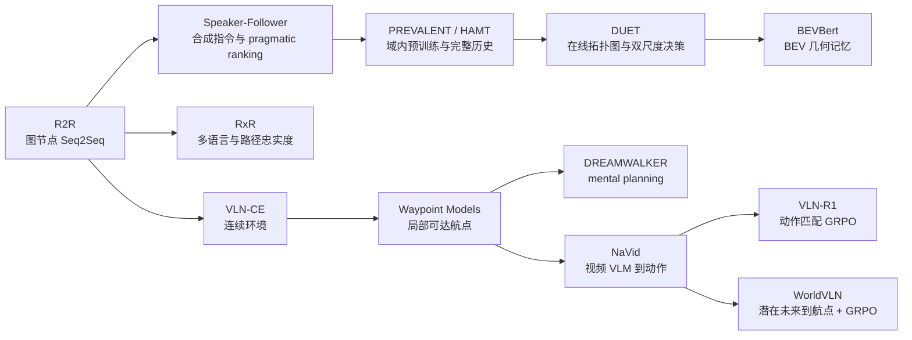

> **阅读范围**：定向检索并全文精读 13 篇代表性论文及其附录，覆盖 2018–2026 年的基准、数据、预训练、记忆/地图、连续控制、VLM 推理与世界—动作模型；每篇均另有独立精读笔记。 
> **检索日期**：2026-08-19 
> **综述性质**：这是机制导向的代表性综述，不是穷尽所有论文的系统综述或元分析。 
> **核心判断**：VLN 的进步不只是模型从 LSTM 换成 Transformer，而是逐步撤掉导航图、候选视点、完美定位和离线全景等 oracle，同时增加历史记忆、显式地图、连续动作与结果反馈。

## 核心结论

视觉语言导航（Vision-and-Language Navigation, VLN）研究的是：智能体能否把自然语言路线描述与第一视角感知对齐，并在未见环境中持续决定“下一步去哪”。八年的主线可以压缩为六次重心迁移：

1. **R2R 建立问题，Speaker-Follower 扩充数据。** 早期模型在已知导航图上从候选全景节点中选下一步，核心是局部视觉—语言对齐与 imitation/RL。
2. **RxR 改变了数据与评价。** 更长、更自然的多语言指令以及 nDTW/SDTW，使“到达目标”和“忠实沿路走”不再混为一谈。
3. **PREVALENT 与 HAMT 把预训练和完整历史带入策略。** 前者先学单步视觉—语言—动作三元组，后者进一步把层级化轨迹历史作为一等输入。
4. **DUET 与 BEVBert 显式建图。** 在线拓扑图适合全局回溯，BEV 网格适合局部几何；二者都比把历史压进一个向量更利于长程决策。
5. **VLN-CE 与 waypoint 系列撤掉“节点跳跃”。** 连续空间要求策略先发现局部可达航点，再由低层控制器执行；这暴露了碰撞、定位、控制误差和训练—部署落差。
6. **NaVid、VLN-R1 与 WorldVLN 把视频 VLM、可验证奖励后训练和预测式中间变量引入导航。** 这条路线扩大语义与动作建模能力，但仍没有自动解决长时记忆、反事实规划、实时性与真机安全。

最重要的阅读原则是：**不要把不同世界假设下的 SR/SPL 横向排序。** R2R 的图节点选择、VLN-CE 的连续 locomotion、IndoorUAV 的 4-DoF 航点与真实无人机的通信/飞控链路，是不同难度、不同动作接口和不同成功阈值的任务。

## 检索记录

### 检索策略

- **核心查询**：`vision language navigation survey`、`R2R VLN`、`VLN continuous environment`、`VLN-CE waypoint`、`topological map VLN`、`BEV VLN`、`video VLM navigation`、`reasoning reinforcement learning VLN`、`navigation world model`、`WorldVLN`，以及每篇准确题名。
- **一手来源**：CVF Open Access、NeurIPS proceedings、ACL Anthology、PMLR/RSS、arXiv、作者项目和官方代码仓库。
- **检索地图**：Gu 等人的 ACL 2022 VLN survey 用于回溯任务、指标与 2022 年前方法；所有核心方法、数字与局限仍回到原论文核验。
- **纳入标准**：创建重要 benchmark/metric，或在数据、历史记忆、地图、连续动作、生成式规划、VLM/RL 后训练中带来明确机制变化；能获得全文并核对主要实验。
- **排除与降级**：EnvDrop、VLN-BERT、AirBERT、RCM、GridMM、ETPNav、ScaleVLN、NavGPT、AwareVLN 等仍是重要工作，但本轮为控制篇幅，只在路线讨论中定位，不逐篇重复机制相近的精读。
- **全文状态**：13/13 核心文献全文读取；正式出版优先 camera-ready，预印本注明版本；代码只在官方仓库存在时标为官方。
- **更正与撤稿**：截至检索日未发现 13 篇核心文献的撤稿；具体版本、DOI、代码和元数据异常记录在各独立笔记中。

### 核心文献集合

| 年份 | 工作 | 本综述中的角色 | 独立精读 |
|---:|---|---|---|
| 2018 | R2R / Seq2Seq | 建立真实扫描室内环境中的图式 VLN benchmark | [R2R](/posts/r2r-vln/) |
| 2018 | Speaker-Follower | speaker 合成指令、listener 数据增强与 pragmatic inference | [Speaker-Follower](/posts/speaker-follower-vln/) |
| 2020 | RxR | 多语言、长路径、时序对齐标注与 path fidelity | [RxR](/posts/rxr-vln/) |
| 2020 | VLN-CE | 将 R2R 轨迹迁移到 Habitat 连续环境，揭示 nav-graph oracle | [VLN-CE](/posts/vln-ce/) |
| 2020 | PREVALENT | 视觉—语言—动作三元组的域内预训练 | [PREVALENT](/posts/prevalent-vln/) |
| 2021 | HAMT | 层级编码完整历史并联合预训练 | [HAMT](/posts/hamt-vln/) |
| 2021 | Waypoint Models for VLN-CE | 学习局部候选航点，桥接图式 policy 与连续控制 | [Waypoint Models](/posts/waypoint-models-vln-ce/) |
| 2022 | DUET | 全局拓扑图与局部观测双尺度决策 | [DUET](/posts/duet-vln/) |
| 2023 | BEVBert | 在线 BEV memory 与显式局部几何 | [BEVBert](/posts/bevbert-vln/) |
| 2023 | DREAMWALKER | 在连续环境中生成/评估未来路线的 mental planning | [DREAMWALKER](/posts/dreamwalker-vln/) |
| 2024 | NaVid | 以视频历史和通用 VLM 直接产生连续导航动作 | [NaVid](/posts/navid-vln/) |
| 2025 | VLN-R1 | 以时间衰减的动作匹配奖励后训练导航 VLM | [VLN-R1](/posts/vln-r1/) |
| 2026 | WorldVLN | 自回归潜在世界转移、航点解码与 Action-aware GRPO | [WorldVLN](/posts/worldvln/) |

这组文献按“机制转折点”选取，而不是按 citation count 排名；近期预印本也不与已充分验证的经典论文赋予相同证据等级。

## 研究问题

### 1. VLN 到底在解哪几个子问题

给定语言指令 $\ell$、部分可观测环境和历史 $h_t=(o_{\le t},a_{<t})$，策略输出动作

$$
a_t\sim\pi_\theta(\cdot\mid h_t,\ell).
$$

这个紧凑公式实际包含五个不同难题：

1. **语言 grounding**：把“走过沙发后在第二扇门右转”绑定到当前或未来视觉地标。
2. **进度与记忆**：判断指令执行到哪一段，记住已访问区域并在走错时回溯。
3. **可通行性与几何**：区分“视觉上像目标方向”和“物理上可以到达”。
4. **长程规划与停止**：局部正确动作未必形成全局正确路线，停止也是一个需要校准的动作。
5. **控制与闭环**：在连续世界中把高层方向转成无碰撞的位移/转向，并消化定位与执行误差。

早期图式 benchmark 把第 3 和第 5 项大量交给 simulator：策略只需在预先给定的相邻节点中选择。后续工作的难度提升，很多来自逐步收回这些 oracle，而不只是场景更复杂。

### 2. “更强模型”还是“更弱假设”

比较 VLN 算法时应同时问：

- 模型是否看到 360° 全景、深度、GPS/heading、候选 viewpoint 或 ground-truth connectivity？
- 是否能访问测试房屋进行 prior exploration？
- 动作是瞬间跳到节点，还是要连续前进、转向、避障？
- 语言是单一英文短路线，还是多语言、长指令或开放表达？
- 目标是只到终点，还是严格沿着描述路线？

若一个方法分数更高，但使用了更强传感器、候选航点或测试时地图，它回答的是不同问题。综述因此不构造一张跨 benchmark 的“总榜”。

## 方法与数据

### 1. 五条正交分类轴

| 轴 | 典型取值 | 它改变的研究问题 |
|---|---|---|
| 移动空间 | 导航图节点 / 地面连续空间 / 空中连续 3D | 是否需要可通行性发现和低层控制 |
| 状态表示 | 当前全景 / recurrent state / 完整历史 / topology / BEV / predictive latent | 怎样保存过去、估计位置和规划未来 |
| 动作接口 | 候选节点 / viewpoint / waypoint / velocity 或 4-DoF 航点 | 高层语义与物理执行之间隔几层 |
| 学习信号 | teacher forcing / student forcing / data augmentation / pretraining / RL | 怎样处理小数据、exposure bias 与结果信用分配 |
| 决策方式 | reactive / graph search / route generation and ranking / latent prediction | 推理时是否显式比较长期后果 |

这些轴不是一棵互斥分类树。例如 DUET 同时属于 Transformer 预训练、在线拓扑记忆和双尺度策略；WorldVLN 同时属于连续航点、视频生成先验和 online RL 后训练。

### 2. 任务与数据的关键分界

#### R2R：图式 VLN 的标准原型

R2R 基于 Matterport3D 的真实室内扫描。每个 panorama 是图节点，边表示可直接移动到的相邻 viewpoint；每条路径配多个人工英文指令。训练/验证按房屋划分，`val-unseen` 与 test 使用未见建筑，主要检验跨场景泛化。

这个设计让语言、视觉与序列决策可被清晰研究，却隐含三项现实中没有的能力：完美定位、已知相邻可达节点、无控制误差的节点跳跃。

#### RxR：多语言与路线忠实度

RxR 扩大路径与指令长度，加入英语、印地语和泰卢固语，并把语音/文本片段与路径位置时间对齐。它迫使模型处理更自然的叙述、语言差异与长历史，也让 nDTW/SDTW 成为比单一 SR 更重要的指标。

#### VLN-CE：保留路线语义，撤掉导航图动作

VLN-CE 把 R2R 路线放进 Habitat 连续环境。agent 不再直接选择邻接 panorama，而要通过离散低层运动或学习 waypoint 在可碰撞的 3D 空间前进。由于图上的最短边不一定对应连续几何中的稳定可执行轨迹，benchmark 转换本身也会引入可达性筛选和路线差异。

#### 从地面连续导航到空中 4-DoF

NaVid 等多在室内地面连续导航中工作；WorldVLN 则评估 UAV-Flow 与 IndoorUAV-VLA 的短程空中动作。后者包含垂直位移和 yaw，强调局部组合控制，但不是 R2R 那种长篇路线跟随。二者都叫 VLN，任务时域和成功阈值却不相同。

### 3. 指标：到达、效率与路线忠实度不能互相替代

设 agent 轨迹长度为 $L$，起点到目标的最短路径距离为 $L^*$，成功指示为 $S\in\{0,1\}$。SPL 为

$$
\mathrm{SPL}=S\frac{L^*}{\max(L,L^*)}.
$$

它惩罚成功但绕路的轨迹，却不关心是否沿着语言描述的特定路线。nDTW 则把预测路径 $P$ 与参考路径 $R$ 的 dynamic time warping 距离归一化：

$$
\mathrm{nDTW}=\exp\left(-\frac{\mathrm{DTW}(P,R)}{\eta|R|}\right),
\qquad
\mathrm{SDTW}=S\cdot\mathrm{nDTW},
$$

其中 $\eta$ 通常与成功阈值相关。nDTW 越高表示越忠实于参考路线；SDTW 再要求最终成功。

常见指标应联合解释：

| 指标 | 回答的问题 | 典型盲点 |
|---|---|---|
| NE / final distance | 最后离目标多远 | 可能走了完全错误的路线 |
| SR | 是否进入成功半径 | 不区分效率与路线忠实度 |
| OSR | 轨迹中是否曾进入成功半径 | 可能经过目标后又走远 |
| SPL | 是否成功且路径高效 | 对“必须沿描述路线”不敏感 |
| nDTW | 与参考路径是否相似 | 可以路线相似但最终没成功 |
| SDTW | 路线忠实且成功 | 仍依赖单条或有限参考路径 |

连续任务还需碰撞率、控制频率、传感器与计算延迟；只报 SR/SPL 无法描述真机可执行性。

### 4. 技术演进图

*图｜作者依据本轮 13 篇文献整理的机制关系图；Mermaid 仅用于说明演进关系，不替代各独立笔记保留的原论文图表。*

## 主要发现

### 1. Seq2Seq 时代真正留下的是训练问题，而不只是网络结构

R2R baseline 把指令编码、视觉注意与动作解码放进 Seq2Seq，但 teacher forcing 会让训练时一直看专家状态，测试时却必须处理自己制造的错误。后续 student forcing、mixed imitation/RL、backtracking 与 progress estimation，持续围绕 exposure bias 和停止校准展开。

Speaker-Follower 从另一个方向缓解小数据：训练 speaker 学习“路线 → 指令”，再给未标注路径生成合成语言；listener 用这些数据训练，推理时还可由 speaker 对候选路线进行语言一致性重排。它揭示了两个长期有效的思想：**环境路径比人工语言便宜**，以及生成模型可以在推理时做 compatibility critic。风险则是 synthetic language 的模式偏差，以及搜索/重排使用的候选预算并不等同于单次 policy rollout。

### 2. 预训练的演进是从“单步对齐”到“历史条件决策”

PREVALENT 以图像条件 MLM 和教师动作预测预训练视觉—语言—动作 encoder。它显著提高同一 Matterport3D 域内的 R2R、CVDN 与 HANNA 迁移，但每个状态—动作三元组在预训练时近似独立，不编码轨迹历史。

HAMT 的推进点是将单视图、全景和历史 panorama 分层编码，并让当前观测与完整历史共同参与跨模态决策。完整历史尤其有利于长指令与回溯，但 token/计算随路径增长，且历史 attention 本身不等于度量一致的地图。

这条路线后来与更大规模数据和 VLM 合流：更强 backbone 提高语义先验，但若动作候选、历史状态与训练协议不同，提升不能只归因于参数量。

### 3. 显式地图把“记住看过什么”改成“知道自己去过哪里”

DUET 在线构建拓扑图：细粒度局部分支关注当前 panorama 与邻近候选，全局分支在累计图上选择远端节点，二者动态融合。它能回溯并处理长程结构，但图节点和边依赖 simulator/candidate waypoint，几何精度有限。

BEVBert 把历史投影到鸟瞰网格，用空间位置组织视觉记忆，更适合表达局部障碍、方向和相对距离。代价是依赖深度、位姿或可近似的投影信息；BEV 离散化、地图漂移和未知区域会形成新误差源。

拓扑图和 BEV 并非谁替代谁：拓扑图适合长程连通关系，BEV 适合局部度量几何。更合理的下一步是多尺度混合地图，并显式建模定位不确定性。

### 4. VLN-CE 的核心不是换 simulator，而是改变行动信息结构

在图式 R2R 中，候选节点同时告诉模型“哪些方向可走”和“移动后会看到哪张高质量 panorama”。连续环境撤掉了这个强先验，agent 必须自己从 RGB-D/视觉中发现可达区域，并通过多步低层动作到达。

Waypoint Models 的价值在于建立兼容层：先从局部感知提出少量可达航点，再让成熟的高层 VLN policy 在这些候选中选择。这种分层显著优于直接逐帧低层动作，却也意味着最终成绩同时依赖 waypoint recall、controller 和高层语言策略。若航点模块使用深度、GPS/compass 或额外几何监督，应在比较时单独列出。

### 5. DREAMWALKER 把“未来”变成规划对象，但生成质量不等于控制质量

DREAMWALKER 不只根据当前帧反应，而是对候选航点先做深度点云 warp、再补全未来 RGB-D 全景，把这些真实/想象节点接入 episodic graph，并用指令条件距离估计与 MCTS 选择行动。它代表从 reactive policy 向 mental planning 的转变：内部未来可作为检查路线合理性的中间变量。

但生成式规划的关键不是图片是否逼真，而是不同候选之间的几何和动作差异是否可信；若世界模型没有以动作条件化，或只生成单一未来，它很难支持严格的“若这样走会怎样”比较。生成多个候选还增加推理延迟，必须与直接 waypoint policy 做等预算比较。

### 6. NaVid 把通用 VLM 接到连续动作，接口设计与数据配方同样重要

NaVid 将当前/历史视频帧和指令放进多模态语言模型，使一个模型同时承担语义 grounding、历史理解和动作生成。输出是 `FORWARD / TURN-LEFT / TURN-RIGHT / STOP` 加距离或角度参数的动作文本，再由底层控制器执行，并非直接输出底盘速度。相比早期固定 ResNet + 小型 policy，它更容易利用开放词汇知识；相比图式方法，它面向连续环境与更接近真实摄像头的数据流。

这类方法的瓶颈从“看不懂对象”部分转移到三点：长视频上下文成本、动作 token/数值回归稳定性，以及通用视觉语言预训练与导航几何之间的鸿沟。VLM 能描述“门在右边”，不等于能稳定估计可通行宽度和转角。

### 7. VLN-R1 与 WorldVLN 代表两种后训练方向

VLN-R1 侧重**固定数据上的可验证动作序列后训练**：模型一次生成 6 个固定导航原语，GRPO 用时间衰减奖励比较每个位置是否匹配唯一 oracle 动作。它不执行采样动作，也不接收碰撞、进展或 episode 成功反馈，因此证据支持的是 action-match RLVR 对 SFT 的改善，而不是环境在线强化学习或显式自然语言推理。

WorldVLN 侧重**视觉预测式中间变量**：8B 自回归视频 backbone 生成 16 帧短时潜在世界转移，动作 decoder 直接输出航点；执行后以真实新观测回填，再通过 Action-aware GRPO 优化任务后果。它在 UAV-Flow 与 IndoorUAV-VLA 的作者实验中分别取得 12 个百分点以上的平均 SR 增益，但这些是短程空中 benchmark；真机仅有受控案例且依赖地面服务器。

二者共同说明，VLN 的后训练正在超出单纯的 token-level 专家动作似然：VLN-R1 优化可验证动作串匹配，WorldVLN 才进一步使用环境 rollout 结果。reward 定义、模拟器覆盖和 reference regularization 决定了模型学到什么，不能把任何增益都解释成普遍的空间推理或闭环规划。

### 8. 一张机制对照表

| 方法 | 状态/记忆 | 动作空间 | 主要学习信号 | 推理特征 | 最强项 | 主要边界 |
|---|---|---|---|---|---|---|
| R2R Seq2Seq | 当前全景 + recurrent state | 图节点 | 模仿 / RL | 局部逐步选择 | 建立标准问题 | 强 nav-graph oracle |
| Speaker-Follower | 当前状态 + 候选路线 | 图节点/路线 | 合成数据 + listener | speaker 可重排候选 | 数据增强与语用一致性 | 搜索预算、合成语言偏差 |
| PREVALENT | 单步跨模态表示 | 图节点 | MLM + action prediction | 下游旧 policy | 可迁移预训练 | 预训练无完整历史 |
| HAMT | 层级完整历史 | 图节点 | 多任务预训练 + imitation/RL | 历史 attention | 长程语言—轨迹对齐 | token 成本、非显式几何 |
| DUET | 在线拓扑图 + 当前局部 | 图/候选 waypoint | 预训练 + imitation | 全局/局部动态融合 | 回溯和长程规划 | 图构建依赖候选与定位 |
| BEVBert | 在线 BEV 网格 | 连续环境中的 waypoint | 表征预训练 + policy learning | 局部度量地图 | 空间几何 | 深度/位姿与地图漂移 |
| Waypoint Models | 局部 RGB-D 几何 + 高层状态 | 连续航点 | waypoint supervision + 高层 policy | 分层控制 | 桥接 R2R policy 与 VLN-CE | 航点召回决定性能上限 |
| DREAMWALKER | 生成式未来 RGB-D + episodic graph | waypoint + 固定低层原语 | imitation + scene synthesis + distance supervision | MCTS mental planning | 比较候选未来 | 生成/价值误差与约 1.43 s 搜索成本 |
| NaVid | 视频历史 + VLM context | 离散类型 + 连续距离/角度 | 视觉语言预训练 + imitation | 视频到动作文本 | RGB-only 开放语义与真机闭环 | 长上下文、底层控制与远端 A100 延迟 |
| VLN-R1 | 长短期 RGB 历史 + VLM context | 6 步固定动作原语 | SFT + action-match GRPO | 文本化动作块生成 | 低样本奖励后训练 | 唯一 oracle、无环境 rollout、非连续值控制 |
| WorldVLN | 短时 predictive latent + 真实回填 | UAV 航点段 | 视频 SFT + action distill + GRPO | 世界 latent 到动作 | 空中闭环 WAM | 不输入候选动作，非严格反事实 |

## 局限与适用边界

### 1. 本综述的边界

- 这是代表性机制综述，不是系统检索；没有穷尽 object navigation、dialog navigation、ALFRED/TEACh、街景导航和多机器人协作。
- 13 篇文献跨越不同数据、传感器、动作和评测协议，无法做统计元分析。
- 近期 WorldVLN、VLN-R1 等证据仍以预印本和作者自报实验为主，成熟度低于 R2R、VLN-CE 等正式 benchmark 论文。
- 独立精读保留原论文关键图表；本综述的 Mermaid 图只用于作者归纳。

### 2. 整个领域反复出现的证据缺口

1. **模拟器—真实世界鸿沟。** 扫描场景多为静态房屋；动态人群、反光、光照、门状态、传感器噪声与轮式/飞行器动力学覆盖不足。
2. **地理与文化偏差。** Matterport3D 主要代表有限地区和住宅类型；多语言不自动等于多文化环境。
3. **oracle 没有统一披露。** 全景、深度、GPS/compass、候选航点、已知停止半径和测试时探索应当像模型参数一样被列入结果表。
4. **结果常缺不确定性。** 很多 VLN 论文只给单个 leaderboard 数字，没有多 seed、置信区间和失败类型分层。
5. **闭环安全评价薄弱。** SR/SPL 不包含碰撞严重度、near miss、急停、隐私和人机共处风险。
6. **绝对效率不透明。** 大 VLM/WAM 经常不报告相同硬件上的 FPS、端到端延迟、显存和功耗。
7. **路径参考并非唯一正确答案。** nDTW 奖励贴近单条参考路线，但现实中可能有多条同样符合语言的安全路径。
8. **推理可解释性容易被高估。** attention、生成未来或 textual CoT 都是中间变量；没有因果干预时，不能证明它们真实驱动动作。

### 3. 三个最容易产生的错误比较

- 用图式 R2R 的 70% SR 宣称优于连续 VLN-CE 的 40% SR；前者不承担相同控制和碰撞难度。
- 用多指令、test-time search 或 prior exploration 结果对比单指令、单 rollout policy，却不标额外信息/预算。
- 把真机视频案例与 simulator test-set 的批量成功率并列为同等强度证据。

## 我的思考

### 1. 下一阶段不应只追求更大的 VLM，而要显式分解不确定性

VLN 的错误至少来自语言歧义、感知错误、定位漂移、地图未知和动力学执行五类来源。一个大模型输出单一动作概率，无法告诉系统应该重新观察、询问人、回溯还是急停。更合理的 agent 应分别估计：

- 语义目标的不确定性；
- 当前 pose/map 的不确定性；
- 候选动作的碰撞与可达风险；
- 长程路线的目标达成概率。

这些量可以驱动 active perception、asking-for-help 和安全 shield，而不是只由更长 CoT 隐式承担。

### 2. 世界模型的判据应从“能生成未来”升级为“能支持反事实选择”

若模型只根据当前 policy 生成一个未来，再从未来反推动作，它可以是有效的预测式策略，却未必是控制意义上的 world model。更强的实验应固定当前历史，输入多个候选动作 $a^{(1)},\ldots,a^{(m)}$，检查模型能否预测不同后果，并验证这些预测排序是否提高闭环成功率。

因此建议把生成式 VLN 评测拆成三层：

1. **预测层**：未来几何、可见地标和碰撞是否校准；
2. **反事实层**：动作变化是否引起方向正确、幅度合理的预测变化；
3. **控制层**：用该模型规划是否在等计算预算下优于 reactive policy。

### 3. 统一 benchmark 应同时报告四种 budget

未来结果表除了 SR/SPL/nDTW，还应固定或公开：

- 感知 budget：相机数量、分辨率、全景、深度和 pose；
- 推理 budget：模型参数、候选数、搜索次数、tokens 和毫秒；
- 交互 budget：每个决策执行多远、闭环频率、是否可询问/重规划；
- 数据 budget：人工指令、合成轨迹、外部视频和在线 rollout 数量。

只有同时标注这些预算，才能区分“算法更好”与“获得更多信息/计算”。

### 4. 推荐阅读顺序

如果目标是快速建立研究地图，可按以下顺序：

1. [R2R](/posts/r2r-vln/) + [VLN-CE](/posts/vln-ce/)：先理解任务假设从图到连续空间发生了什么。
2. [Speaker-Follower](/posts/speaker-follower-vln/) + [PREVALENT](/posts/prevalent-vln/) + [HAMT](/posts/hamt-vln/)：理解数据、预训练与历史。
3. [DUET](/posts/duet-vln/) + [BEVBert](/posts/bevbert-vln/) + [Waypoint Models](/posts/waypoint-models-vln-ce/)：理解显式地图与动作抽象。
4. [DREAMWALKER](/posts/dreamwalker-vln/) + [NaVid](/posts/navid-vln/)：理解生成式规划和视频 VLM。
5. [VLN-R1](/posts/vln-r1/) + [WorldVLN](/posts/worldvln/)：最后评估 reasoning RL 与 WAM 的新证据及边界。

## 参考文献

1. Anderson, P. et al. Vision-and-Language Navigation: Interpreting Visually-Grounded Navigation Instructions in Real Environments. *CVPR* (2018). [CVF](https://openaccess.thecvf.com/content_cvpr_2018/html/Anderson_Vision-and-Language_Navigation_Interpreting_CVPR_2018_paper.html) · [DOI](https://doi.org/10.1109/CVPR.2018.00387)
2. Fried, D. et al. Speaker-Follower Models for Vision-and-Language Navigation. *NeurIPS* (2018). [Proceedings](https://proceedings.neurips.cc/paper/2018/hash/6a81681a7af700c6385d36577ebec359-Abstract.html)
3. Ku, A. et al. Room-Across-Room: Multilingual Vision-and-Language Navigation with Dense Spatiotemporal Grounding. *EMNLP* (2020). [ACL Anthology](https://aclanthology.org/2020.emnlp-main.356/) · [DOI](https://doi.org/10.18653/v1/2020.emnlp-main.356)
4. Krantz, J. et al. Beyond the Nav-Graph: Vision-and-Language Navigation in Continuous Environments. *ECCV* (2020). [arXiv](https://arxiv.org/abs/2004.02857) · [Code](https://github.com/jacobkrantz/VLN-CE)
5. Hao, W. et al. Towards Learning a Generic Agent for Vision-and-Language Navigation via Pre-Training. *CVPR* (2020). [CVF](https://openaccess.thecvf.com/content_CVPR_2020/html/Hao_Towards_Learning_a_Generic_Agent_for_Vision-and-Language_Navigation_via_Pre-Training_CVPR_2020_paper.html) · [DOI](https://doi.org/10.1109/CVPR42600.2020.01315)
6. Chen, S. et al. History Aware Multimodal Transformer for Vision-and-Language Navigation. *NeurIPS* (2021). [Proceedings](https://proceedings.neurips.cc/paper/2021/hash/2e5c2cb8d13e8fba78d95211440ba326-Abstract.html)
7. Krantz, J., Gokaslan, A., Batra, D., Lee, S. & Maksymets, O. Waypoint Models for Instruction-Guided Navigation in Continuous Environments. *ICCV* (2021). [CVF](https://openaccess.thecvf.com/content/ICCV2021/html/Krantz_Waypoint_Models_for_Instruction-Guided_Navigation_in_Continuous_Environments_ICCV_2021_paper.html)
8. Chen, S. et al. Think Global, Act Local: Dual-scale Graph Transformer for Vision-and-Language Navigation. *CVPR* (2022). [CVF](https://openaccess.thecvf.com/content/CVPR2022/html/Chen_Think_Global_Act_Local_Dual-Scale_Graph_Transformer_for_Vision-and-Language_Navigation_CVPR_2022_paper.html)
9. An, D. et al. BEVBert: Multimodal Map Pre-training for Language-guided Navigation. arXiv:2212.04385v2 (2023 version). [arXiv](https://arxiv.org/abs/2212.04385) · [Code](https://github.com/MarSaKi/VLN-BEVBert). 官方仓库称论文被 ICCV 2023 接收，但本次未在 CVF 正式论文目录中检得该题名，因此仍按预印本标注。
10. Wang, H. et al. DREAMWALKER: Mental Planning for Continuous Vision-Language Navigation. *ICCV* (2023). [CVF](https://openaccess.thecvf.com/content/ICCV2023/html/Wang_DREAMWALKER_Mental_Planning_for_Continuous_Vision-Language_Navigation_ICCV_2023_paper.html) · [DOI](https://doi.org/10.1109/ICCV51070.2023.00998)
11. Zhang, J. et al. NaVid: Video-based VLM Plans the Next Step for Vision-and-Language Navigation. *RSS* (2024). [RSS](https://www.roboticsproceedings.org/rss20/p079.html) · [PDF](https://www.roboticsproceedings.org/rss20/p079.pdf)
12. Qi, Z. et al. VLN-R1: Vision-Language Navigation via Reinforcement Fine-Tuning. arXiv:2506.17221v2 (2025). [arXiv](https://arxiv.org/abs/2506.17221)
13. Zhao, B. et al. WorldVLN: Autoregressive World Action Model for Aerial Vision-Language Navigation. arXiv:2605.15964 (2026). [arXiv](https://arxiv.org/abs/2605.15964) · [Code](https://github.com/EmbodiedCity/WorldVLN.code)
14. Gu, J. et al. Vision-and-Language Navigation: A Survey of Tasks, Methods, and Future Directions. *ACL* (2022). [ACL Anthology](https://aclanthology.org/2022.acl-long.524/) · [DOI](https://doi.org/10.18653/v1/2022.acl-long.524)
15. Ilharco, G. et al. General Evaluation for Instruction Conditioned Navigation using Dynamic Time Warping. NeurIPS ViGIL Workshop (2019). [arXiv](https://arxiv.org/abs/1907.05446)
